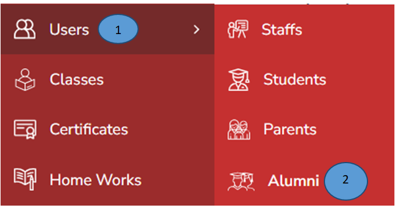
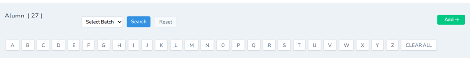
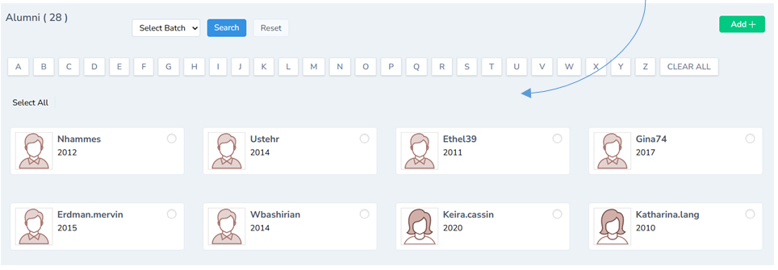

# Alumni Management  
 

1.	Click users form the Alumni Management

2.	Click Alumni from the side menu 

3.	Click Add button on the right top corner. A new form will open 

4.	Record all the details in the form and click submit. Alumni details will be successfully added 

Note: Reset is also possible 

Note: using alphabetical order names can be filtered.

Batch wise filtration is also possible 

