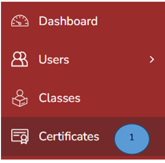
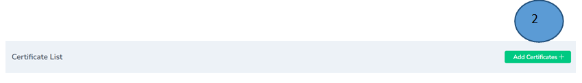
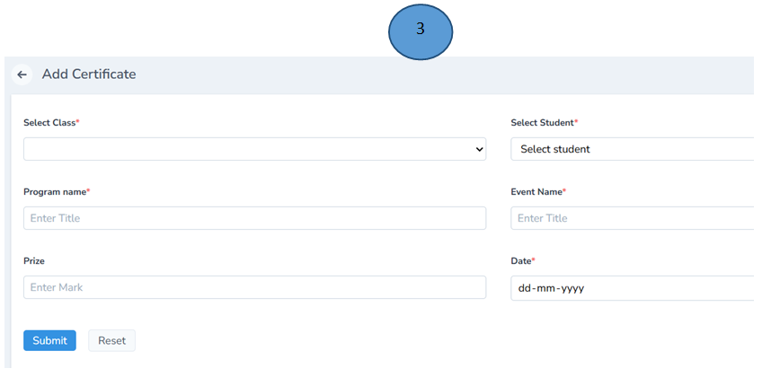
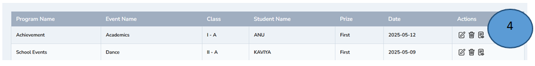
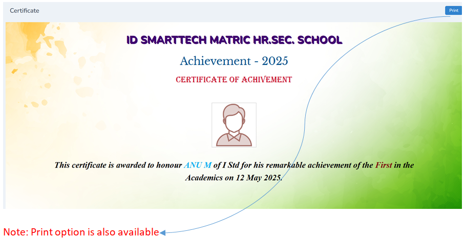
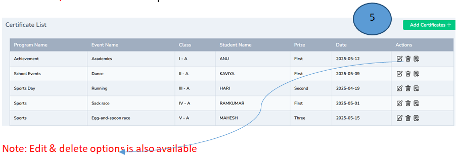

# Certificate management   
 
1.	Click Certificates from the left pane of the dashboard

2.	Click add certificate on the right top corner 

3.	Record all the details in the form and click submit 

4.	Certificate will be generated successfully, click view from the actions tab and view the certificate 

5.	A list of certificates generated will also be shown.

