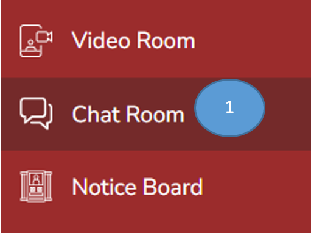
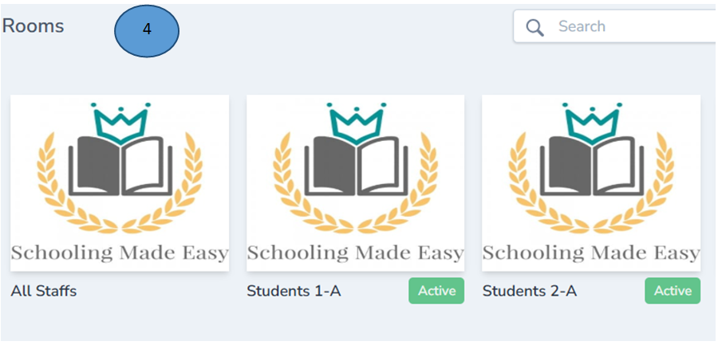
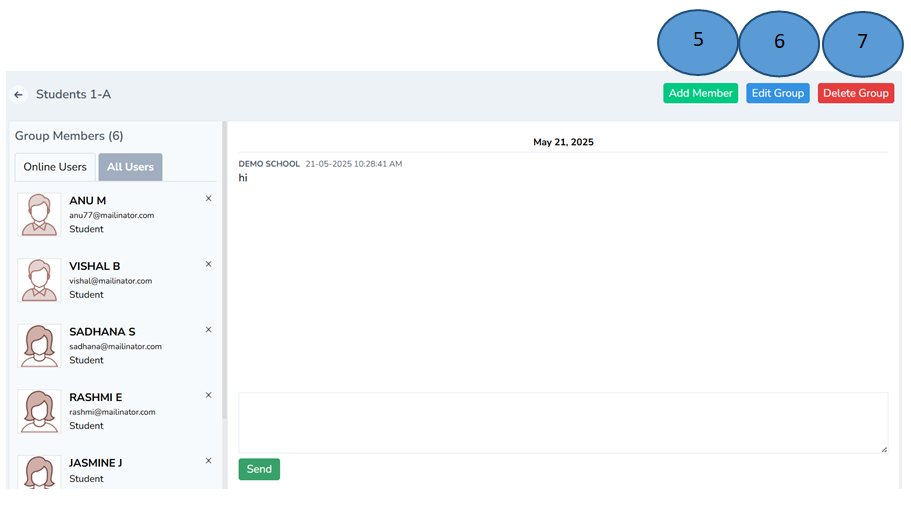
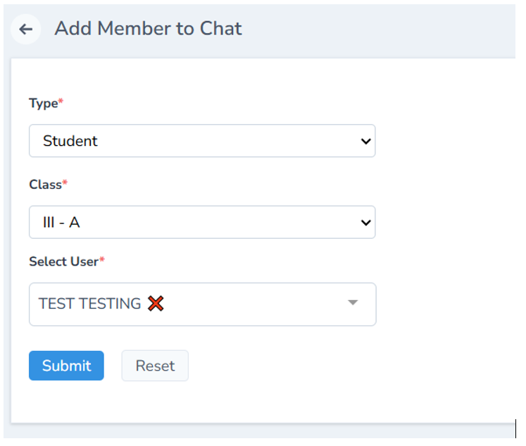
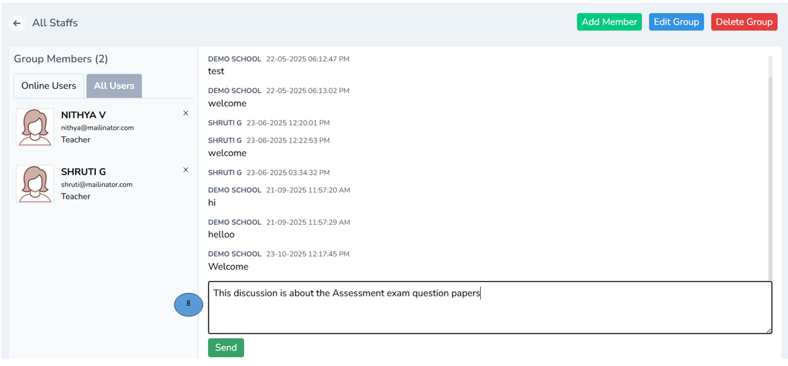

# Chat Room Management

1. Click Chat room from the admin dashboard

2. Click Add Room on the right top corner

3. Fill all the details in the form and click active and finally click submit

4. A chatroom will be created as shown below

5. Click the chatroom to add member,

Note : You can Edit group and delete group as well  

6. You can edit the members in the group

7. You can also delete the group if you don’t need it.

8. Type a message in the chat box and click send. All the members and start chatting with the members of the group without any hassles.

