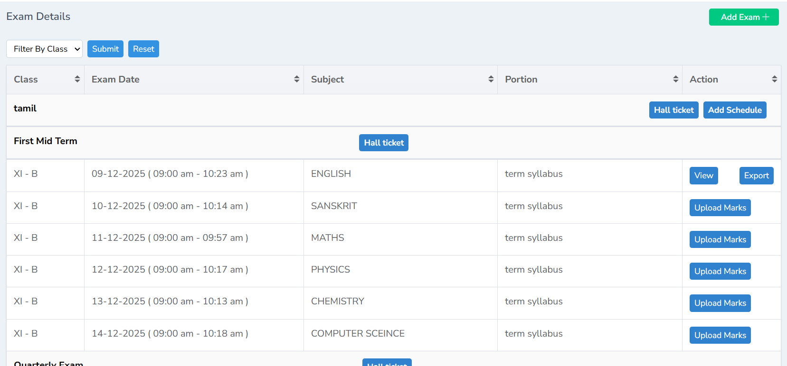
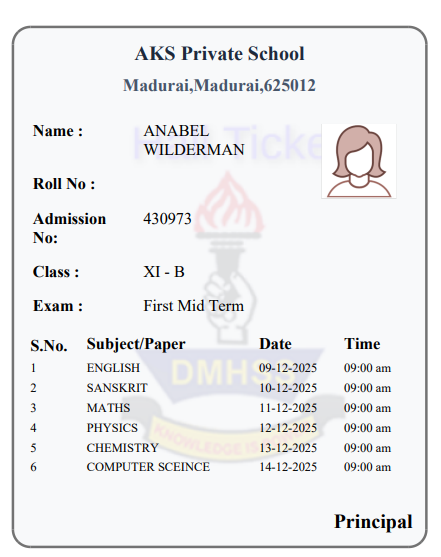

# How to Add Exam – Admin Module Manual

This guide explains how Admin users can create exams, add exam schedules, and generate hall tickets in GegoK12.

## Login to Admin Panel

1.	Open the GegoK12 login page.
2.	Enter your Admin **Username and Password.**
3.	Click **Login** to enter the admin dashboard.

## Navigate to the Exam Module

1.	From the left-side navigation pane, click **Exam.**

## Add a New Exam

**Step 1: Click Add**

1.	Inside the Exam module, go to the top-right corner.
2.	Click the **Add** button to create a new exam.

**Step 2: Fill Exam Details**

A new form will appear. Enter the required exam details such as:

**•	Class**

**•	Exam Name**

**•	Term / Category**

**•	Description (optional)**

**•	Any additional required fields**

After filling in all fields, **click** Submit.

**Step 3: Exam Added Successfully**

Once saved, the exam will appear in the **Exam List** for the selected class.

## Add Exam Schedule

After adding the exam, the next step is to record the entire schedule for each subject.

**Step 1: Click Add Schedule**

1.	Locate the newly added exam in the list.
2.	Click **Add Schedule.**

**Step 2: Enter Exam Schedule Details**

A schedule form will appear. Enter:

- **Subject Name**

**•	Exam Date**

**•	Start Time**

**•	Duration**

**•	Portion**

Click **Save** once all details are entered.

**Step 3: Final Exam Schedule Display**

The complete exam schedule will be displayed under the exam entry with all details clearly arranged.

## Generate Hall Tickets

Hall tickets can be generated directly from the exam list.

**Step 1: Click Hall Ticket**

1.	Locate the exam for which the hall ticket must be generated.
2.	Click the **Hall Ticket** button.

**Step 2: Download/Print Hall Tickets**

•	The system will generate hall tickets for students of the selected class.

## Completion

You have successfully:

- Added a new exam
- Created a complete exam schedule
- Generated hall tickets for the exam
The exam details will now be available to teachers, students, and parents according to their role permissions.

Once the exams are completed the Admin can upload the marks from the dashboard and the teachers can record the marks from the mobile app. 

Click Upload marks, a new tab will open, tick sample format and click save 

Once saved, Click Here to Download. The sample format will be downloaded in the downloaded folder.

Record all the details in the excel sheet as shown below and save it 

Now click import file, choose the right file and click import 

Once imported, the marks will be imported successfully 

Click exam, filter the class you are recording marks for and click view to see the marks obtained in the exam

Click export to export the document in the excel sheet

An effective exam management module within a school management software plays a crucial role in ensuring smooth, transparent, and error-free examination processes. By automating tasks such as exam scheduling, hall ticket generation, attendance tracking, evaluation, and result processing, it significantly reduces administrative workload and minimizes human errors. The system enhances accuracy, maintains data security, and provides timely access to exam-related information for administrators, teachers, students, and parents.
