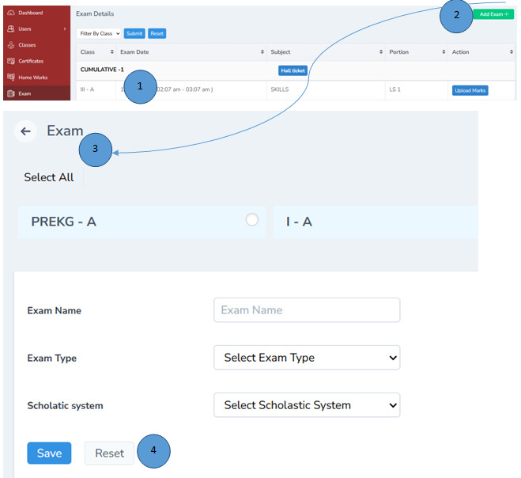
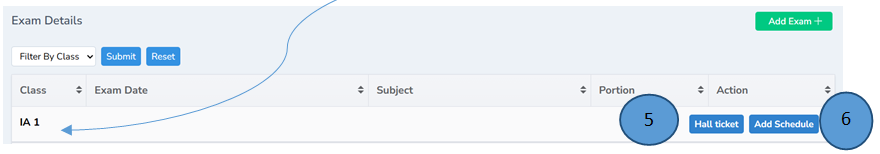
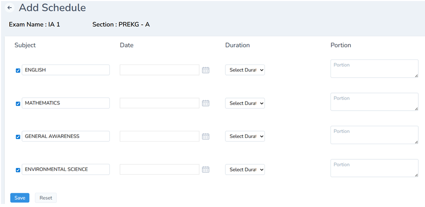
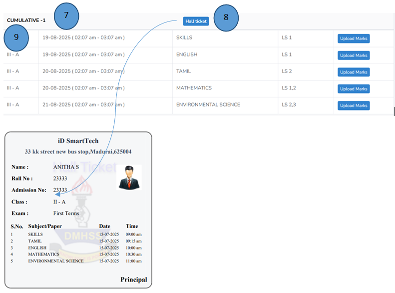

# Exam Management 

1.	Click Exam from the left pane 

2.	Click Add Exam on the right corner 

## Create Exam

3.	Fill in all the details and click submit exam will be added successfully

4.	If you want to change the details, click reset. 

## Generate Hallticket

5.	Hall ticket can be easily generated by clicking hall ticket tab

## Exam Schedule

6.	With the help of add schedule tab , the exam schedule can be easily added by filling the details and click save. 

Note: Reset can also be done easily with the reset tab

7.	The added schedule will be displayed with all the details and same will be sent to the parents app.

8.	Just click Hall ticket tab to generate hall ticket is seconds 

## Marks Upload

9.	Marks can be uploaded once the exams are completed

10.	Marks can be uploaded by importing from the excel sheet. 

11.	Marks can also be exported 

