# Fee record Module Demo

Easily manage student fee payments with automated invoices, payment tracking, and clear financial reports. Stay organized, reduce errors, and keep your school’s finances transparent and efficient.

## How to Use the Fee Record Module

Follow these simple steps to add and manage fee records in your school management system:

1. **Click on “Fee Record”** from the left-hand menu to open the fee management section.

   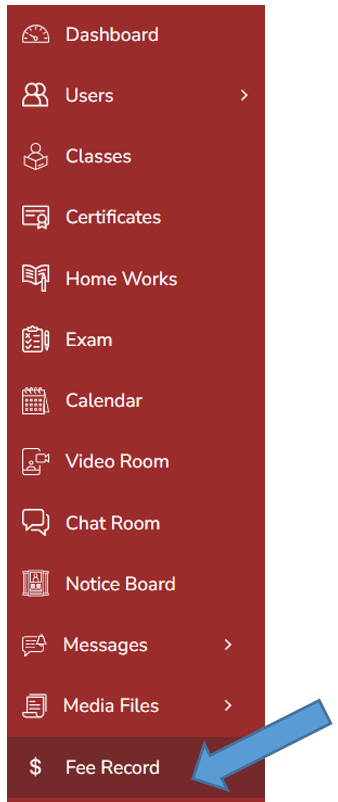

## Create Fees

2. **Click the “Add” button** in the top-right corner to begin adding a new fee.

   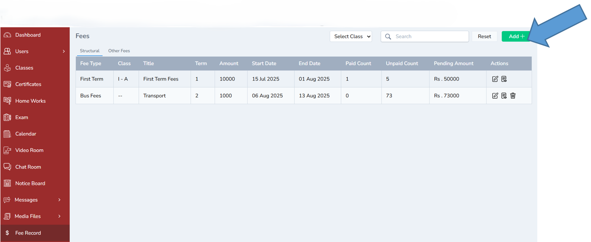

---

3. **Click “Add a New Fee Type”** to create a custom fee category.

   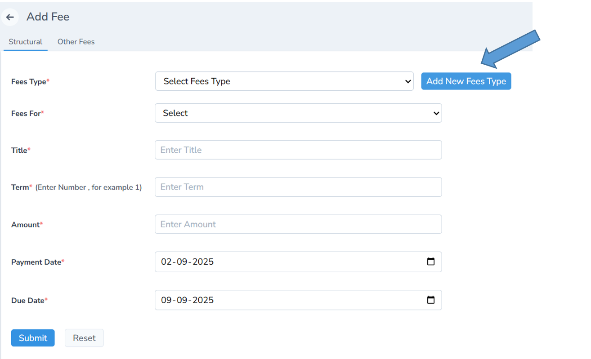

---

4. Enter the **fee name** and a short **description,** then save it.

   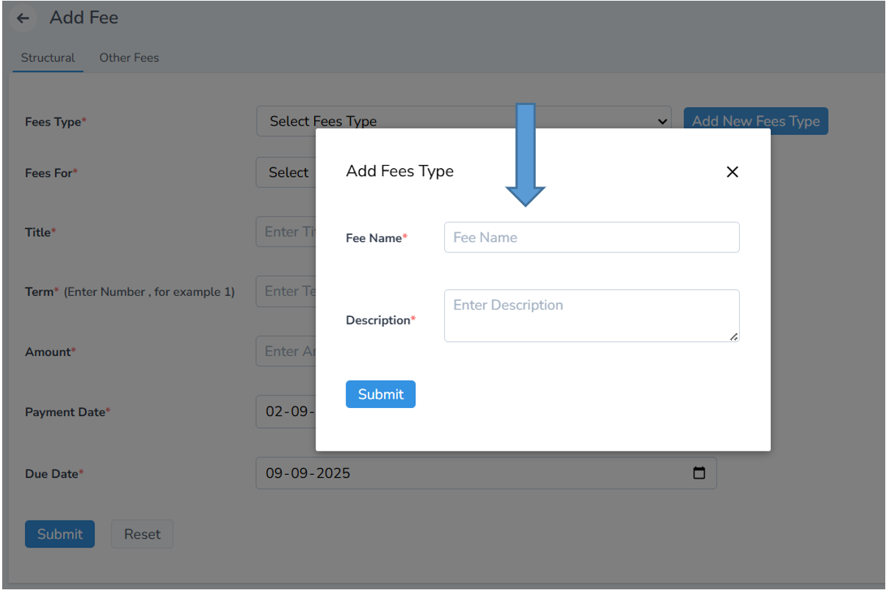

Fill in the fee details in the form:

- **Fee Type** (e.g., Tuition, Lab Fee)
- **Fees For** (e.g., Class 10, Term 1)
- **Title, Term, Amount,** and other relevant fields
- Click **Submit** to save the fee record.

  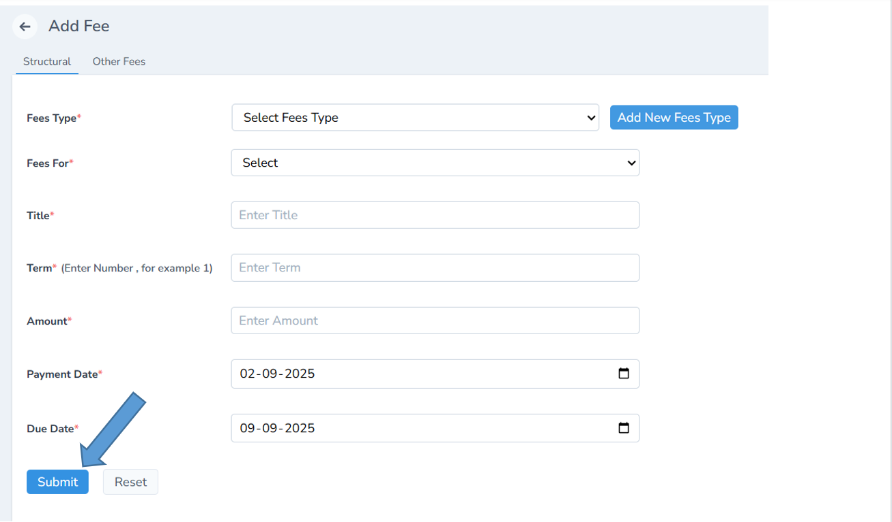

Use the **Reset** button to clear the form before submitting (if needed)

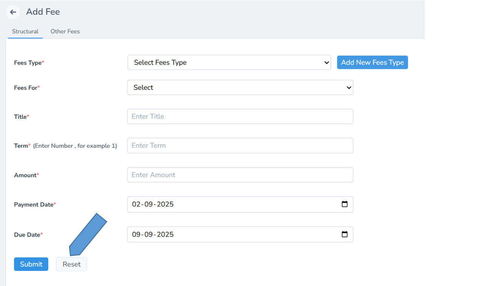

The newly added fee will now appear in the list below.

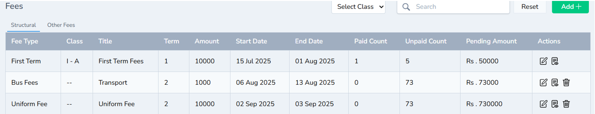

## Edit Fee

You can also **Edit** the fee details by clicking the **Edit icon**

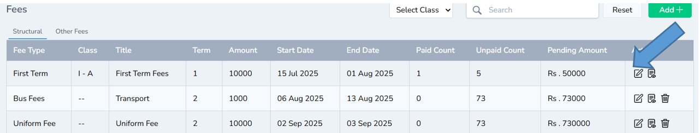

## Payment Details

You can also **View payment details** by clicking the 👁 **Show icon**
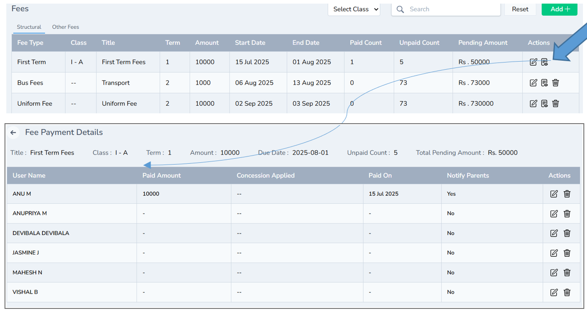

## Delete Fees

You can also **Delete the fee** permanently using the **Delete icon**

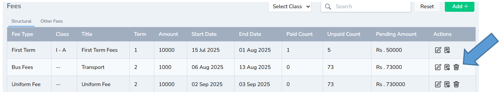

## Other Fees
To add other fees, simply repeat the same steps.

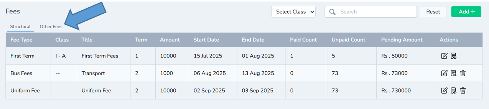

---
