# Inventory Management 

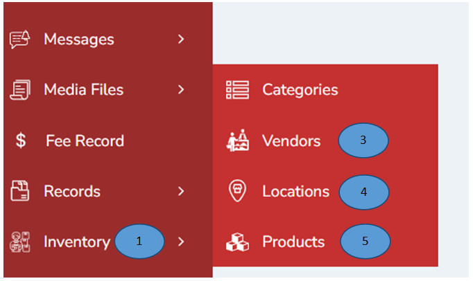

1.	Click on “Inventory” from the left menu pane.

## Category

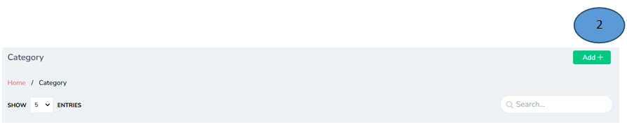

2.	Click the “Add” button on the top-right corner, fill the details and click submit. 

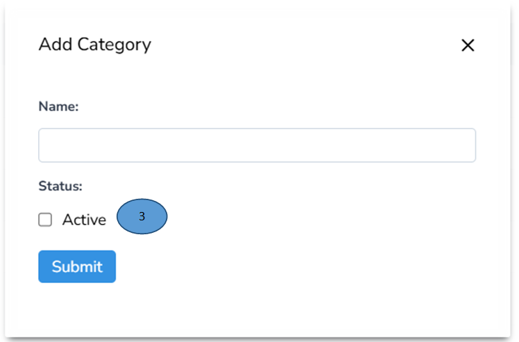

3.	Click the status as Active, The new category will be added as shown below 

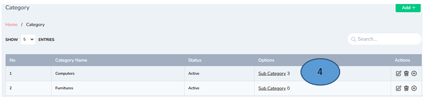

4.	A sub category will be added by clicking subcategory from the options

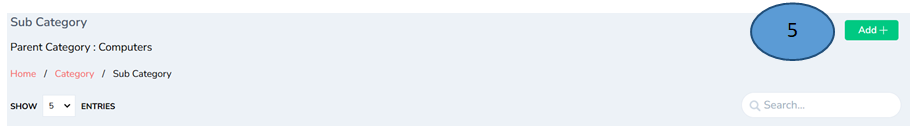

5.	To add the details in the subcategory click add on the click top corner and fill the details. Click “Submit sub category will be successfully added.

## Vendor

6.	Click Vendor 1 and add the details and click submit.

7. The vendor details will be listed as shown 

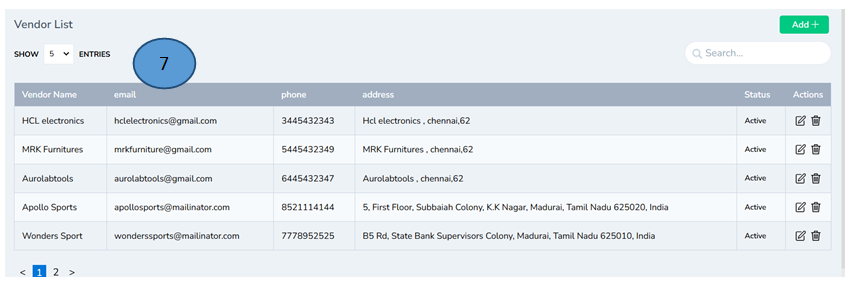

Note: Edit and delete options are displayed in the actions tab

## Location

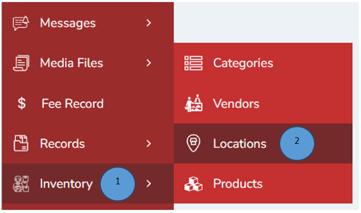

1.	Click Inventory from the left pane

2.	Click Locations on the side tab

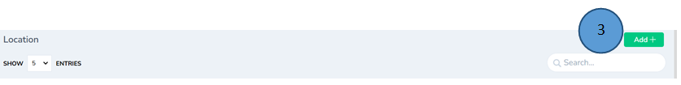

3.	Click Add button on the right top corner to add the location of the product and enter the location and click submit.

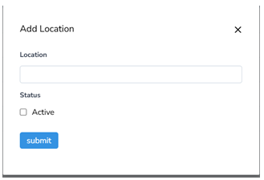

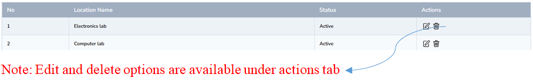

## To add Products 

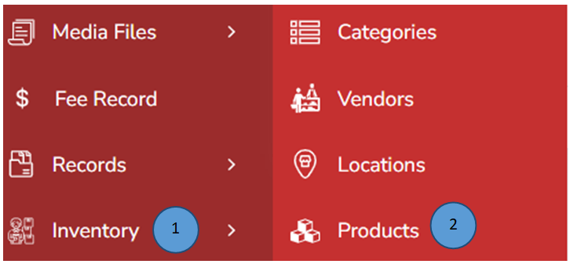

1.	Click Inventory from the left pane 

2.	Click products on the side menu 

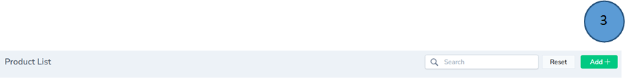

3.	Add Add products on the right top corner and new will be displayed. Fill all the details and click submit.

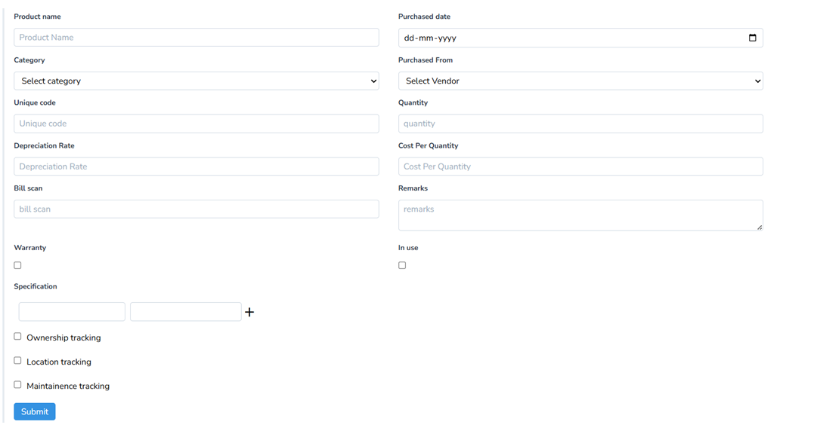 

4.	A new product list will be created and all the products will be listed down for any reference. 

 

