# Quiz Management     

1.	Click online assessment from the left pane of the dashboard  

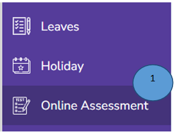

2.	Click Add button on the right top corner. A new form will appear

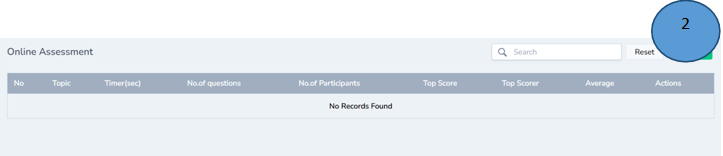

3.	Record all the details in the form and click submit

Note: Time should not be less than 30 secs

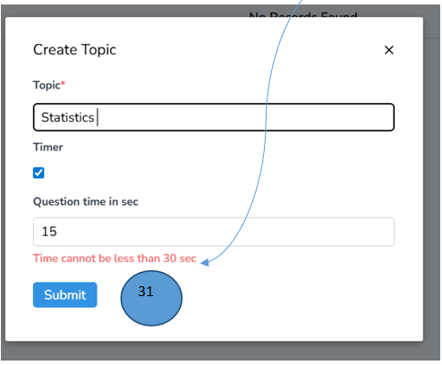

4.	Click show button in the middle of the action tab

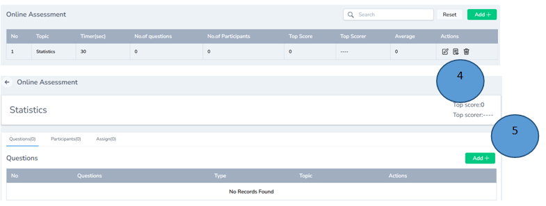

5.	Click Add button on the right top corner to add the questions 

6.	Enter all the questions correctly by selecting the right type and click submit

Note: The answer should also be selected by ticked the box in the beginning of the question

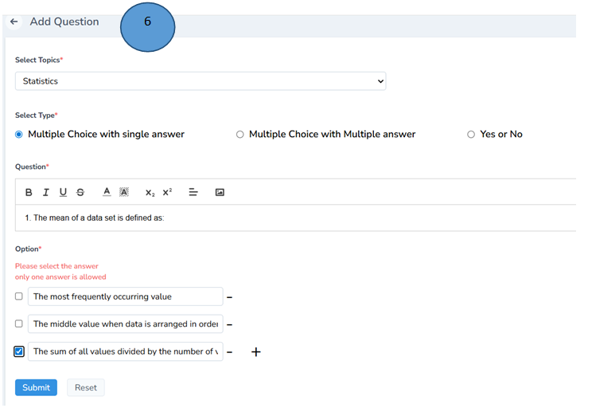

7.	Again Click Online assessment from the left pane 

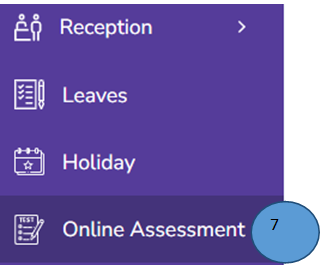

8.	Click View icon  from the actions tab 

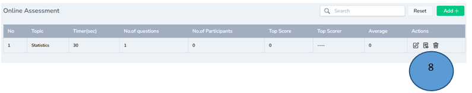

9.	The recorded question will be displayed. Edit and delete options are available

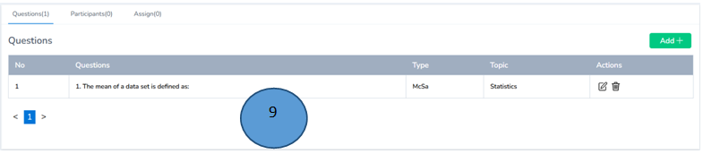

10.	You can assign the quiz to the participants by clicking the Assign tab

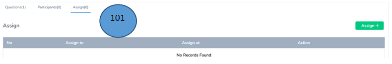

11.	Select the class and click submit

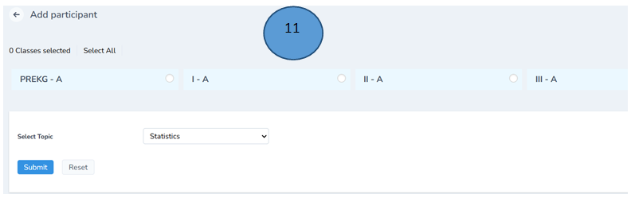

12.	Quiz participant will be added successfully  

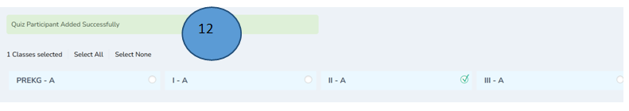

