# Stock Management    

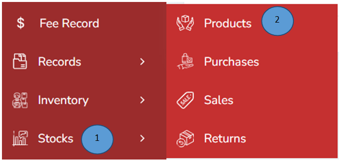

1.	Click stocks from the left pane 

2.	Click Products from the side menu 

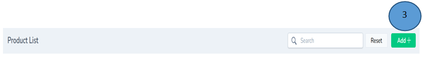

3.	Click Add button on the right top corner 

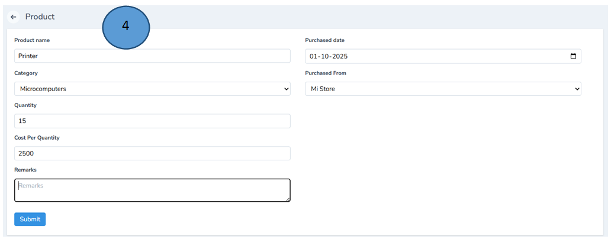

4.	Fill in form and click submit. 

5.	A new product will be successfully added in the product list as shown below

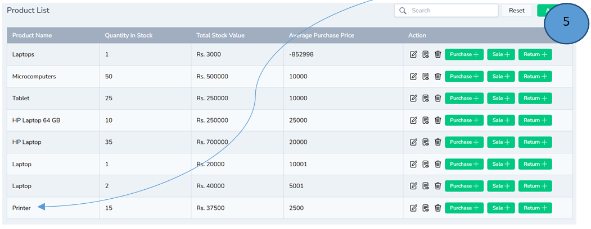

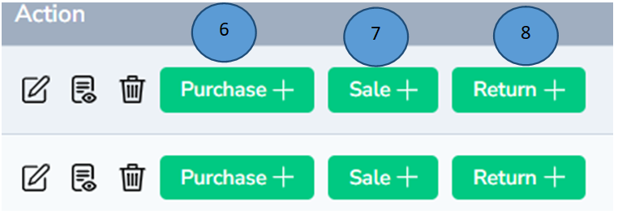

6.	Under actions tab with the help of purchase tab you can add more products of the same category

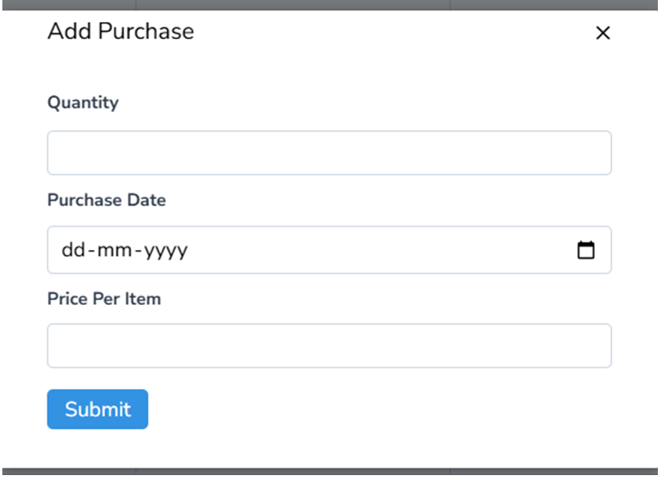

7.	Under actions tab with the help of sale tab you can add sell products of the same category

8.	Under actions tab with the help of return tab you can return products of the same category

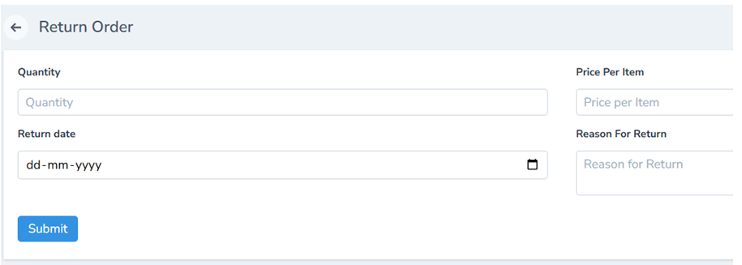

Note: Edit,show & delete options can be used if there are any changes from the action tab

## Purchase Management 

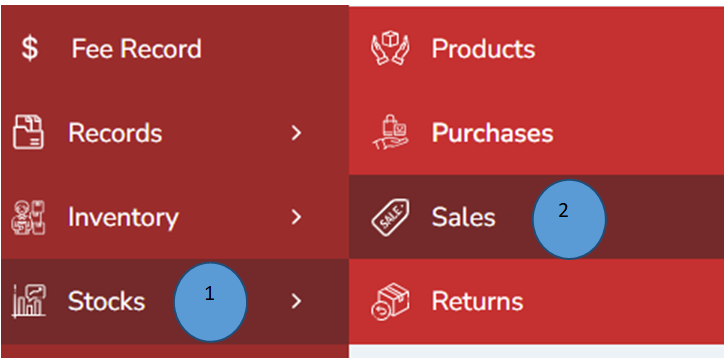

1.	Click Stocks from the left pane 

2.	Click purchases from the side menu 

3.	The purchases list will have listed below. 

Note: Edit, show & delete options can be used if there are any changes from the action tab

## Sales Management 

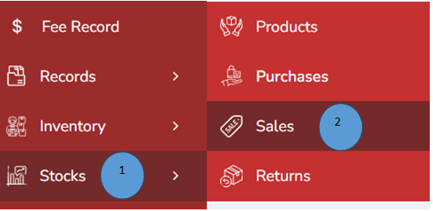

1.	Click Stocks from the left pane 

2.	Click sales from the side menu

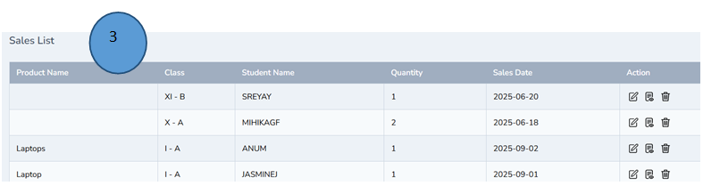 

3.	The sales list will be displayed 

Note: Edit,show & delete options can be used if there are any changes from the action tab

## Return Management 

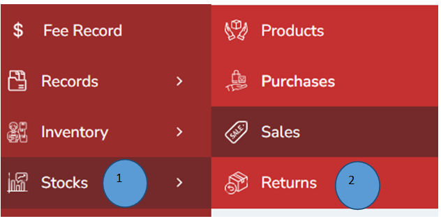

1.	Click Stocks from the left pane 

2.	Click returns from the side menu

3.	The return order list will be listed as shown in the picture below

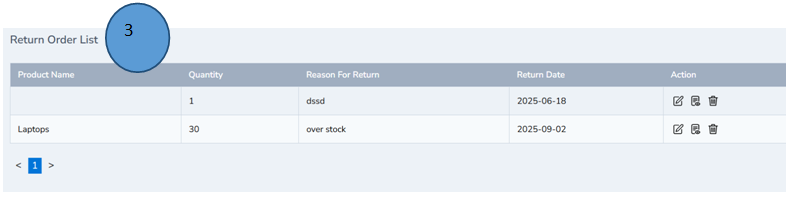

4.	The return order list will be listed as shown in the picture below

