# Transport Management 

1.	Click Transport on the left pane    

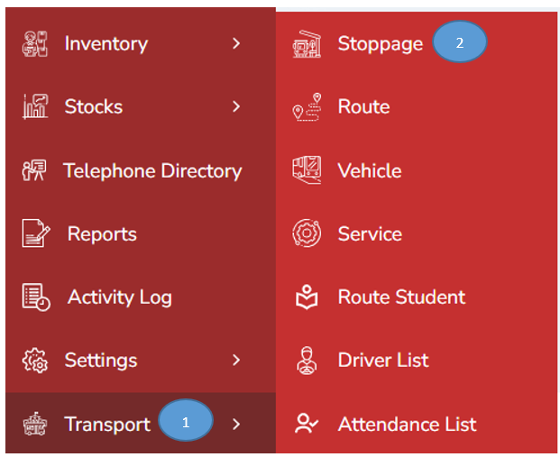

2.	Click stoppage on the side menu

3.	Click Add button on the right top corner 

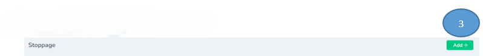

4.	Record all the details in the form and click submit

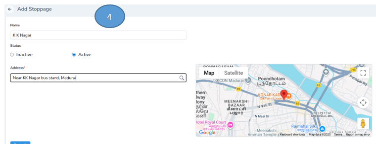

Note:Active/ Inactive options are available

5.	The stopping list will be listed as shown below

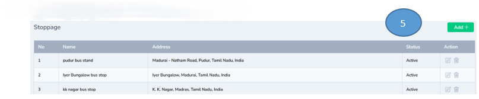

Note : Edit & Delete options are available in the actions tab

## Route Management 

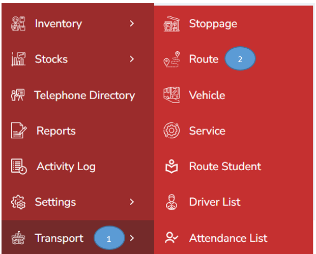

1.	Click transport tab from the left pane of the dashboard

2.	Click Route from the side menu

3.	Click Add button on the right top corner

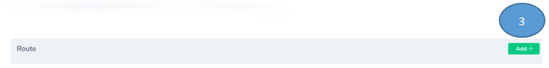

4.	Record all the details and click submit 

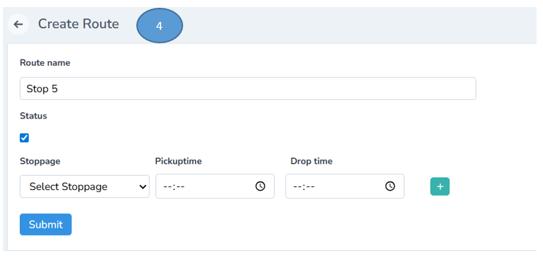

Note:  Click plus button if you need to add more stoppings

5.	The newly added stop will be listed down as shown in the image below

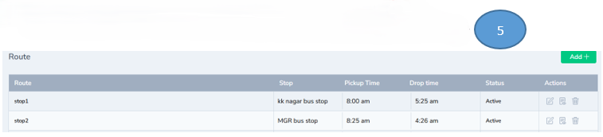

## Vehicle Management 

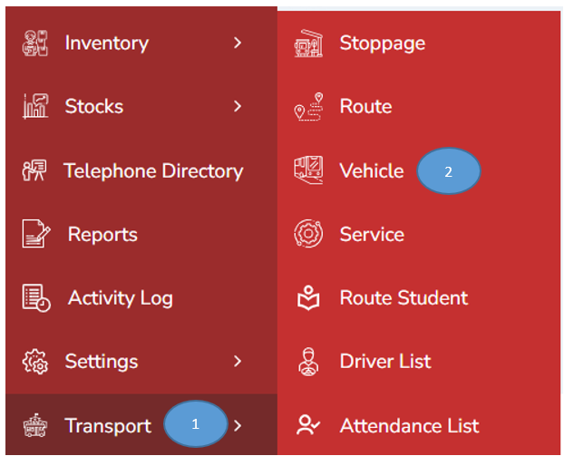

1.	Click transport tab from the left pane of the dashboard 

2.	Click vehicle from the side menu 

3.	Click Add button on the right top corner  

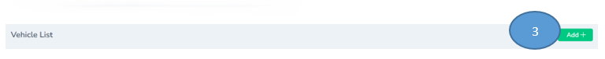

4.	Record all the details in the form and click submit. The vehicle details will be successfully added

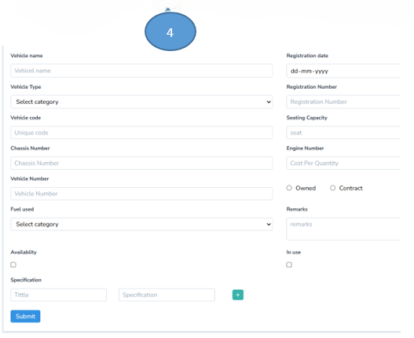

5.	Once done, the vehicle details will be successfully added and listed below as shown in the image

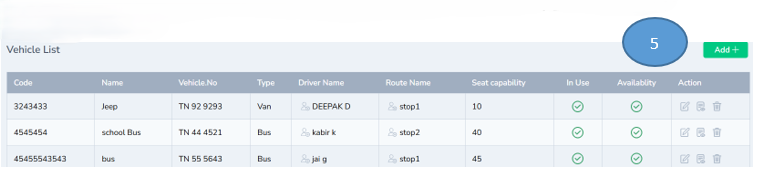

## Service Management 

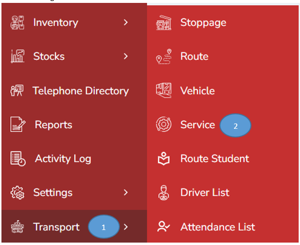

1.	Click transport tab from the left pane of the dashboard 

2.	Click vehicle from the side menu 

3.	Click Add button on the right top corner 

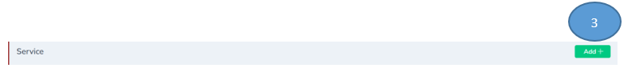 

4.	Record all the details in the form and click submit, a new service will be recorded

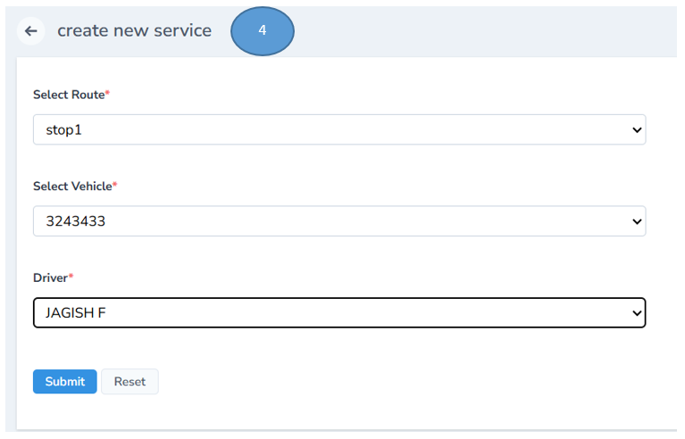 

5.	The list of services will be available in the service list

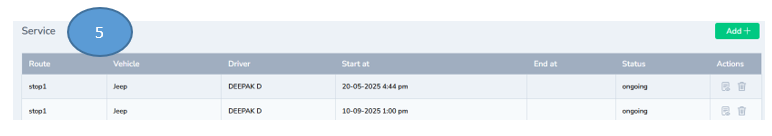 

## Route Student Management 

1.	Click transport tab from the left pane of the dashboard 

2.	Click route student from the side menu

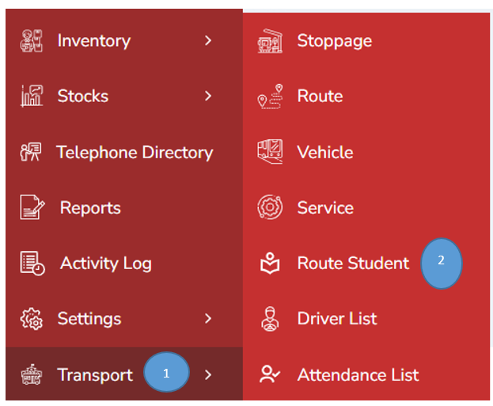 

3.	Select the route and add students in the same route and click submit 

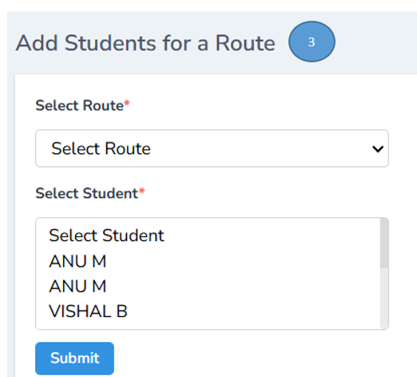 

## Drivers List 

1.	Click transport on the left pane

2.	Click drivers list on the side menu 

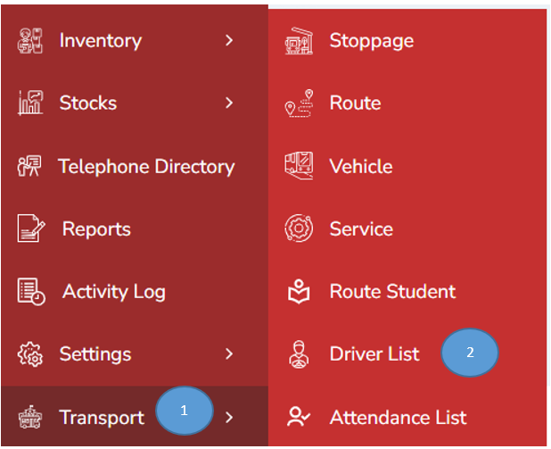 

3.	The no. of active drivers will be listed down as shown in the image below 

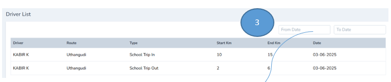 

Note : You can filter the drivers list from From date toTodate 

## Attendance Management 

1.	Click transport on the left pane

2.	Click Attendance list on the side menu 

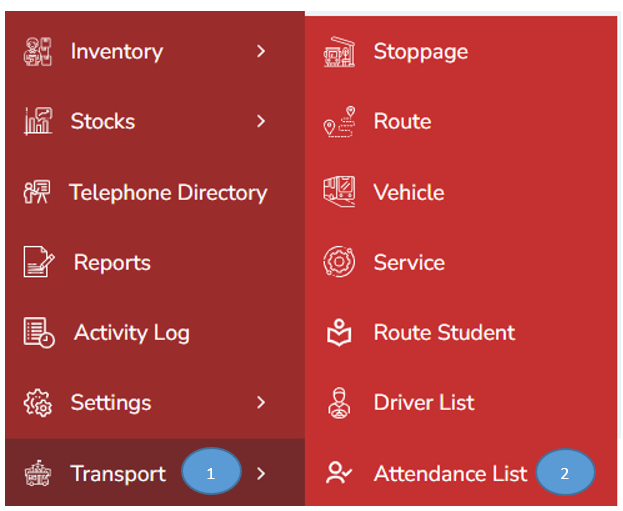

3.	Student attendance list will be displayed. 

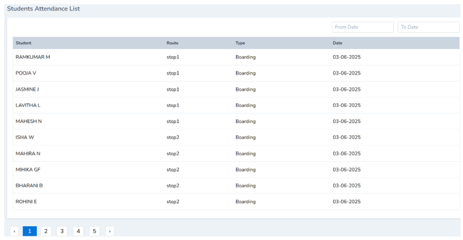

