# How to Create an Accountant Login from the Admin Panel

## Introduction to the Accountant Module

The **Accountant Module** in GegoK12 allows schools to manage all financial-related operations efficiently. The module provides access to several important submodules that help accountants perform daily tasks with ease.

**Overview of Submodules**

- **Calendar** – View academic and financial events, fee due dates, reminders, etc.
- **Fee Details** – Manage fee structures, payment statuses, pending amounts, and receipts.
- **Holiday** – View school holidays and plan financial tasks accordingly.
- **Payroll** – Manage staff salary details, payslips, allowances, and deductions.
- **To-Do List** – Track tasks and financial activities that need the accountant’s attention.
- **Notice Board** – View important announcements from the school management.
- **Activity Log** – Monitor actions performed inside the accountant panel for tracking and audits.

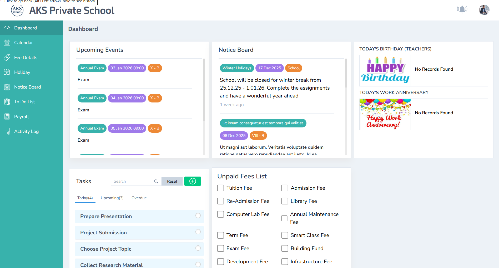

## Creating an Accountant (Admin Guide)

**Navigate to the Non-Teaching Staff Section**
Menu Path

**Users → Staff → Non-Teaching**

Steps

1.	Log in with your **Admin credentials.**

2.	From the left menu, go to **Users.**

3.	Click on **Staff.**

4.	Select **Non-Teaching**

5.	A new tab will open showing the list of non-teaching staff.

6.	Click the **Add (+)** button to create a new non-teaching staff profile.

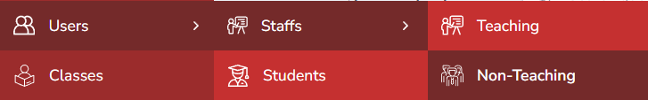

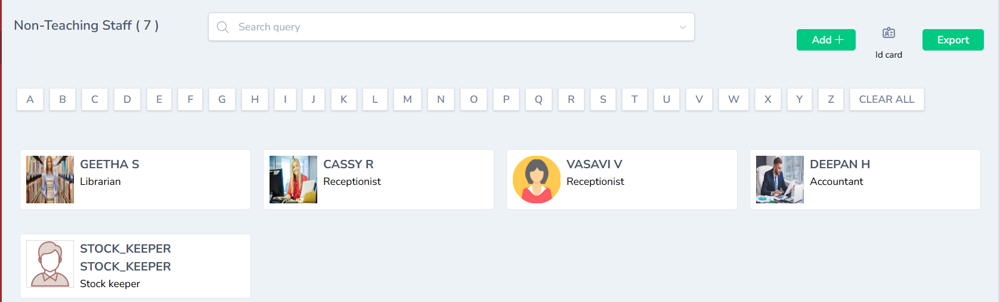
 
**Fill in Basic Profile Details**

Once you click **Add,** a new staff creation form opens.

Enter the Required Details

- **Name**

- **Mobile Number**

- **Email ID** (This will be used as the Login Username)

- **Designation** → Select Accountant

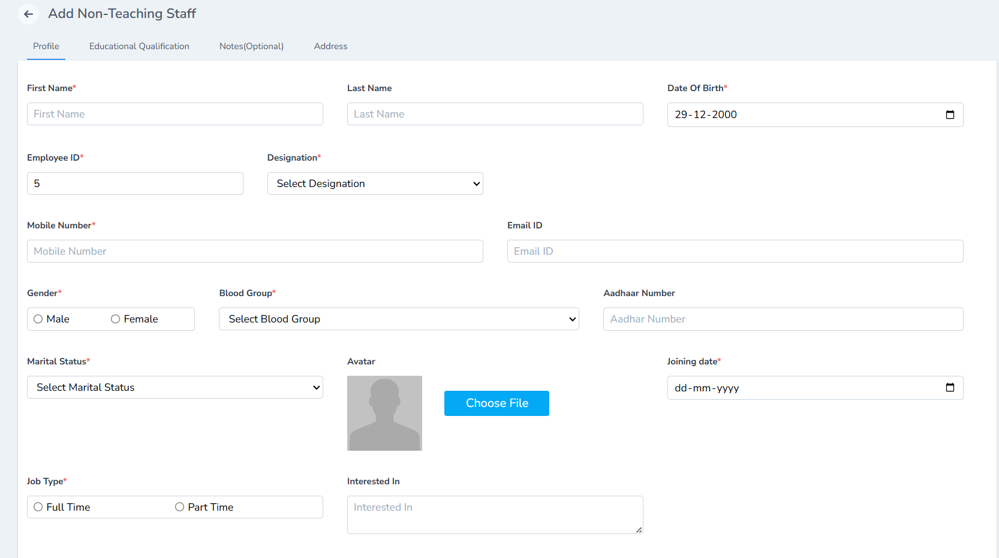

After entering all the details, click Submit.
 
**Add Educational Qualification**

Once the basic details are saved:

1.	A new tab **Educational Qualification** will open.

2.	Enter all qualification details such as:

- UG Degree

- PG Degree

- Subject Specialization etc

3.	Click **Submit** to proceed.

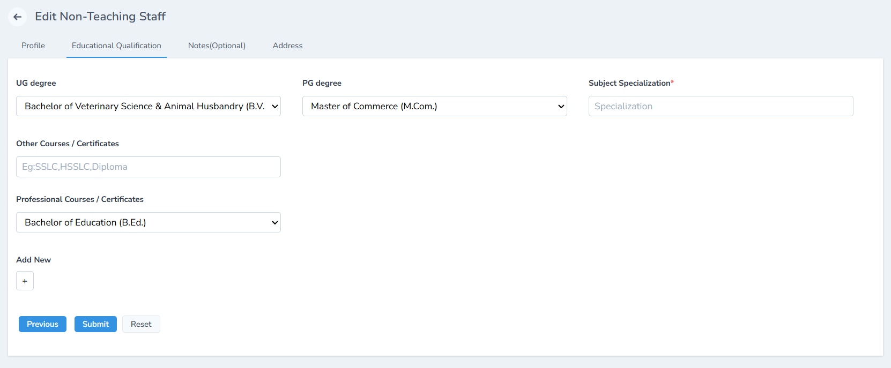
 
**Add Notes (Optional)**

The next tab shows the **Notes** section.

-	Enter any internal notes related to the staff (optional).

- 	Click **Submit** to move to the next step.

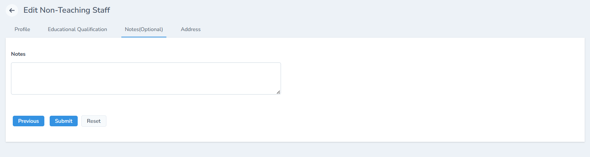
 
**Add Address Details**

A new tab labeled **Address** will appear.

1.	Enter the complete address of the accountant.

2.	Review the details.

3.	Click **Submit.**

Once this final section is completed, the accountant’s profile is fully created.

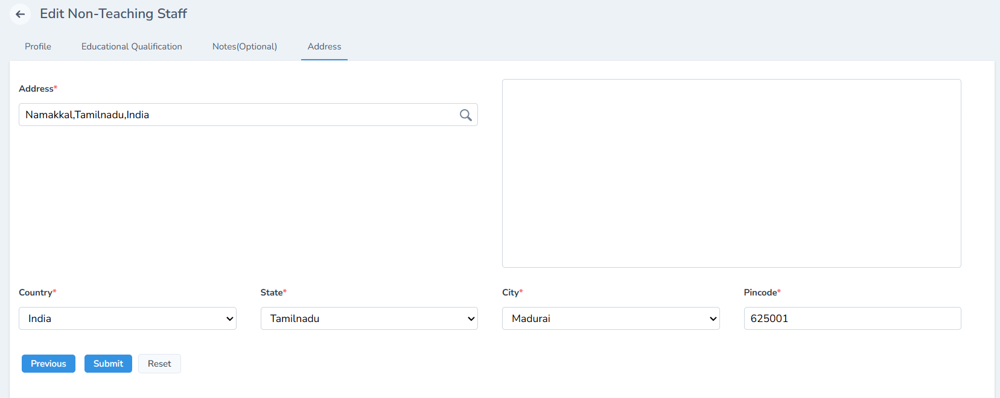

## Login Credentials Creation

After all steps are completed, **GegoK12 automatically generates the login credentials** for the Accountant.

Default Login Credentials

- **Username:** The Email ID entered during staff creation

- **Password:** password (A default password)

**Note:**
The Accountant or Receptionist can change this password later from the profile settings.

## Completion

The **Accountant login is now successfully created,** and the staff can access the Accountant Module with the generated credentials.

Additional modules

From the Accountant’s profile page, the admin can

- Edit Profile
- Delete Profile
- View Profile
- View timeline
- Add Notes
- Upload Documents
- Record Bank Details

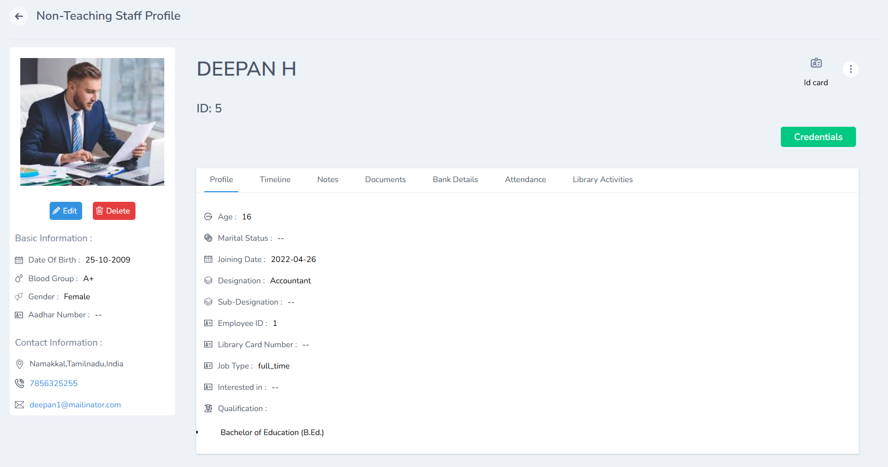

View timeline by clicking on it 

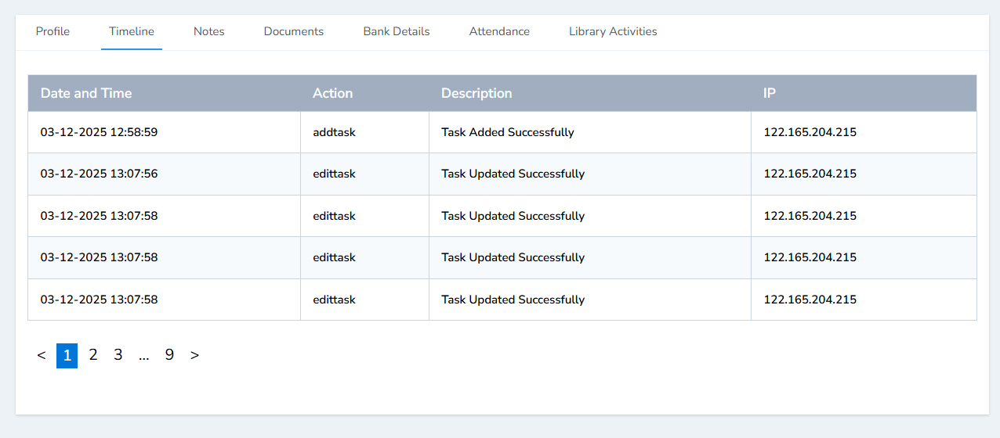
 
Add notes and click submit. The same will be saved. 

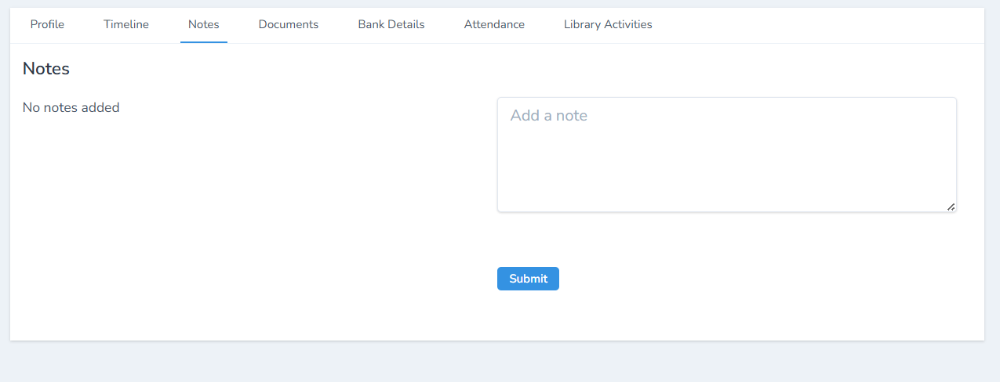

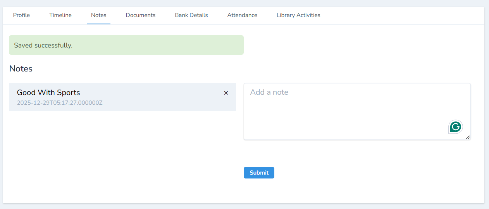
 
Upload documents such certificates, ID proofs & other documents by clicking Add and click submit. The important documents will be added.

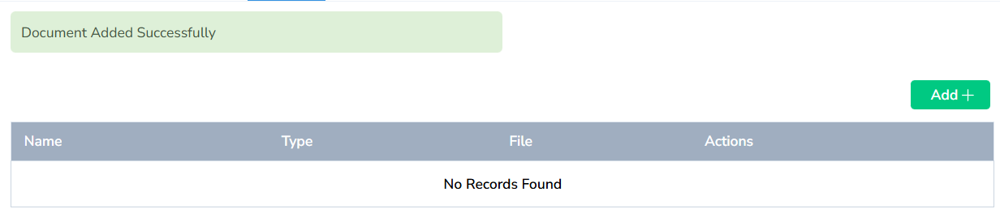

Add bank details for salary processing and click submit. The account details will be successfully added. 

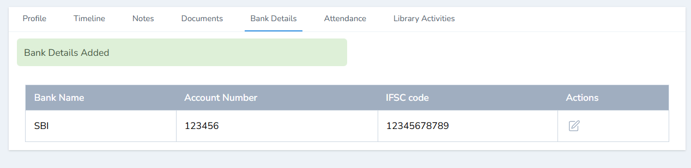

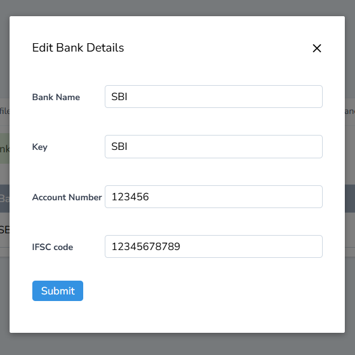

## Accountant Login and Dashboard

Accountant log in through the school portal using: 

**Email ID → Username**

**password → Default password**

They may change their password after login.

## Login with Accountant Credentials

Once the accountant logs in using their assigned username and password, they will be directed to the **Accountant Dashboard.**

### Accountant Dashboard Overview
 
The dashboard provides a clear summary of all important financial and administrative activities. It includes:

- **Left Navigation Pane:**

Displays all accountant-related submodules for quick access.

- **Upcoming Events:**

Shows important academic or financial events that require the accountant’s attention.

- **Notice Board Updates:**

Displays announcements from the school administration.

- **Birthdays & Work Anniversaries:**

Highlights upcoming celebrations for staff members, helping maintain cordial communication.

- **Tasks To Be Done:**

A prioritized list of pending tasks assigned to the accountant.

- **Unpaid Fee List:**

Shows students with outstanding payments, enabling quick follow-up.

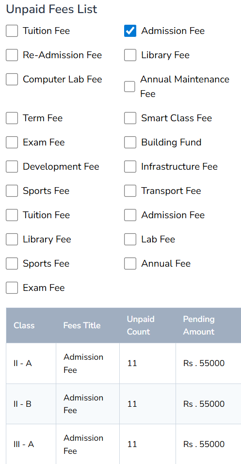
 
This overview allows the accountant to efficiently monitor key activities and manage daily responsibilities with ease.

**Left Sidebar Navigation Menu**

   - **Dashboard** – Main landing page with quick access.

   - **Calendar** – View school events, schedules, and important dates.

   - **Fee Details** – List the fee details 

   - **Holiday** – List of declared holidays.

   - **Notice Board** – Access announcements and notices.

   - **To Do List** – Tasks and reminders for the staff.

   - **Payroll** – Salary, payslips, and financial details.

   - **Activity Log** – Track system activity and staff actions.

**Top-Right User Profile Section**

   - Displays the staff **profile photo.**

   - Shows **name** (Deepan S).

   - Shows **email ID.**

   - Dropdown menu options:

      - **Change Password**
      - **Change Avatar**
      - **Logout**

 **Main Content Area**

 - **Screen Title:** Change Avatar

 - Current profile picture displayed prominently.

 - Buttons:

  - **Choose File** – Upload a new avatar image.

  - **Upload** – Save the new profile image

### Calendar Sub-Module – Accountant Overview 

- Shows **fee due** dates to plan collections and follow-ups.

- Displays **salary and payroll** schedules for timely processing.

- Lists **school holidays** to plan financial tasks around non-working days.

- Shows **important school events** that may need budgeting or expenses.

- Helps manage **monthly workload** and prevents missed deadlines.

- Improves **coordination** with other departments by viewing shared events.

#### Calendar

Click Calendar from the left pane, the list of the events in the calendar by the admin will be displayed in this module

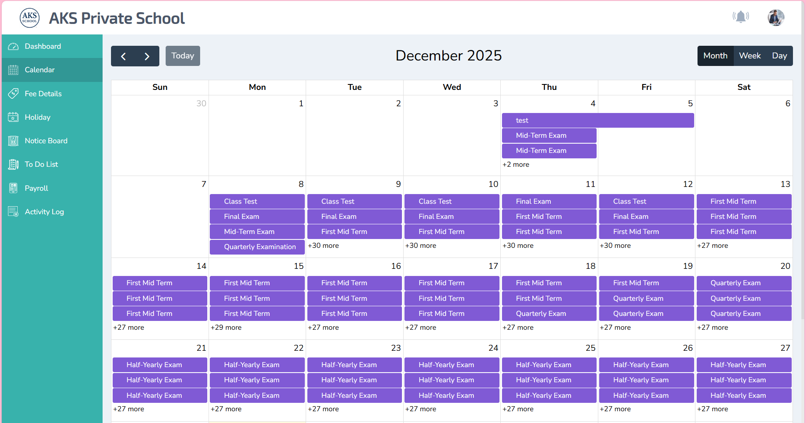
 
#### Fee Details

Click fee details to view the breakdown of the fee. By clicking add tab the other fee can also be added.  

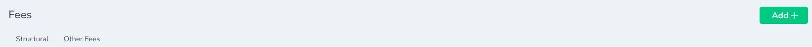

Fee can be added by clicking on the right top corner with the Add button

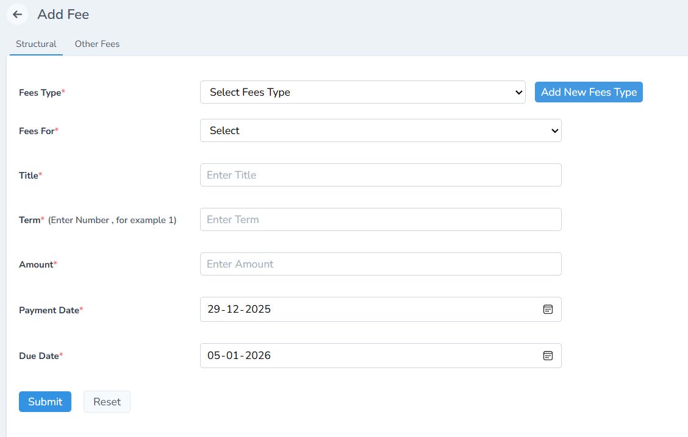

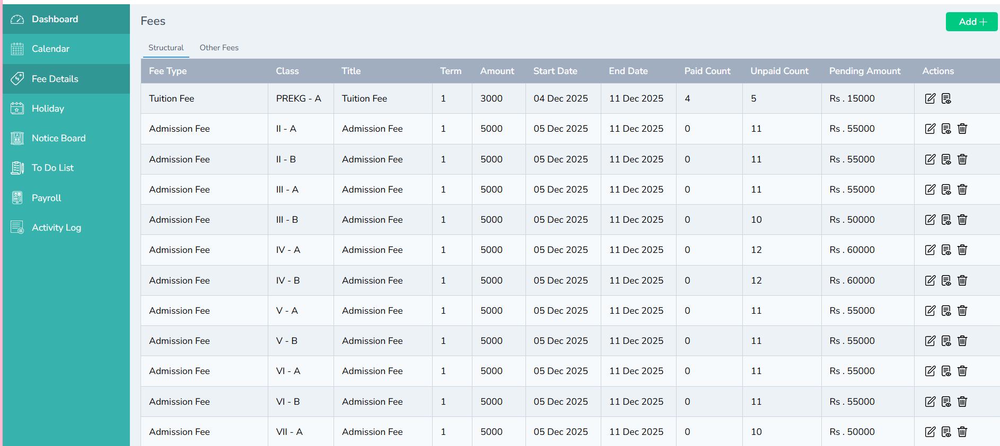
 
Editing the fee is also possible by clicking the edit button on the action tab 

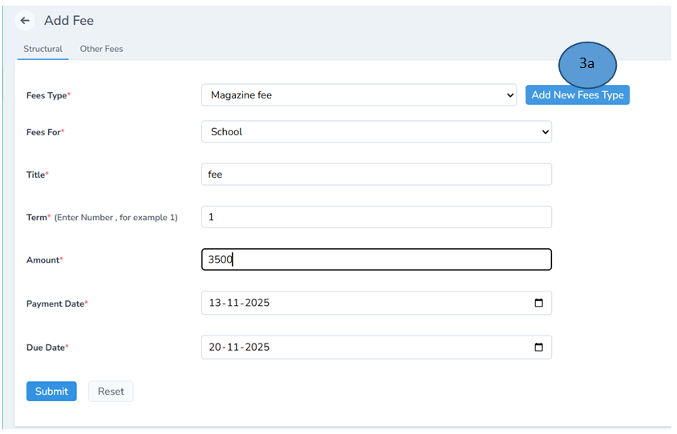

#### Holiday List

Click Holiday to view the list of holidays for the year

**Note:** The admin will record the holidays from the Admin panel and the same will be reflected in the Accountant’s dashboard.

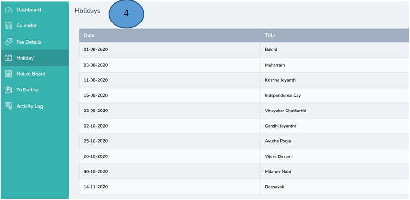

Click notice board to view the list of events added by the admin 

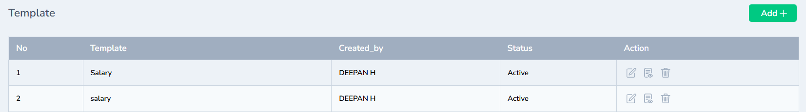
 
#### To do list

Click To do List to add the tasks and click submit

**Note:** Reminders can be given one hour before the task, one day before the task and two days before the task 

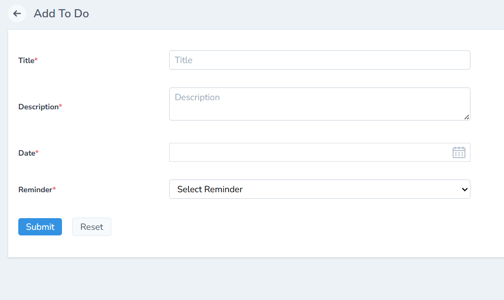

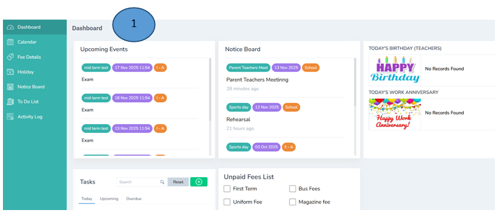
 
#### Payroll

The Payroll Module in GegoK12 is designed to simplify and automate all salary-related processes within the institution. It enables administrators and accountants to manage staff compensation with accuracy, transparency, and efficiency. From creating salary templates to processing monthly payslips and generating transaction reports, every workflow is streamlined to ensure error-free payroll management. This module supports various salary components such as basic pay, allowances, deductions, PF, ESI, and income tax, making it a complete solution for managing staff financial records.

## Payroll Module – Step-by-Step Guide

### Payroll → Template Creation

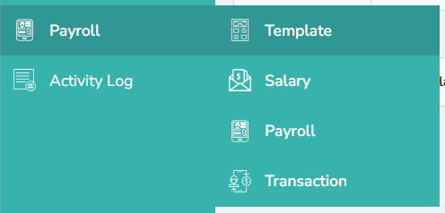
 
**Step 1:** Navigate to Payroll Templates

**Menu Path:**

**Payroll → Template → Add**

 
 **Step 2:** Fill Template Details

A new template creation form will open. Enter the following details:
 
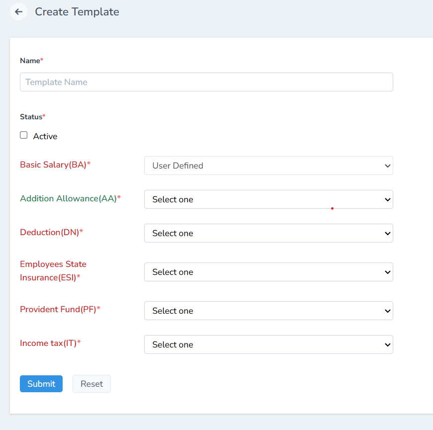

1.	**Template Name**

2.	**Status: Select Active**

3.	**Basic Salary:** Choose **User Defined**

4.	**Additional Allowance:** 

Choose one option:
   - Not Applicable

   - User Defined

   - On Attendance

   - Computation

**5.Deduction:** 

Choose one option:
  - Not Applicable

  - User Defined

  - On Attendance

**6.Employee State Insurance (ESI): Choose from:**

  - Not Applicable

  - User Defined

  - On Attendance

  - Computation

**7.Provident Fund (PF): Choose from:**

  - Not Applicable

  - User Defined

 - On Attendance

- Computation

**8.Income Tax: Choose from:**

 - Not Applicable

 - User Defined

 - On Attendance

 - Computation

**Step 3:** Submit

Click **Submit** to save the payroll template.

**Step 4:** Manage Templates

**Edit:** Modify the template anytime through the Edit option under the Action tab.

**View:** Click View to check the gross salary calculation of the staff.

**Delete:** Remove the template using the Delete option.

### Payroll → Salary Creation

**step 1:** Navigate to Salary

 
Menu Path:

**Payroll → Salary → Add**

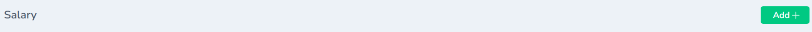
 
**Step 2:** Select Staff

Choose the staff member from the staff list.

**Step 3:** Fill Salary Details

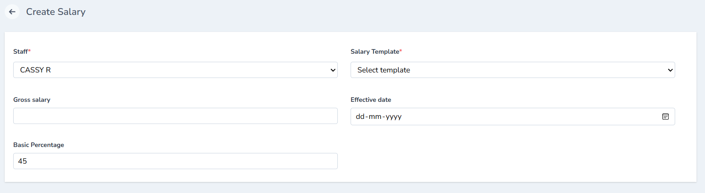
 
A form opens. Enter:

1.	**Staff Name**

2.	**Template Name**

3.	**Gross Salary**

4.	**Effective Date**

5.	**Basic Percentage**

6.	**Basic Salary**

7.	**Additional Allowance Amount**

8.	**Deduction Amount**

9.	**PF Amount**

10.	**Income Tax Amount**

**Step 4:** Submit

Click **Submit.**

The salary structure for the staff is now created.

**Step 5:** Manage Staff Salary

- **Edit:** Modify any salary details.

 
- **View:** View the salary structure.

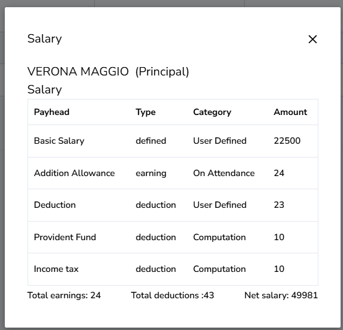
 
- **Delete:** Delete if required with the delete icon 

### Payroll → Payslip Creation

**Step 1:** Navigate to Payslip

Menu Path:

**Payroll → Payslip**

 
**Step 2:** Generate Payslip 

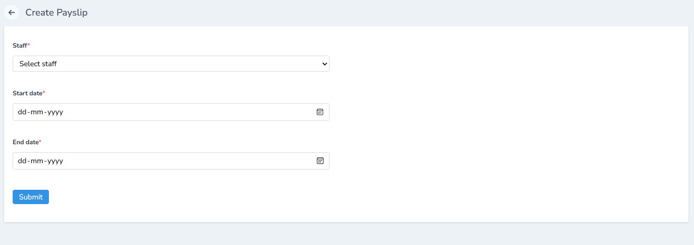

Click Add to add the salary structure 

1.	Select the **Staff Name**

2.	Select **Start Date**

3.	Select **End Date**

4.	Click **Submit**

A detailed **Salary Slip** will be generated automatically.

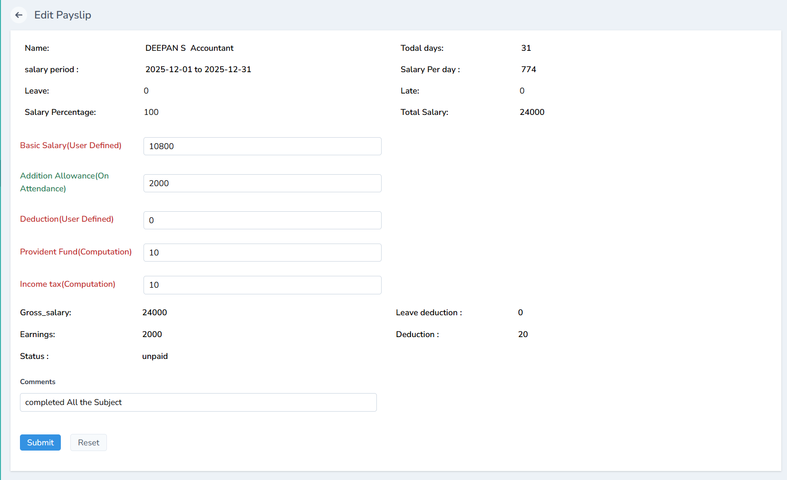
 
**Step 3:** Update Attendance-Based Deductions (Optional)

- Update **Late Coming** or **Leave** details.

- Deductions will be recalculated based on attendance.

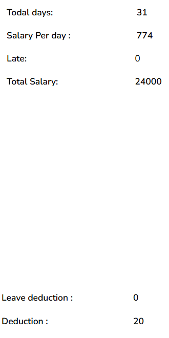
 
### Payroll → Transaction

**Step 1:** Navigate to Transaction

Menu Path:

**Payroll → Transaction → Add**

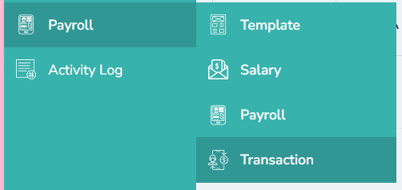
 
**Step 2: Fill Transaction Details**

1.	Select **Staff Name**

2.	Select **Start Date**

3.	Select **End Date**

4.	Click **Submit**

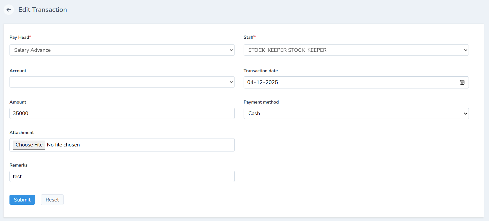
 
**Note:** Staff wise transaction slip can also be downloaded. 

**Step 3:** Generate Payroll Report

- On the top-right corner, click **Report.**

- The **complete payroll history** of the staff will be displayed.

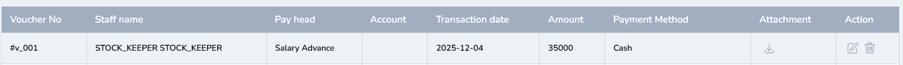
 
**Step 4:** Bank Copy (Optional)

- A copy of the payroll details can be **sent to the bank.**

**Step 5:** View Completed Transactions

- All processed transaction records will appear under the **Transaction** sub-module.

**Activity Log**

The Activity Log displays all actions performed by the Accountant, ensuring transparency and accountability.

- Manage fee payments (paid/unpaid), generate receipts, update payment status

- Create and manage salary templates and staff salary structures

- Generate payslips and process monthly salary transactions

- View and record income/expense entries

- Access financial reports and transaction history

- Track events, notices, and fee-related schedules

- Manage tasks and reminders

- View all actions in the Activity Log for transparency

- Update personal profile and change password

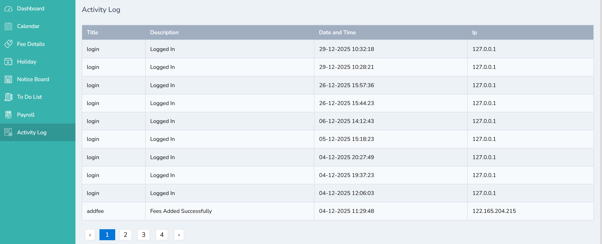

