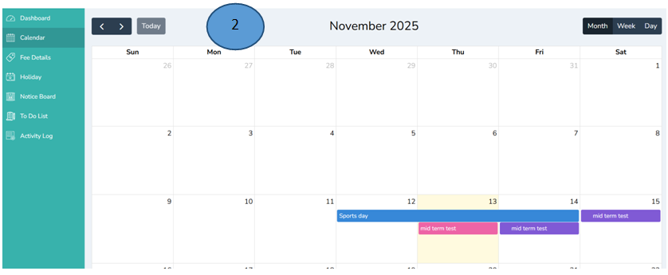
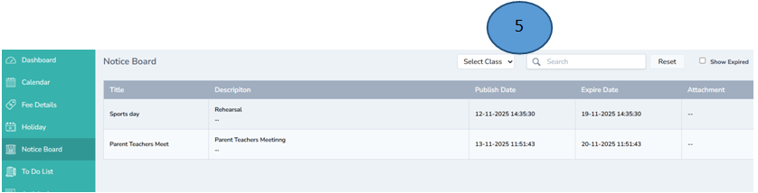
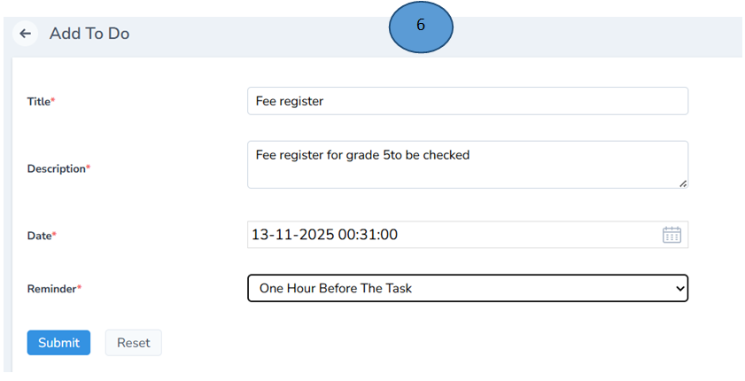
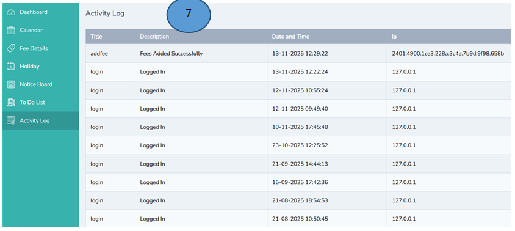

# Accountant Management 

Login with the accountant credentials 

## Dashboard

1.	This is the overview of the accountant dashboard, it displays the submodules on the left pane, Upcoming events, notice board events, any birthday to e celebrated for teachers and work anniversaries, tasks to be done, unpaid fee list etc for the better understanding. 
 

## Calendar

2.	Click Calendar from the left pane, the list of the events in the calendar by the admin will be displayed in this module

## Fee Details

3.	Click fee details to view the breakdown of the fee. By clicking add tab the other fee can also be added.  

3a. You can add new fee by clicking on the add tab on the right top corner and click submit, new fee will be added in the fee details list

## Holiday

4.	Click Holiday to view the list of holidays for the year

## Notice Board

5.	Click notice board to view the list of events added by the admin 

## Task 

6.	Click To do List to add the tasks and click submit. 

## Activity Log

7.	Click Activity log to view the list of activities executed in the Accountant module 

