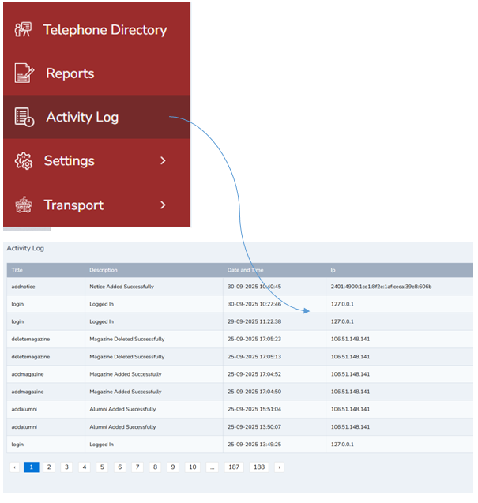

# Activity Log Management 
 

1.	Click activity log and you can all the recent and old activity done in the portal.

Note: Activity log is available in all the logins like student, teacher , parent, admin etc 

