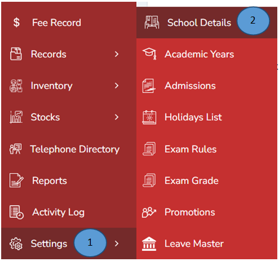
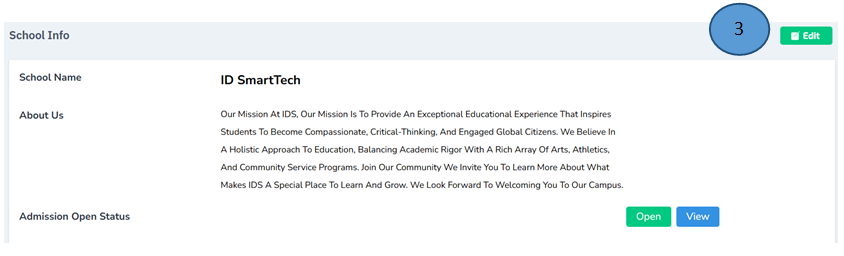
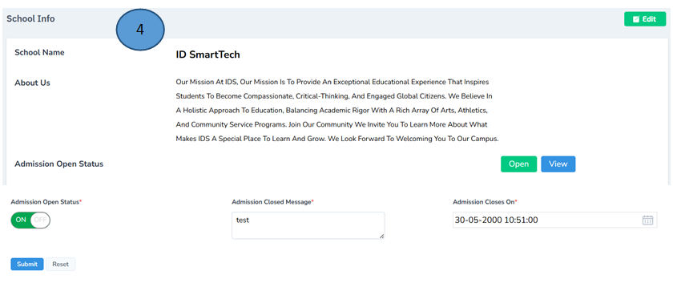
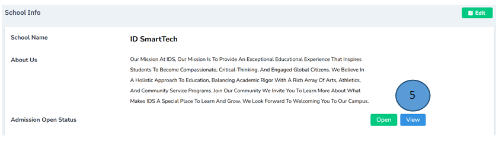
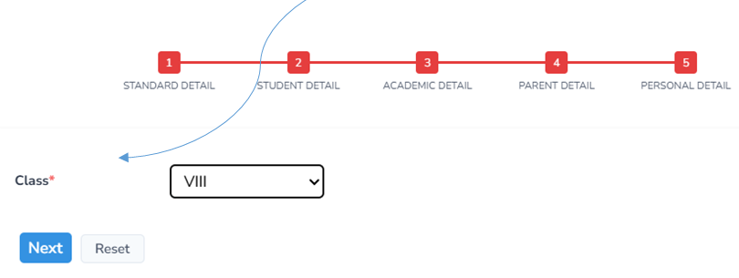
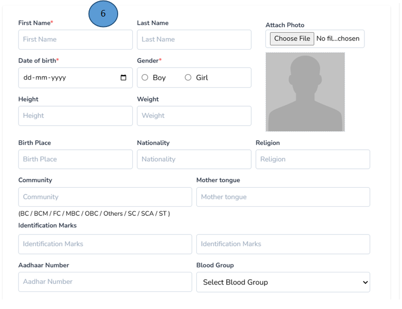

# Admission management 
 

1.	Click settings from the left pane

2.	Click School details from the side menu

3.	Click edit on the right corner 

4.	Change the admission status such as Admission On/Off , Admission closed messages , Admission closes on and submit 

Note: Reset option is also available

5.	If you click view, the admission form will open . Fill all the details and click next

6.	A new form will open , record all the details in the form and click Next and complete all the procedures. Repeat the same procedure for all the new applicants 

