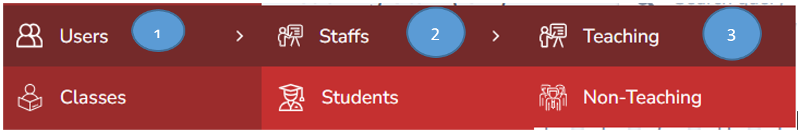
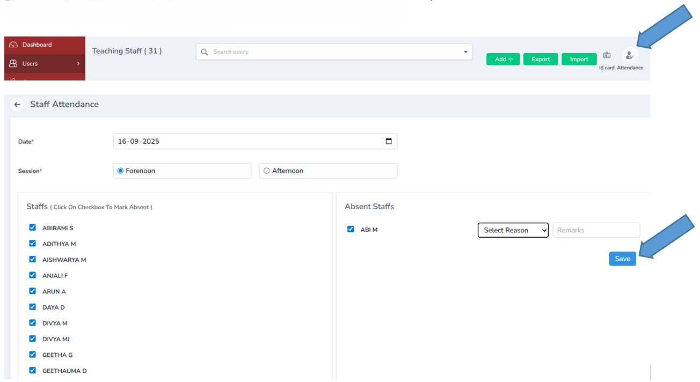
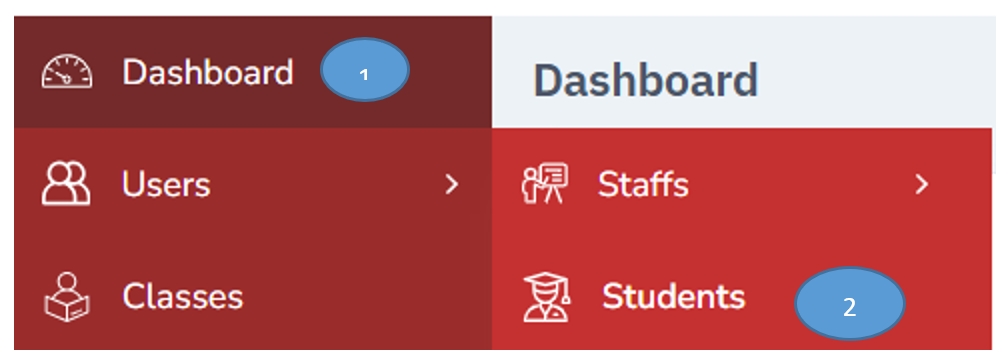
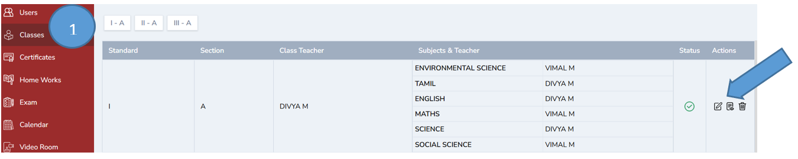
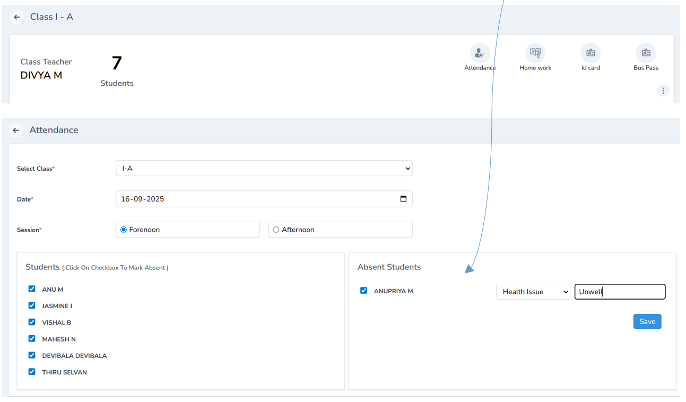

# Attendance Management

Easily manage student and teacher attendance digitally from the admin dashboard. Eliminate the need for paper registers, ensure visibility for everyone, and download detailed attendance reports anytime.

## For Teachers/Non- Teaching Staff

To mark attendance for teachers /non-teaching staff just click users -----staff ------ Teaching

Click attendance tab on the extreme right, select the date, session , name of staffs and mark the attendance by addressing the reason for leave and click save

NOTE: THE SAME PROCEDURE CAN BE USED FOR NON TEACHING STAFF.

---

## For Students

To mark student’s attendance click Classes -----click show icon on the action tab

Click attendance -------select class -----date and session -------select students ------address the reason for leave and click save

Attendance will get successfully updated in the student’s profile and a message will be sent to the parent in the parent’s app.

---
