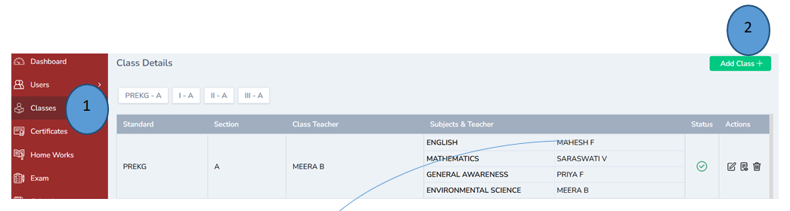
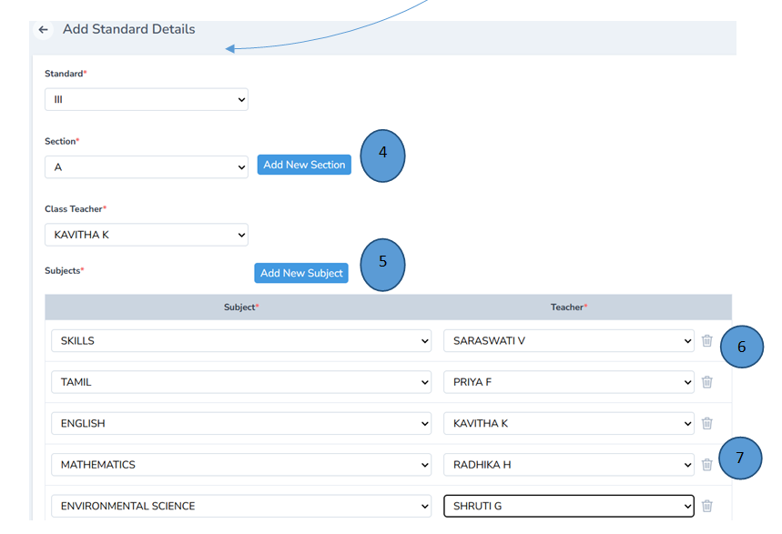

# Class and Section Management 

1. Click Classes from the left pane
2. Click add button on the right corner to add a new class 
3. Record all the details and click submit,a new class will be created 

4. A new section can also be added based on the requirement
5. A new subject can also be added based on the requirement
6. Teachers can be selected with the drop down menu
7. Teachers can also be deleted from the list if they are terminated/suspended or resigned 

