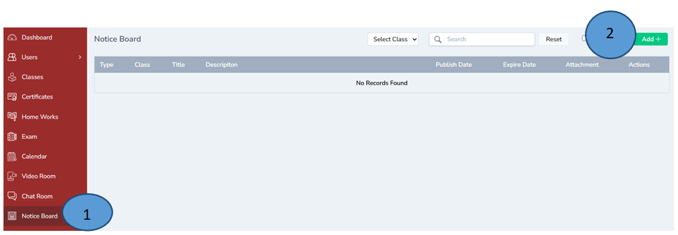
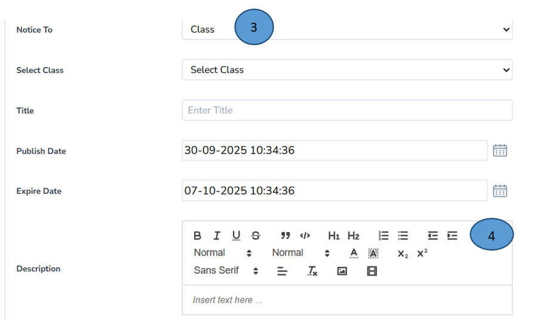
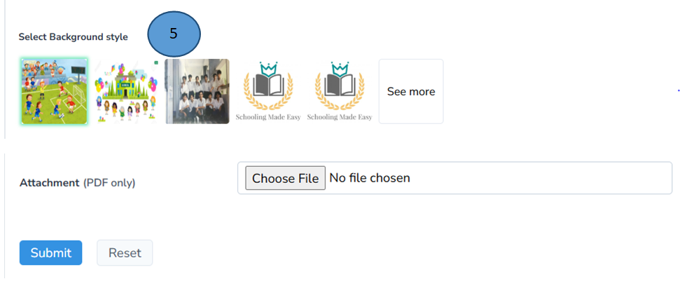
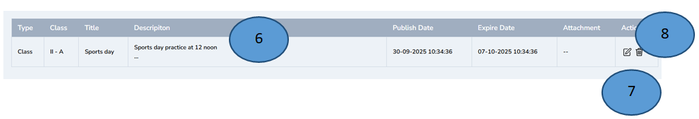

# Class wall Management  
 

1.	Click Notice board on the left pane 

2.	Click Add new tab on the right top and a new form will open 

3.	Select class from “Notice to tab” and record all the details 

4.	A short description can be typed, all the formatting can be done to make it attractive 

5.	Select the background style and click submit, a new notice will be published in the class wall in the parents mobile app

6.	All the notices published will be displayed here 

7.	Edit option is also available in the actions tab if you need any editing

8.	Delete option is also available in the actions tab 

