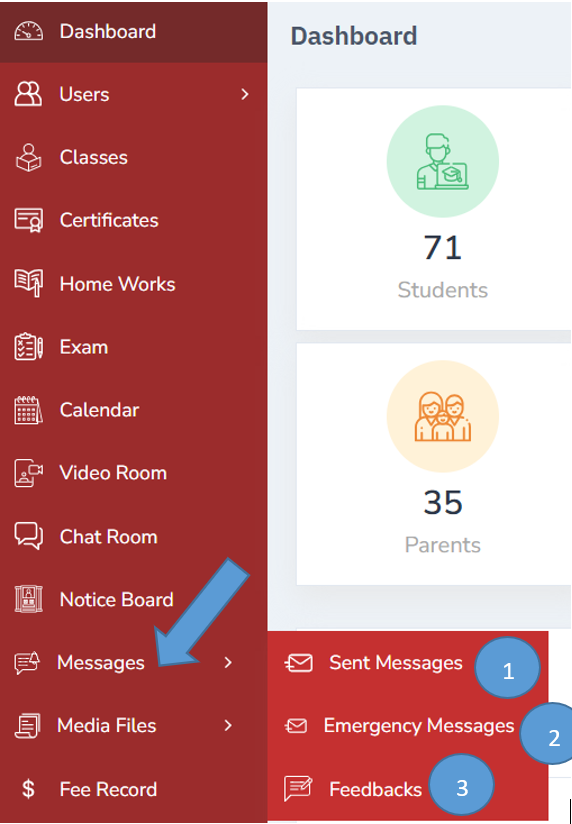
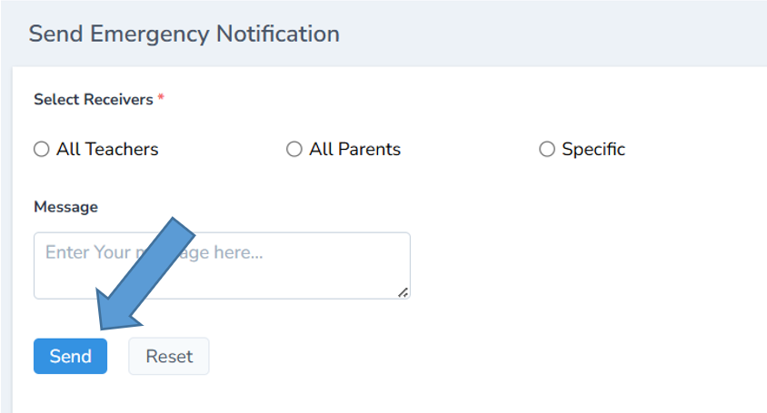
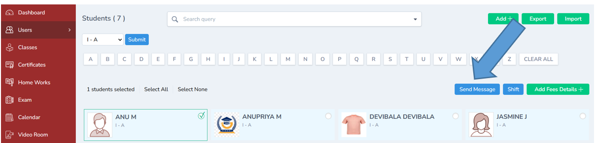
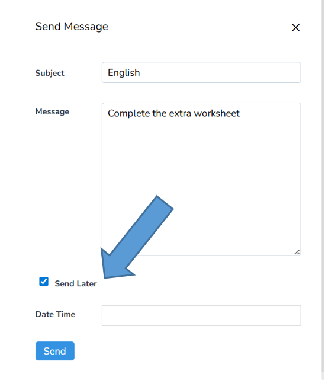

# Communication Management in School Management Software

Communication Management is a feature that helps schools share information instantly and securely with students, parents, and staff through one central platform. Instead of relying on paper notices or scattered WhatsApp groups, everything is handled directly in the software.

Click messages -----Click emergency messages

1. The messages sent through the software can be viewed
2. Emergency messages can be sent to only teachers, only parents or it can be sent specifically
3. Feedback received from the parents /Guardian can be viewed

To send emergency messages click emergency notification from the messages tab and fill all the details and click send. The messages will be delivered immediately. A notication will be received in the teachers/ parents app.

Message can be directly sent to the student through the student profile

Click users ---- students -----select class ---- select particular student ----- click send message

Record all the details and click send if you want to send it immediately to the parent’s app.

Note: Send later option is also available to schedule the message by entering the date and time.

---
