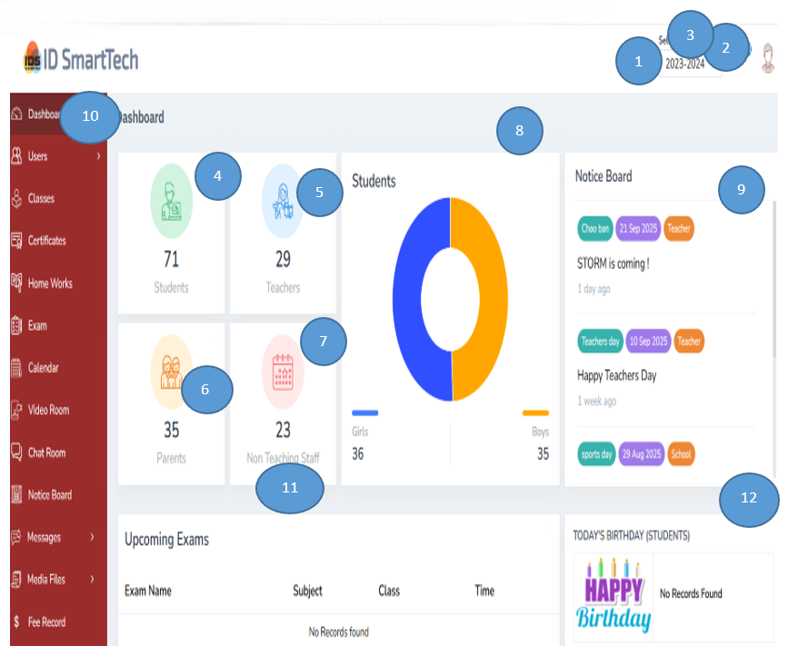
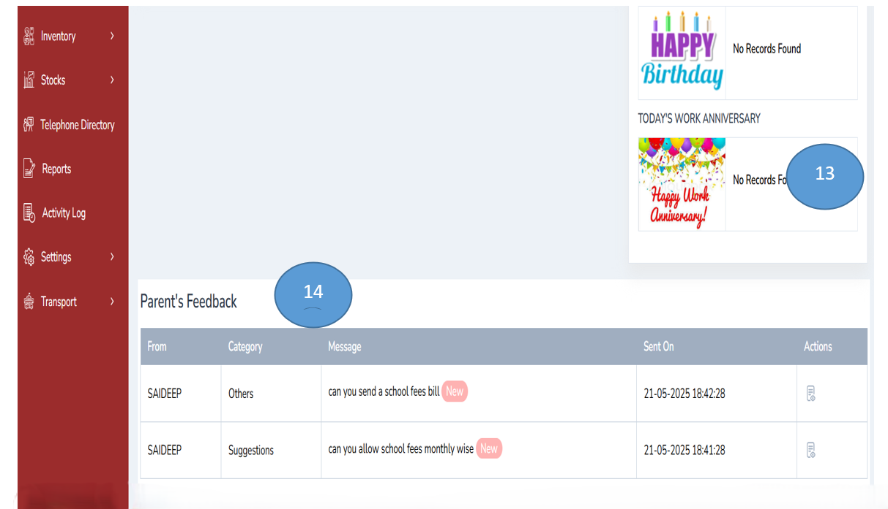
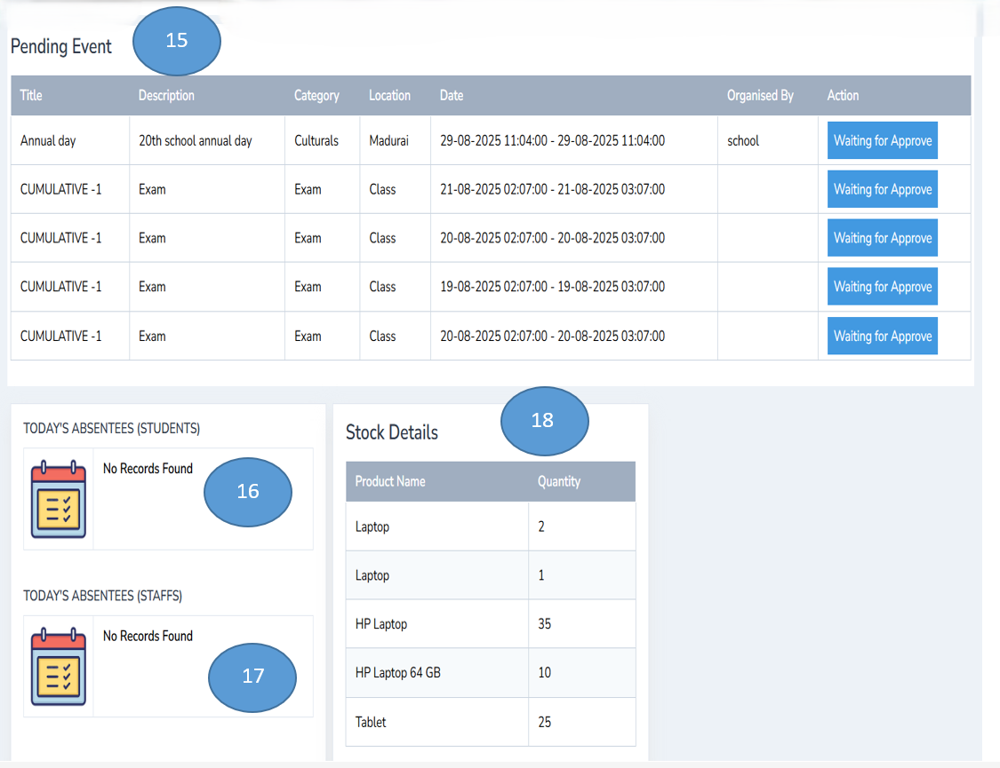
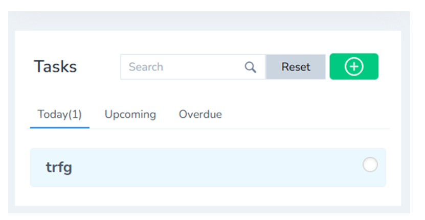
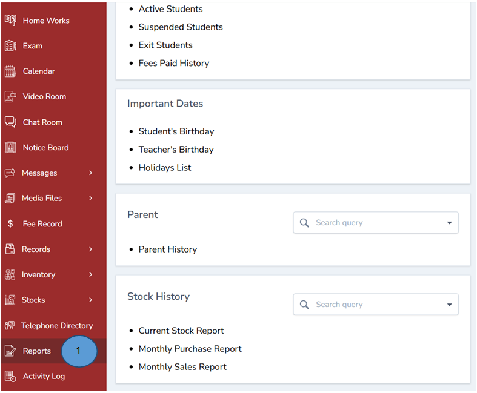
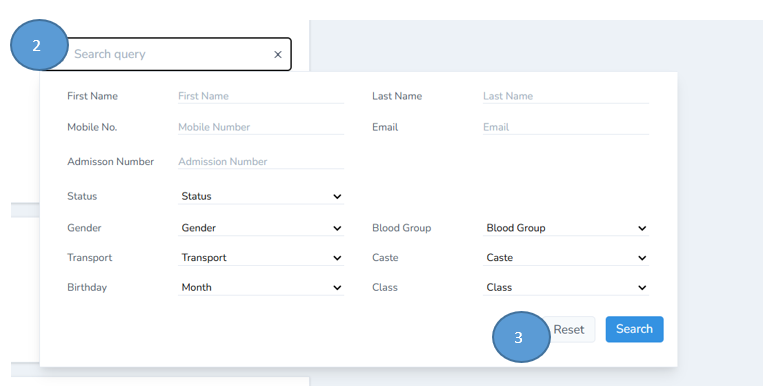
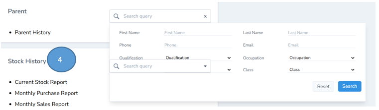

# Dashboard management and reports

The dashboard provides an overview of the entire portal. Any changes or updates made across various modules are summarized and displayed here for quick reference.

1. **Change Academic Year** – The academic year can be updated as required.

2. **Unread Notifications** – A list of all unread notifications is displayed for quick reference.

3. **Edit School Profile** – School profile information can be updated directly from the dashboard.

4. **Total Students** – The total number of students enrolled is displayed.

5. **Total Parents** – The number of parents registered on the portal is displayed.

6. **Non-Teaching Staff** – Total number of non-teaching staff present in the portal is shown.

7. **Student Gender Ratio** – The ratio of boys to girls is displayed for better insights.

8. **Upcoming Events** – Events scheduled in the near future are displayed on the dashboard’s notice board.

9. **Module List** – The left pane shows the list of all available modules for easy navigation.

10. **Work Anniversaries** – Teaching and non-teaching staff work anniversaries are displayed.

11. **Parent Feedback** – Feedback received from parents is displayed for quick action.

12. **Forthcoming Events** – Upcoming school events are displayed for planning purposes.

13. **Daily Student Attendance** – The total number of students absent for the day is shown.

14. **Daily Staff Attendance**– The total number of staff absent for the day is displayed.

15. **Stock Details**– Total number of items or stock details are displayed.

16. **Tasks Overview**– Tasks to be done, upcoming tasks, and pending items are displayed.

17. **Upcoming Exams**– The schedule for forthcoming exams is displayed on the dashboard.

18. **Student Birthdays**– Birthdays of students are displayed for the day

## Report Management

1. Click reports from the left pane different types of reports can be generated.

2. You can search for query using different filters and sort the answer using search button

3. The same process can be used for parent search and stock search

4. You can view the stock history

