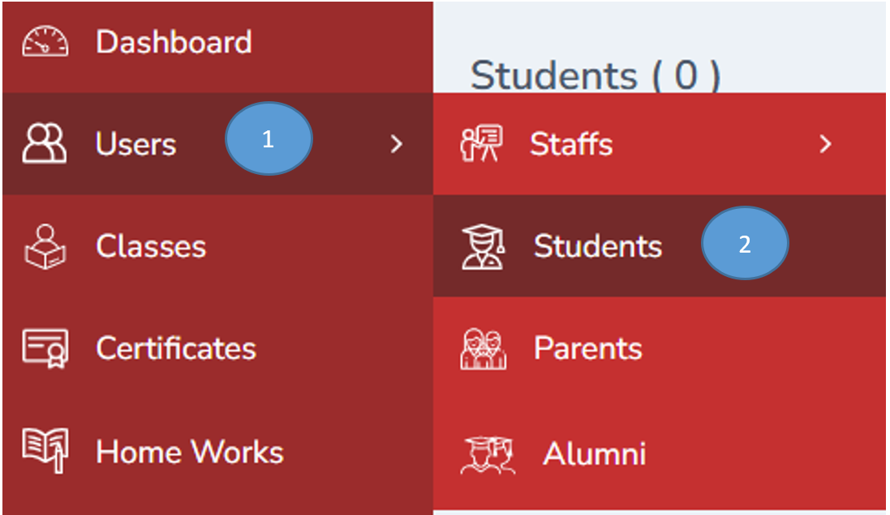
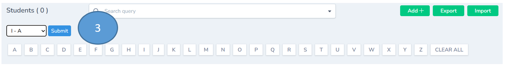
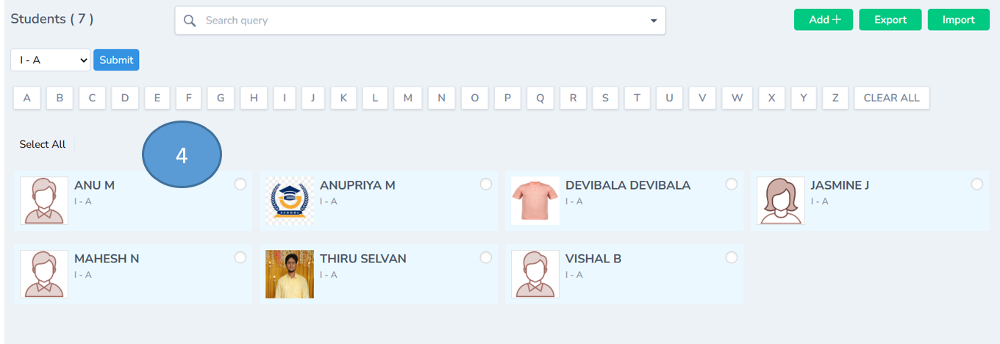
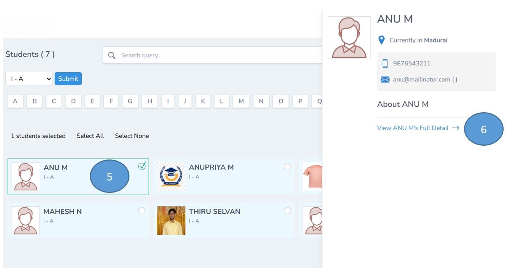
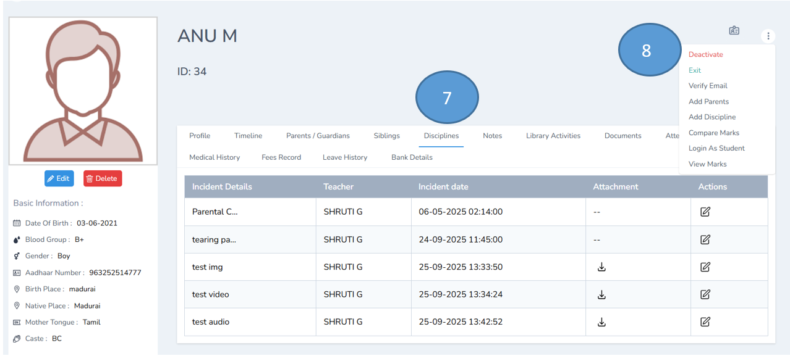
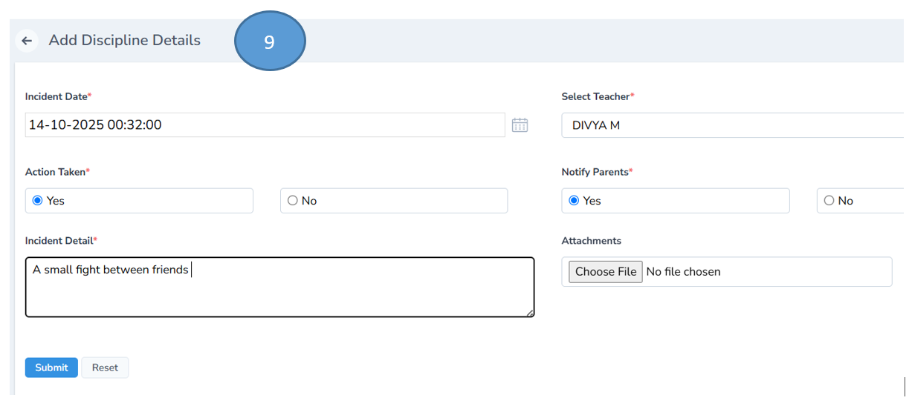
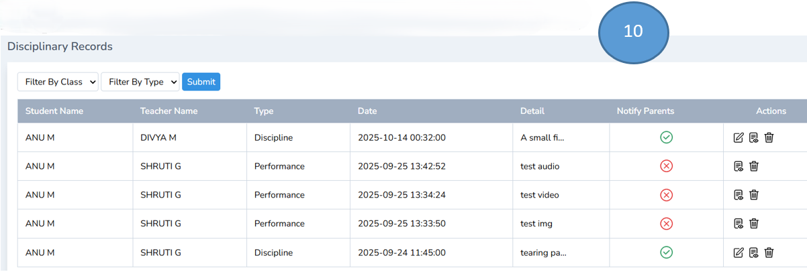
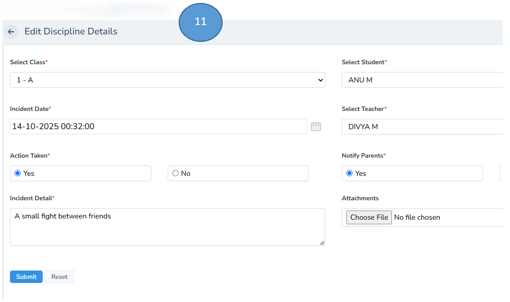
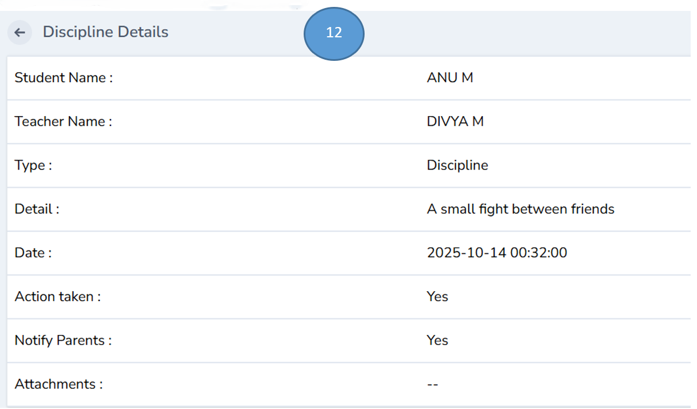
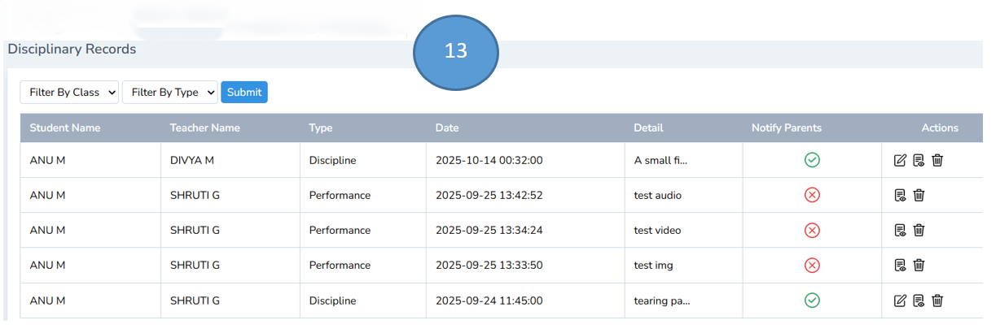

# Disciplinary Record Management

1. Click users from the admin dashboard and

2. Click students from the sub menu

3. Select the class and click submit

4. A list of students from the respective class will be displayed

5. Select the student and double click on the profile

6. Click view the complete profile

7. Click Discipline tab

8. Click the 3 dots on the right top and click add discipline

9. Add all the details in the form and click submit

10. Disciplinary record will be updated in the students’ profile as listed below

Note : If necessary parents can be notified
Filter are also available to short list

11. Click for Editing the records

12. Click view to see the complete record

13. Click Delete if you want to delete it

