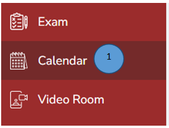
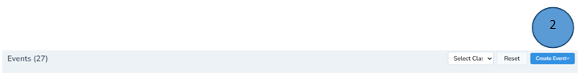
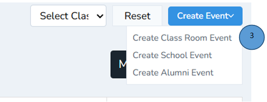
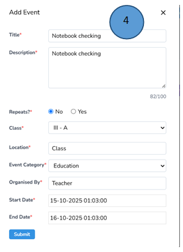
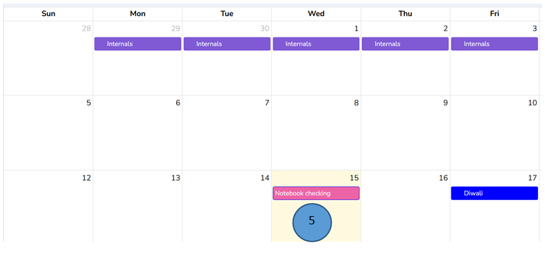

# Events & calendar Management

1.	Click calendar from the left pane of the admin dashboard 

2.	Click Create Events on the right top corner 

Note: Event can be classroom event, School event or Alumni event

3.	Click Classroom Event from Create event tab

4.	Fill all the details and click submit 

 

5.	Classroom event will be listed in the calendar as shown below

 

Note: The same procedure will be applied for School Event and alumni event . All the events will be listed in the digital school calendar

