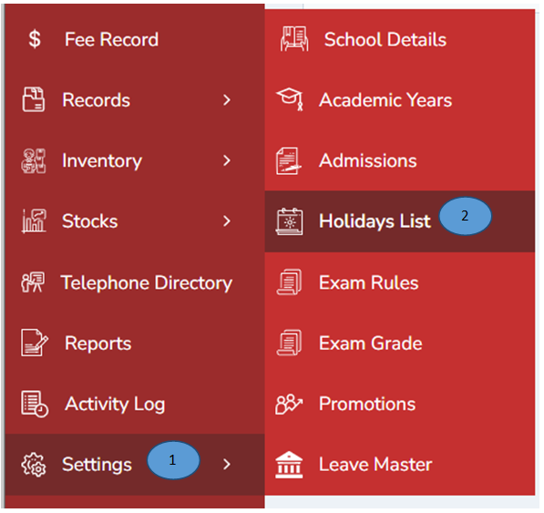
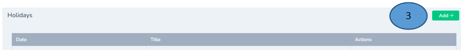
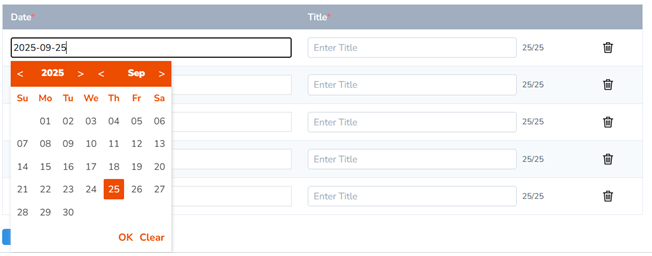
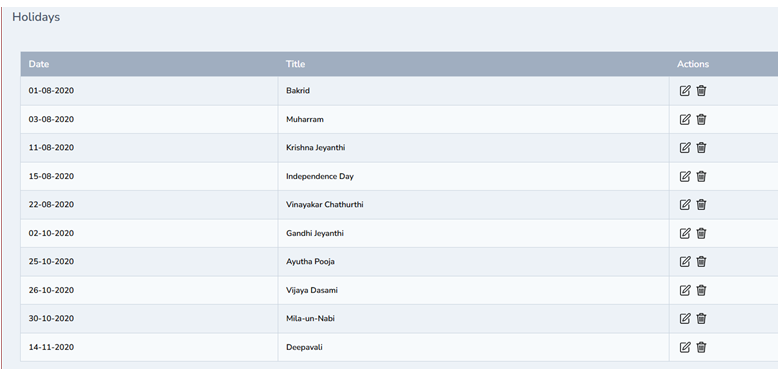

# Holiday list 
 

1.	Click settings from the left pane 

2.	Click Holiday list from the side menu

3.	Click Add tab on the right top to add the list of holidays, record all the holidays by marking in the calendar and fill the title and click submit. 

Note: Delete option is also available if you wanted to delete the same

4.	The list of holidays will be displayed to all the parents & teachers in the mobile app. 

