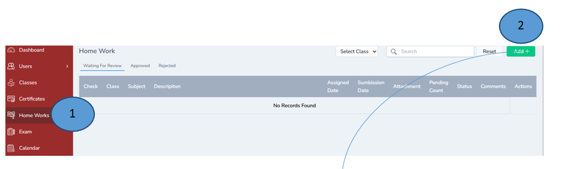
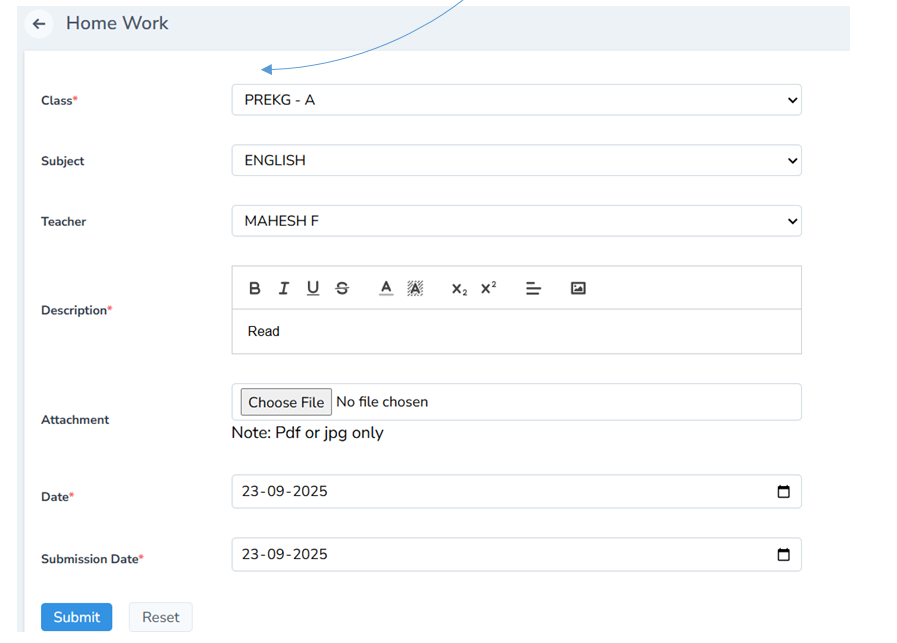
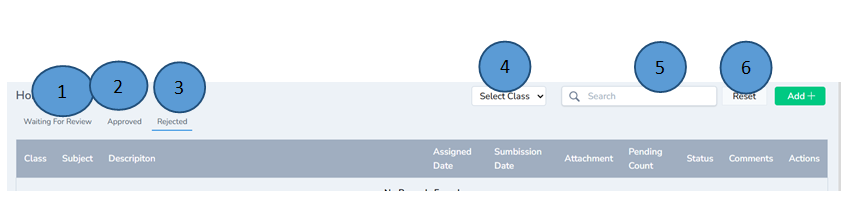
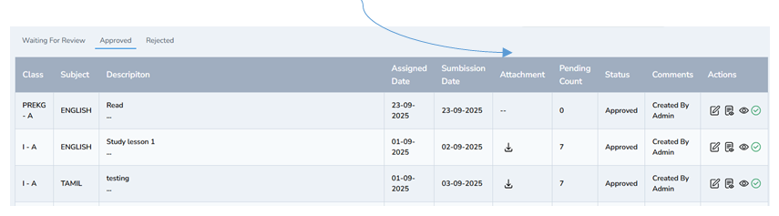

# Homework Management 

1.	Click Homework from the left pane 
2.	Click add button on the right corner to add the homework 

Note : Class wise homework can be given . Once the Homework is approved the same will be sent to the parent’s app immediately.

1.	Once the homework is added the same will be sent to the admin for approval
2.	Once admin approves the homework the same will be listed down the approved tab as shown down 

3.	Homework can also be rejected if there are any corrections or changes required. 
4.	Homework can be assigned based on the class wise
5.	Search option is also enabled 
6.	Reset tab is also enabled 

