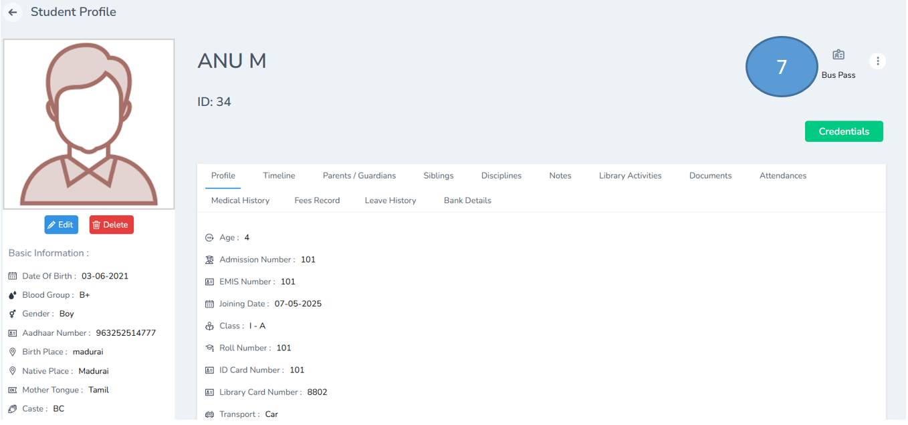
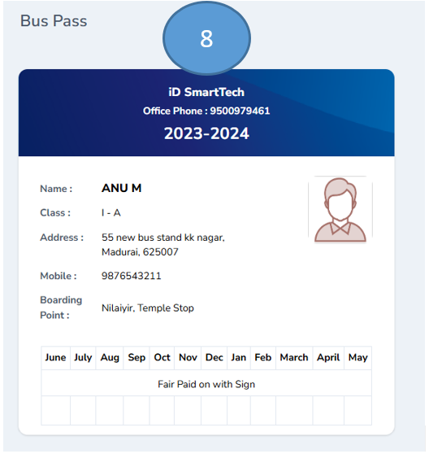
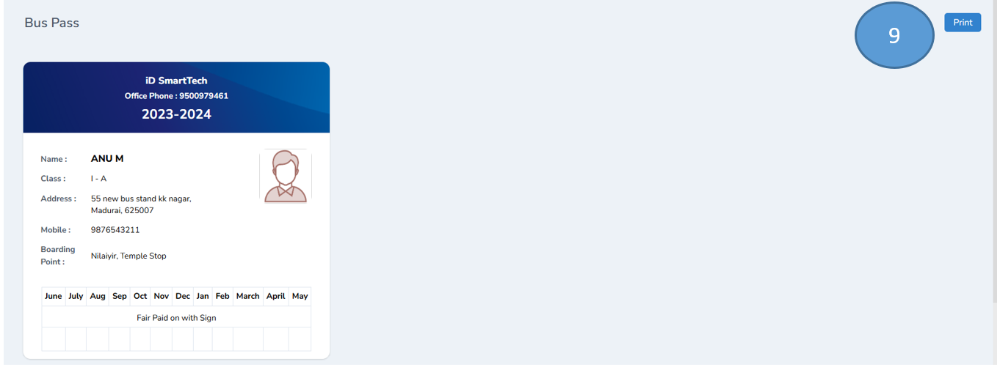

# ID Card and Bus Pass Generation

1. Click users from the admin dashboard and

2. Click students from the sub menu

3. Select the class and click submit

4. A list of students from the respective class will be displayed

5. Select the student and double click on the profile

6. Click view the complete profile

7. Click Bus pass on the extreme right corner

8. The bus pass will be generated

9. Click print on the right corner for distribution

