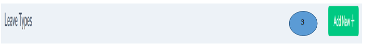
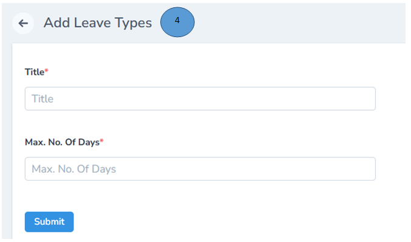
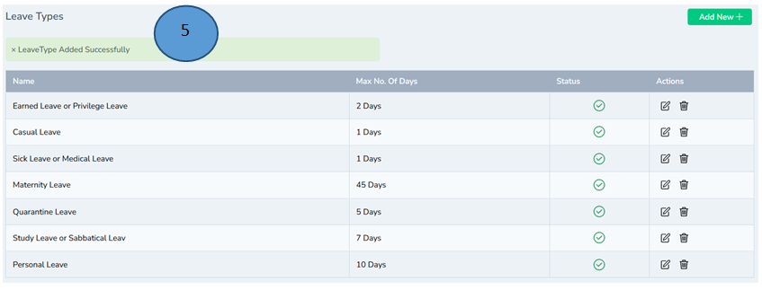

# Leave Master Management 
 

1.	Click settings from the left pane 

2.	Click Leave master from the side menu 

3.	Click Add new on the right top corner to list down the different types of leave like casual leave(CL), Maternity leave(ML), Personal leave (PL) etc

4.	Fill all the details and click submit. The leave will be updated in the portal and the same will be displayed in the staff’s mobile app

5.	The added leave will be updated and listed down. 

Note: Edit and delete option is available if there are changes needed

