# Leave Management and Staff Attendance

## Module Overview

GegoK12 combines **Leave Management** and **Staff Attendance** so schools can:

- Define their own **leave types and rules** (e.g., CL, SL, ML).
- Allow **Teachers** to apply for leave online via web or mobile.
- Let **Principals** approve/reject leave and ensure academic continuity.
- Ensure **Admins** mark staff attendance daily with **two sessions – Forenoon & Afternoon.**

 **Important:**

   - **Leave Master** is typically configured **once per academic year** and then used throughout.
   - **Attendance** is updated **every working day.**

## Leave Master Settings (Admin)

### Purpose

The **Leave Master** controls the list of **leave types** available in your school (e.g., Casual Leave, Sick Leave, Maternity Leave). These types appear in:

- Teacher leave application screens

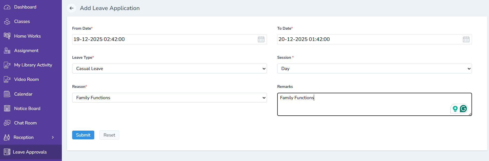

- Principal approval screens

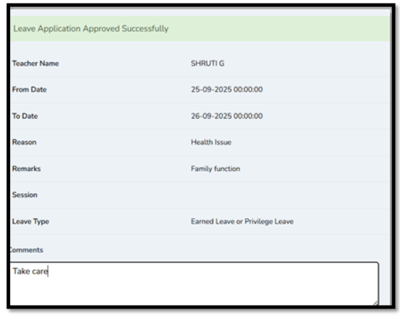

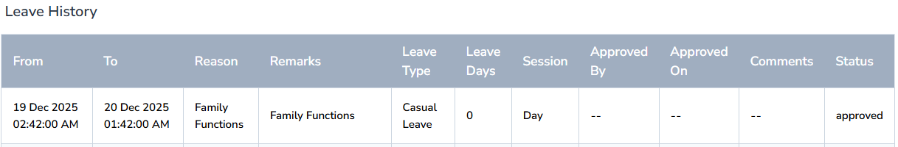

The **Admin** configures this **once per year** or whenever leave policies change.

### Role & Access

- **Role of logged-in user: Admin / System Administrator**
- **Login using:** Admin credentials created during onboarding

Only users with Admin rights can access **Settings → Leave Master.**

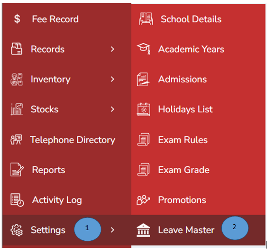

### Accessing Leave Master

**1.Log in as Admin**
_ Open your GegoK12 Admin URL in the browser.
- Enter your **Admin username and password.**
- Click **Login.**

**2.Open the Settings module**

- After login, you will land on the Admin Dashboard.
- In the **left pane** (sidebar), locate and click **“Settings”.**

**3.Open Leave Master**

- Under Settings or Core Modules, click **“Leave Master”.** The system loads the **Leave Master List View.**

### Understanding the Leave Master List View

The **Leave Master List** View typically shows:
- **Leave Name** – Full name (e.g., “Casual Leave”).
- **Short Code** – Shorthand (e.g., “CL”).
- **Max Days / Year** – If configured..
- **Actions** – Edit / Delete icons.

This page also has an **“Add New”** button at the top-right to create new leave types.

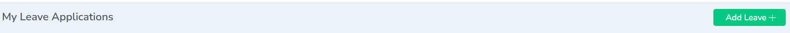

### Adding a New Leave Type (Extended Form)

**Role of logged-in user:** Admin

1. Click **“Add New”**
- On the **top-right corner** of the Leave Master list, click the **“Add New”** button.
- A **Leave Type Add Form** opens.

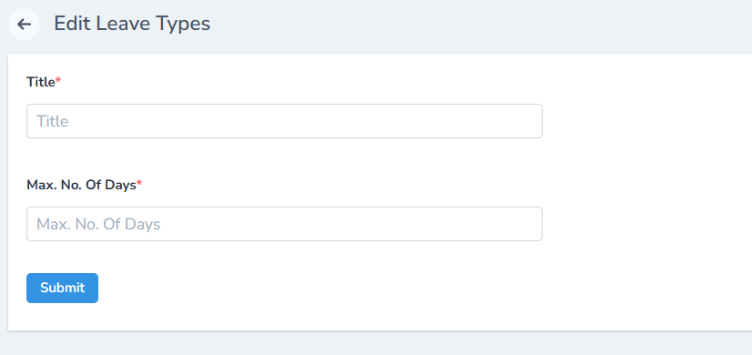

**2. Fill in the Leave Master fields (Extended Form)**

Typical fields in the extended one-time yearly setup are:

**Leave Name**
   - Example: “Casual Leave”, “Sick Leave”, “Maternity Leave”.

**Short Code**
   - Example: CL, SL, ML – used in reports and quick views.

**Description**
   - Explain when this leave can be used.
   - Example: “Short-term personal work”, “Medical reasons only”, etc.

**Maximum Days / Year**
   - Set the **maximum number** of days allowed per academic year.
   - Example: “12” days/year for Casual Leave.

   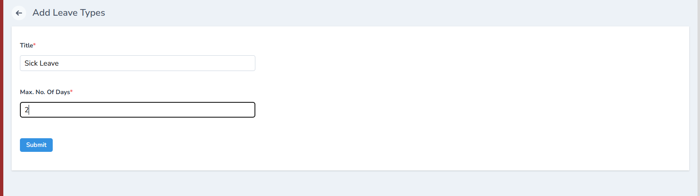

**3. Submit the Leave Type**

- After filling all details, click **“Submit”.**
- The system:
   - Validates required fields.
   - Saves the new leave type.
   - Returns to the **Leave Master List.**

   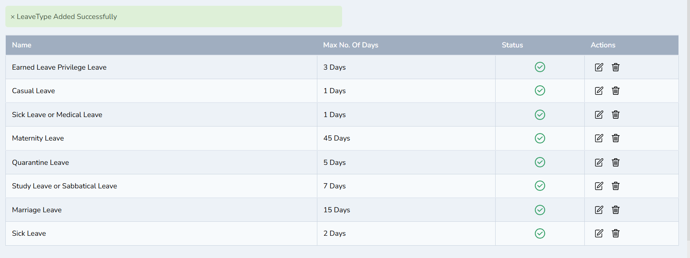

**4. Verify the Leave Type in the List**

- Confirm that the new leave appears in the **Leave Master List.**
- Check:
   - Name & Short Code
   - Max Days / Year
   - Paid / Carry Forward flags
   - Status = Active

**5.Effect on Teachers & Mobile App**

- Once configured:
   - The leave types become available in the **Teacher’s Leave Application** form.

 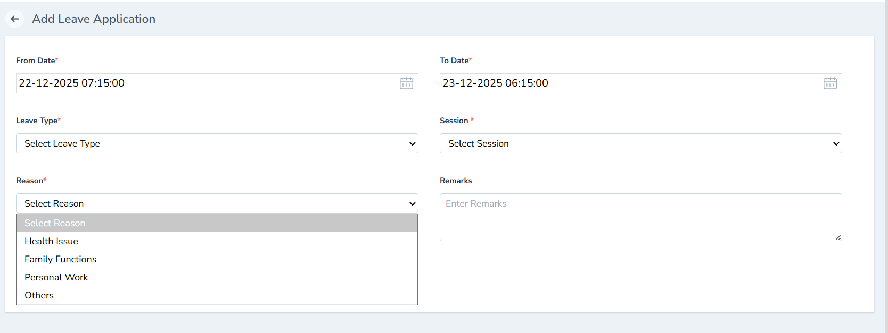  

The same leave types are reflected in the **Teacher mobile app leave** screen.

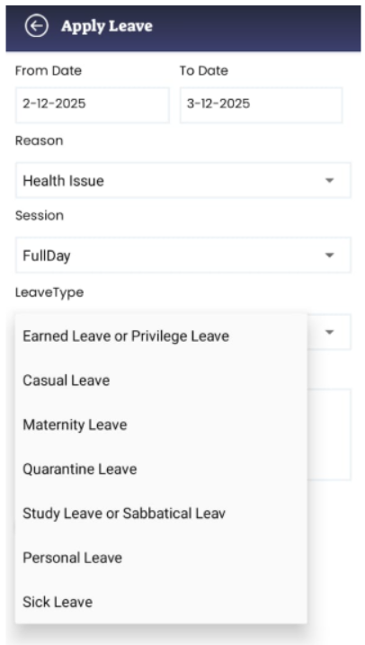

### Editing or Deactivating a Leave Type

**Role of logged-in user:** Admin

**1.Locate the leave type in the list**
Go to **Settings → Leave Master.**

Find the row for the leave you want to modify.

**2.Edit a Leave Type**

 - Click the Edit icon in the Actions column.
 - Update fields like:
    - Max Days / Year
    - Description
   - Status (Active/Inactive)
 - Click **Submit** to save changes.

 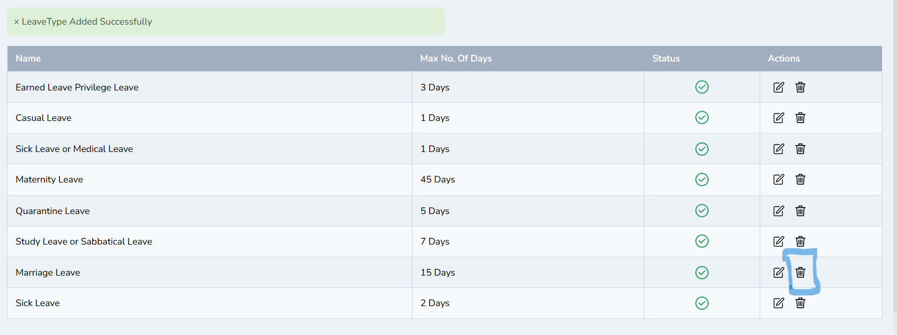

**3.Delete a Leave Type (Use with Caution)**

- Click the **Delete** icon if it is a newly added type not yet used.
- Confirm deletion when prompted.

## Teacher Leave Application (Teacher)

### Purpose

Teachers can apply for leave **online** instead of using paper forms. All submissions are recorded and routed to the **Principal** for approval. The available Leave Types come from **Leave Master.**

### Role & Access

**Role of logged-in user: Teacher**

**Login using:** Teacher email and password provided by Admin

### Logging in as Teacher

1.Open the **Teacher portal URL** in your browser or open the **Teacher App.**

2.Enter:
- **Username** – Email address assigned by Admin
- **Password** – Default or updated password

3.Click **Login.**

After successful login, the system opens the **Teacher Dashboard.**

### Opening the Leave Module

1.From the **Teacher Dashboard**, locate the **Leave** option in the main menu or tile view.

2.Click **Leave** to open the **Leave screen.**

3.On the **Leave screen,** you will usually see:
 - A list of previously applied leaves (with Status).
 - A button at the top-right: **“Add Leave”.**

 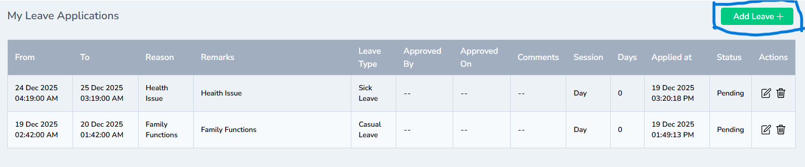

### Applying for a New Leave

**Role of logged-in user:** Teacher

**1.Click “Add Leave”**

- On the top-right of the Leave screen, click **“Add Leave”.**
- A **Leave Application Form** opens.

**2.Fill in Leave Details**
In the Leave Application form, enter:

 **- Leave Type**
 - These values come from Leave Master configured by Admin.

 - Select from the dropdown (CL, SL, PL, ML, etc.)

**- Start Date**
  - Choose the first day of your leave from the date picker.

**- End Date**
- Choose the last day of your leave.
- For a one-day leave, Start Date = End Date.

**- Reason for Leave**
- Provide a clear reason (e.g., “Medical appointment”, “Family emergency”, “Exam duty”, etc.).

**3.Review & Submit**
 - Double-check **dates, leave type,** and **reason.**
 - Click **“Submit”.**

**4.After submission:**

The system stores the leave request.

The initial Status is set to **Pending.**

The request becomes visible in the **Principal’s Leave Approval** screen.

### Viewing Leave History & Status

1.Go to **Leave → Leave History** (tab or link, depending on UI).

2.The history screen shows:
- Date range of each leave
- Leave Type
- Reason
- Status:
   - **Pending** – Waiting for Principal’s action
   - **Approved** – Approved by Principal
   - **Rejected** – Rejected by Principal

**3.Using Mobile App**

The same leave details and statuses are visible in the **Teacher Mobile App** under the Leave section.

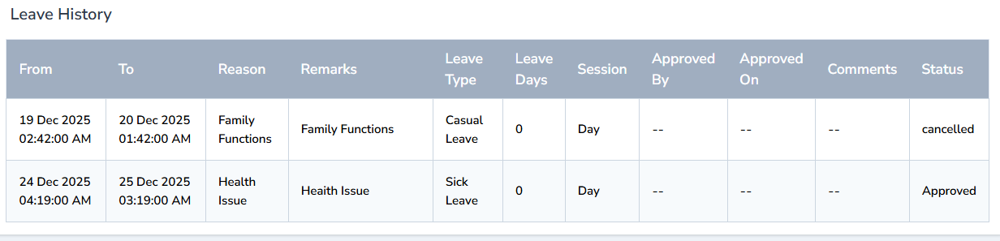

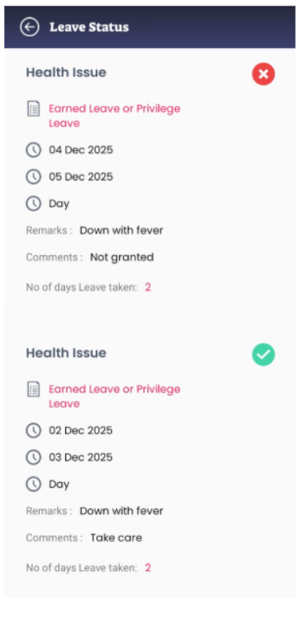

## Principal Leave Approval (Principal)

### Purpose

The **Principal** is responsible for **approving** or **rejecting** leave requests submitted by teachers, taking into account timetable, exams, and academic continuity. Once the Principal acts, the teacher is notified and the record is updated.

### Role & Access

**Role of logged-in user: Principal**

**Login using:** Principal credentials created by Admin

### Logging in as Principal

1.Open the **Principal Portal URL.**

2.Enter **Principal username and password.**

3.Click **Login.**

After login, you land on the **Principal** Dashboard.

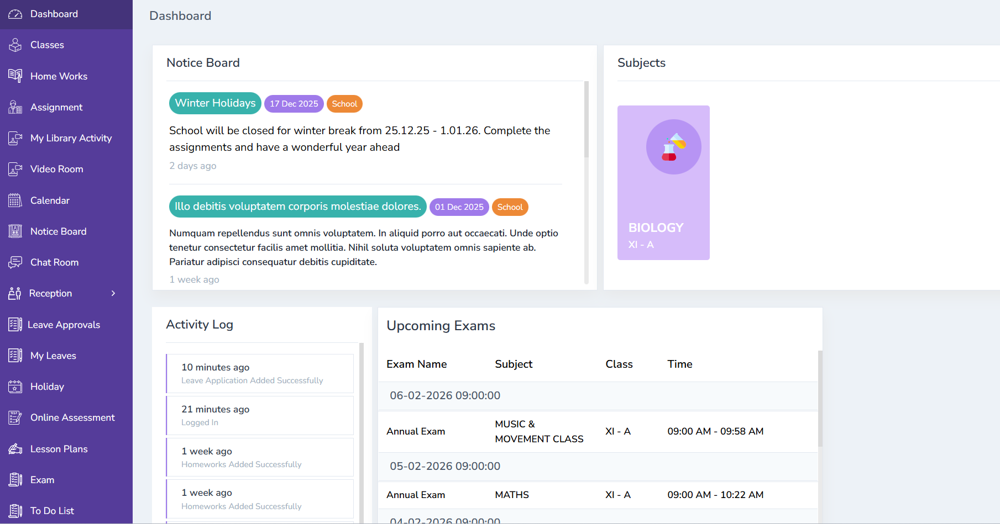

### Opening the Leave Approvals Screen

1.Locate the **left-side menu.**

2.Click **“Leave Approvals”.**

3.The **Leave Approval List View** appears with all **Pending** requests.

### Understanding the Leave Approval List

Each row typically contains:

 - Teacher Name
 - Leave Type
 - Start Date – End Date
 - Reason
 - Status (Pending / Approved / Rejected)
 - Action (icons for Approve / Reject)

### Approving or Rejecting a Leave

**Role of logged-in user:** Principal

**1.Review the Leave Request**

- Read the **Leave Type, date range, and reason.**

- Optionally check teacher’s timetable or other workload if needed.

**2.Approve a Leave**

- Click the **✔ (tick) icon** in the Action column for that row. 

The system:

  - Updates Status to **Approved**
  - Makes the approval visible in the teacher’s **Leave History.**

  

**3.Reject a Leave**

- Click the **✖ (cross) icon to Reject** the leave. 

- The system:
  - Updates Status to **Rejected.**
  - Sends a **notification** to the teacher (applier) about the rejection as per your note.

  

**4.Effect on Teacher View**

 - Teacher’s **Leave History** now shows Status = **Approved or Rejected** for that request. 
 - The teacher can also see the updated status in the **Mobile App** where applicable.

 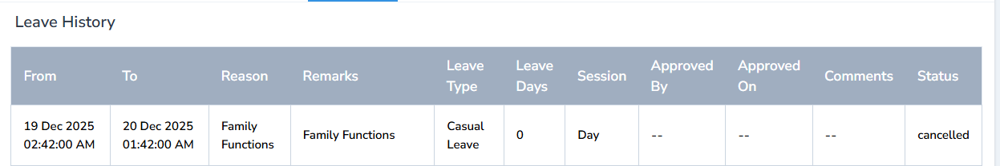

This completes the **Leave workflow:**

**Admin → Teacher → Principal**

1.Admin defines leave types in Leave Master

2.Teacher applies for leave

3.Principal approves/rejects the request

## Staff Attendance Management (Admin)

### Purpose

While the leave module manages **individual absences with approval, Staff Attendance** records** daily presence/absence** of all teaching staff. In your configuration, attendance is marked for **two sessions:**

**- Forenoon (FN)**

**- Afternoon (AN)**

This is done by **Admin,** not by Principal or Teacher. 

### Role & Access

**- Role of logged-in user: Admin / Office Admin / HR** (whoever manages staff attendance)

**-Login using:** Admin-level credentials with access to **Users → Staff.**

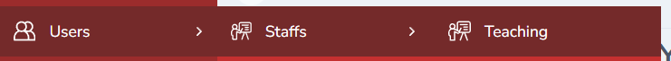

### Opening the Teaching Staff List

1.Log in as **Admin.**

2.From the **left sidebar,** click **“Users”.**

3.Under Users, click **“Staff”.**

4.Click **“Teaching”** to view all teaching staff. 

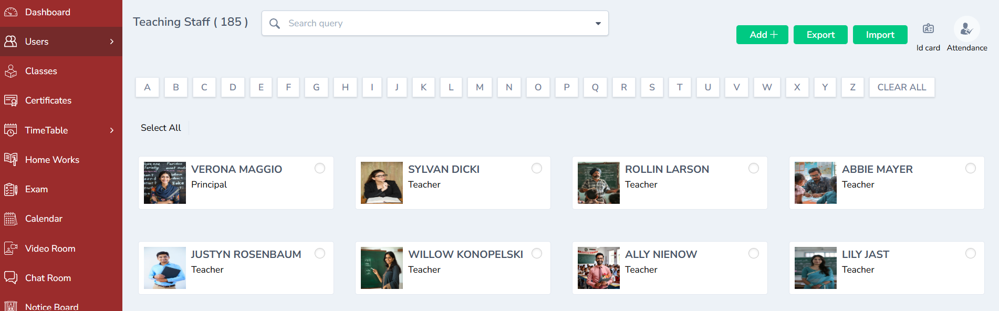

The Teaching Staff List shows all staff for whom you will mark attendance.

### Opening the Attendance Entry Form

1.On the **top-right corner** of the Teaching Staff List page, click the **“Attendance”** button. 

2.The system opens a **new attendance entry form.**

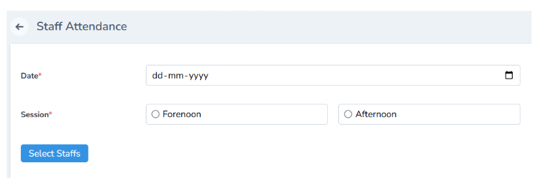

### Selecting Date and Session (Two Sessions)

In the Attendance Entry form:

**1.Select Date**
 - Click on the **date picker.**
 - Choose the date for which you are marking attendance (usually today).

**2.Select Session**

Choose one of:

**- Forenoon** – morning session

**-Afternoon** – afternoon session

**-(If configured) Full Day** – where needed

3.The system records attendance **session-wise,** so you may repeat this process twice daily (FN & AN) if required. 

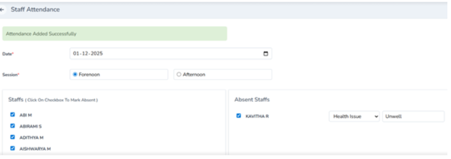

### Marking Present & Absent Staff

**Role of logged-in user:** Admin

**1.Default State – All Present**

- When the attendance form loads:
    - All teaching staff are **selected (checked)** by default, indicating **Present.**

**2.Marking Absentees**

- For any staff who are **Absent,** uncheck the box next to their name.

- As you uncheck, the **Absentees List** on the right automatically updates to show who is absent. 

**3.Cross-Checking Absentees**

- Use the **Absentees List** to verify:

   - Leave requests approved for that day

   - Unplanned absences
- Make corrections if necessary (re-check or uncheck boxes).

### Saving Attendance

1.After verifying:

**- Date**

**- Session (FN/AN)**

**- Absentees List**

2.Click **“Save”** to submit the attendance. 

- The system:

    &#9642; Validates the data.

    &#9642; Saves attendance for that date & session.

    &#9642; Confirms with a success message (e.g., “Attendance saved successfully”).

**3.Effect on Teacher Profile**

- Once saved:

    &#9642; The attendance entry is now visible in each teacher’s **Attendance tab** inside their profile.

    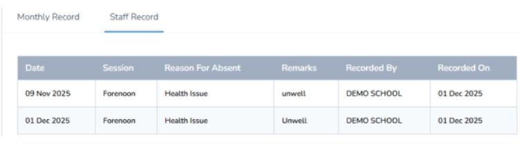 

- This can be used later for:

   &#9642; Monthly / yearly attendance reports

   &#9642; Payroll integration (if applicable)

## End-to-End Flow Summary

**1.Admin – Leave Master Setup**

- Configures extended **Leave Master** fields (Leave Name, Code, Max Days, Paid, Carry Forward, Status) once per academic year. 

**2.Teacher – Apply for Leave**

- Logs in as **Teacher,** opens **Leave → Add Leave,** selects type & dates, and submits. 

**3.Principal – Approve/Reject**

- Logs in as **Principal,** opens **Leave Approvals,** and uses **✔ / ✖** to approve or reject.

- If **rejected,** the **applier (teacher)** receives a **notification** and can see updated status. 

**4.Admin – Daily Staff Attendance**

- Logs in as **Admin,** opens **Users → Staff → Teaching → Attendance,** picks date & session (Forenoon / Afternoon), unchecks absentees, and saves.

- Attendance reflects in each teacher’s **Attendance tab.**