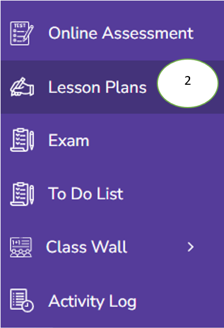
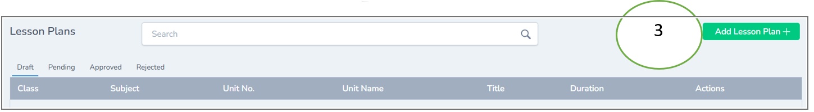
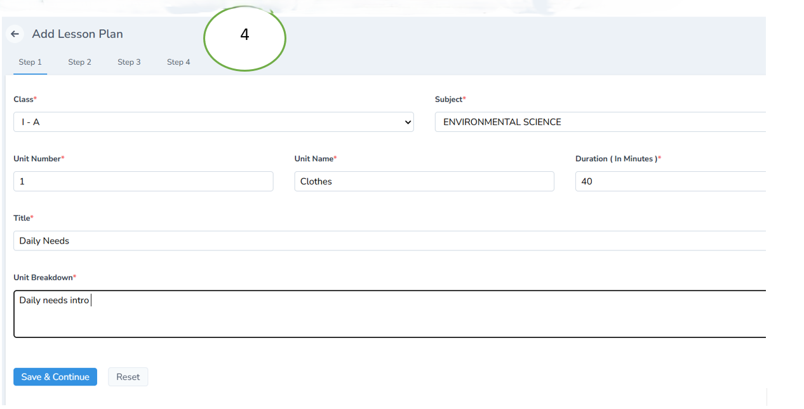
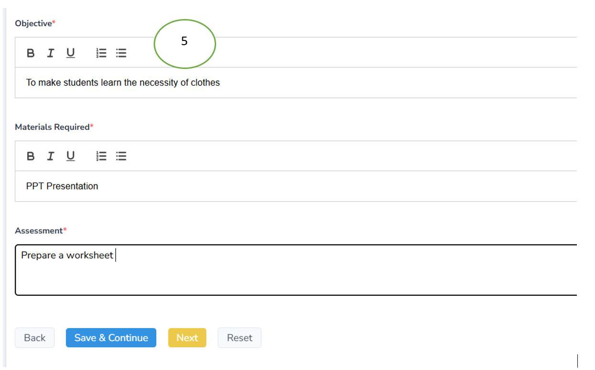
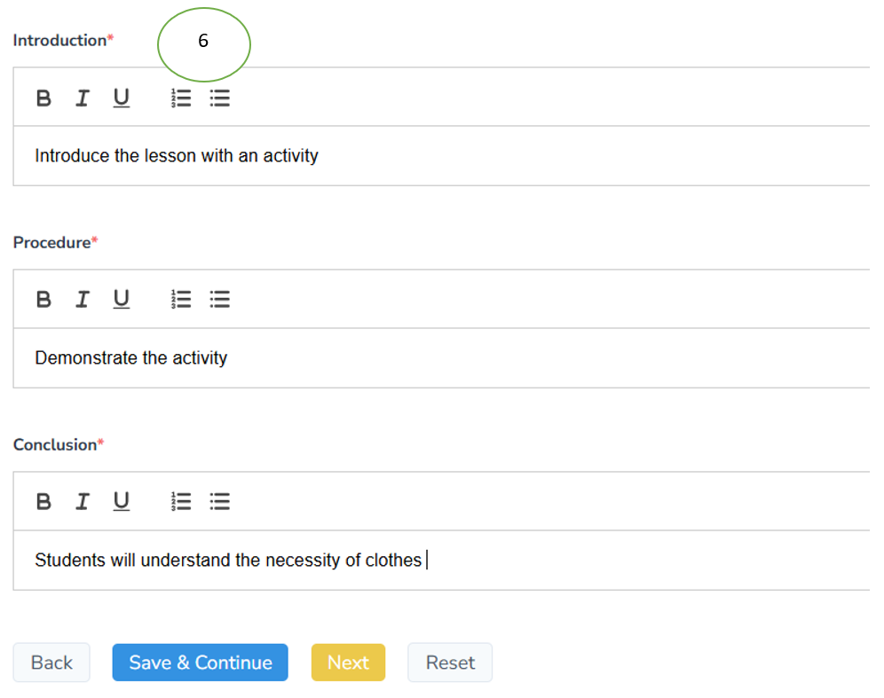
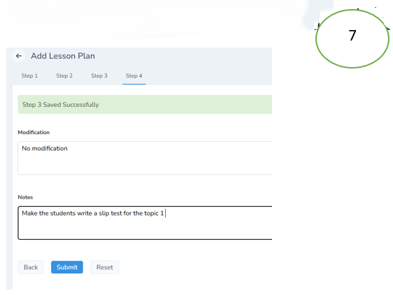
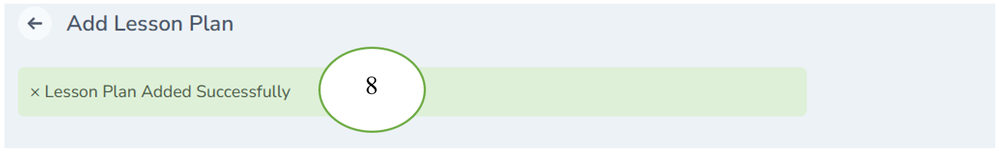

# Lesson Plan Management

1. Enter the teacher credentials and click login

2. Click Lesson plans from the left pane of the dashboard

3. Click “Add Lesson Plan” on the right corner

4. Fill all the details in the form and click save & Continue if you’re satisfied with it

5. Once the step 1 is saved succesfully, the step 2 form opens. Fill all the details correctly and click save & continue if not click reset

6. Once the step 2 is saved succesfully, the step 3 form opens. Fill all the details correctly and click save & continue if not click reset

7. Once the step 3 is saved succesfully, the step 4 form opens. Fill all the details correctly and click save & continue if not click reset

8. Lesson plan will be saved successfully and the parents can view the teacher’s lesson plan in their mobile apps

