# Library Management 

## Book Categories module     

1.	Login with the Library credentials and click Book Categories from the left pane 

2.	Click Add book on the right top corner 

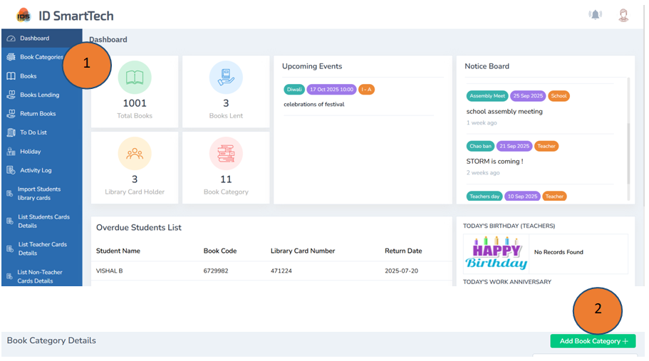

3.	Add the category of the book and click submit 

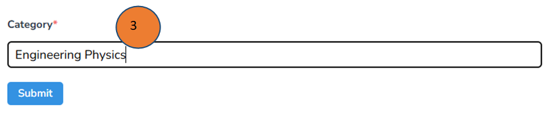

4.	The categories of the book will be listed as shown below

## Book Module 

1.	Click books from the left pane of the dashboard

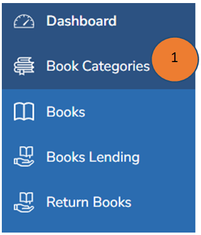

2.	Click Add books on the right side top corner. A new form will appear

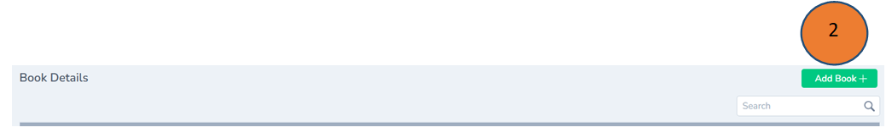

3.	Fill all the required details in the form and click submit. Book details will be saved successfully.

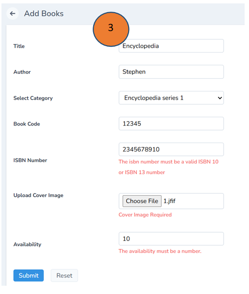

4.	The book details will listed as shown below in the book details module

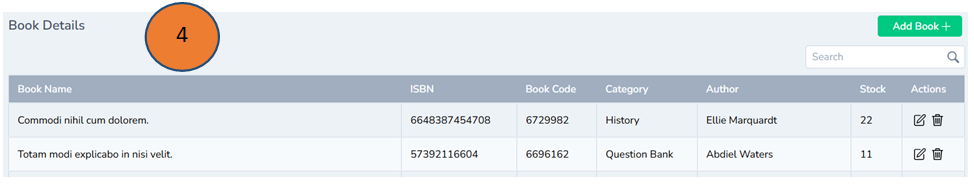

## Book Lending Management 

1.	Click Books lending tab on the left pane of the dashboard 

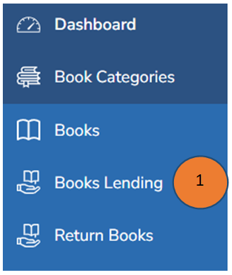

2.	Click add on the right top corner 

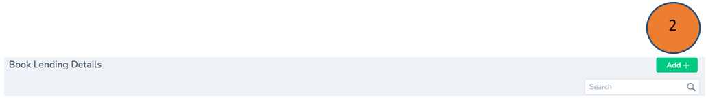

3.	Enter all the details in the form and click submit

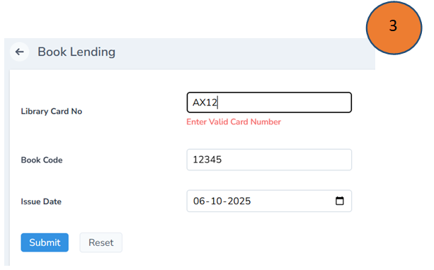 

4.	The book lending details will be shown as listed in the image

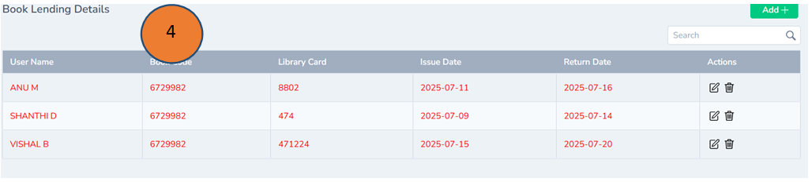 

## Return Book Management 

1.	Click Return books on the left pane 

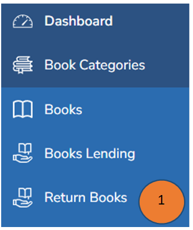

2.	Click Add button on the right top corner

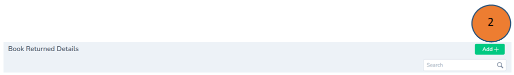 

3.	Record all the details in the form and click submit 

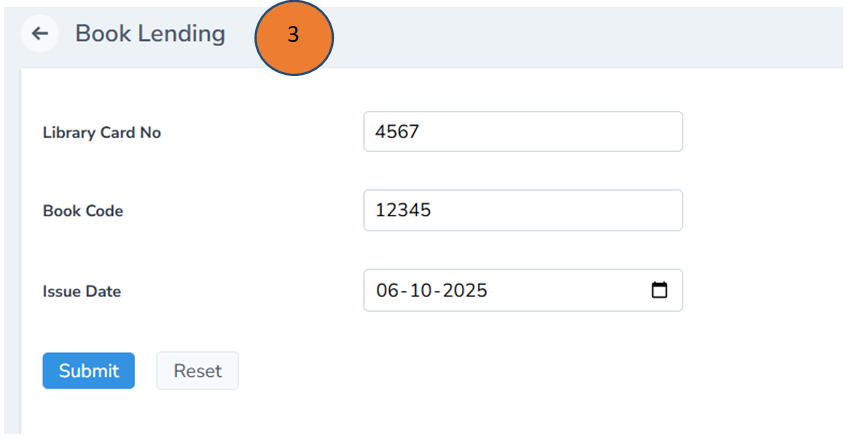

4.	Click Return books the Book return details will listed down as shown 

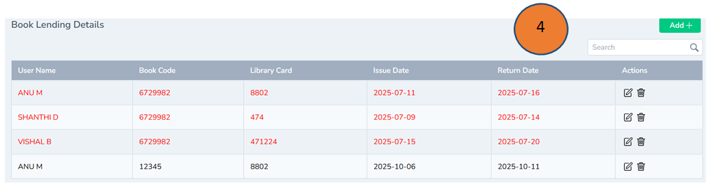

## To Do List Management

1.	Click to do List module on the left page of the dashboard

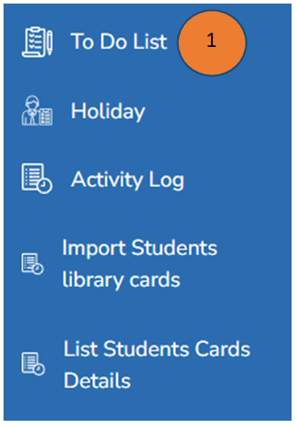

2.	You can add the tasks based on your preferences like assigned by me or assigned to me 

3.	If the tasks arecompleted, you can click completed button 

4.	If the tasks are in progress, then you can click active button 

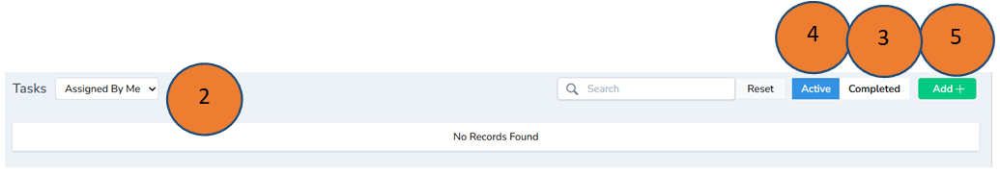

5.	Click Add button to add a task by filling all the details 

Note:  Reminders can be set 

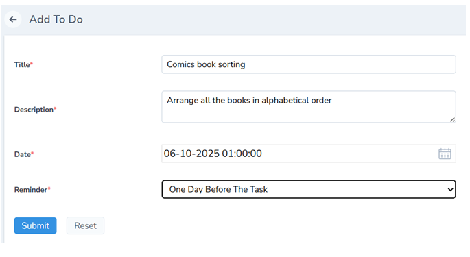

## Holiday List 

1.	Click Holiday list from the left pane of the dashboard

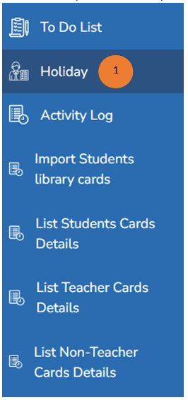

2.	The list of holidays will be displayed as shown below

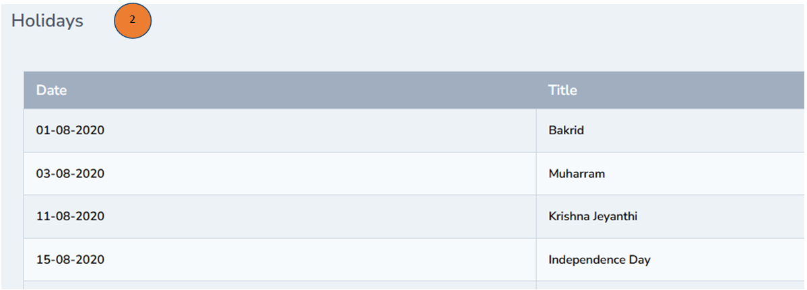

## Activity Log 

1.	Click Activity log from the left pane of the dashboard

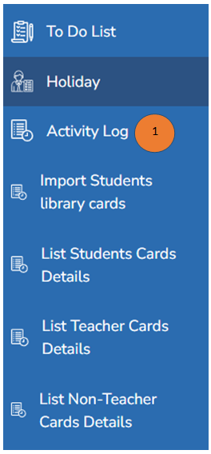

2.	The list of activities done in the portal will be displayed as shown below

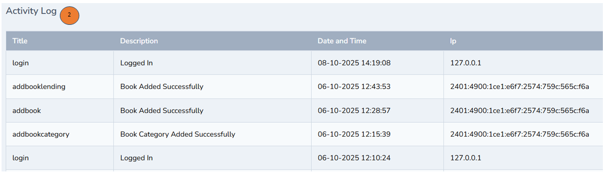

## Import Students Library Cards Management 

1.	Click Import Students Library Cards from the left pane of the dashboard

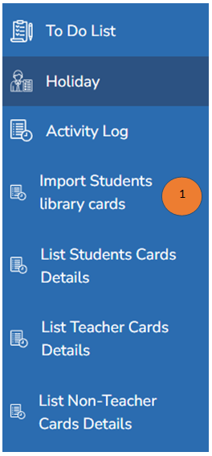

2.	Click Download sample format to download the card

3.	Click Choose File if you have any sample  and click import, student’s library card will be imported 

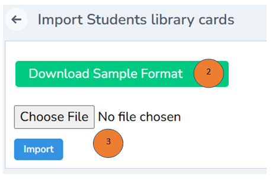

## List Students Cards Details 

1.	Click List Students Cards / Teachers card Details/Non Teacher details  from the left pane of the dashboard

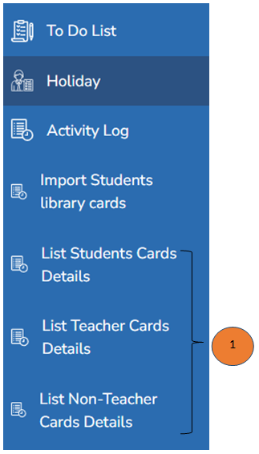

2.	You can search with the help of the names for a quick filter 

3.	You can search with the help of the Alphabetical letters for a quick filter 

4.	You can check the list of teacher details all in one place 

5.	Click the check box at the right corner of every card and click import 

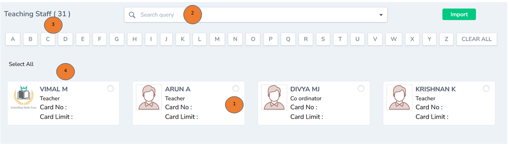

