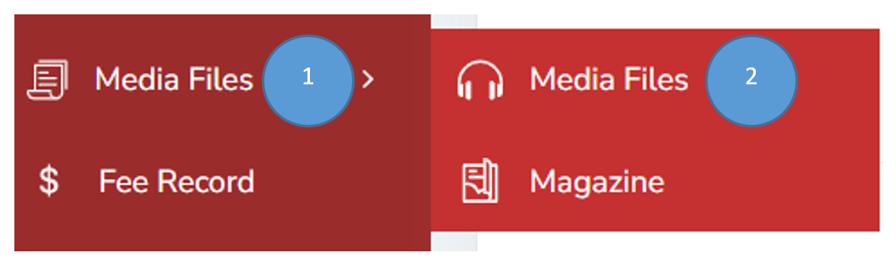
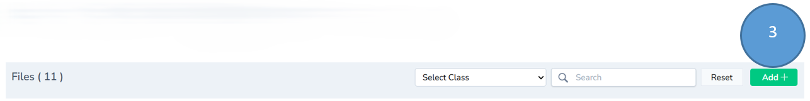
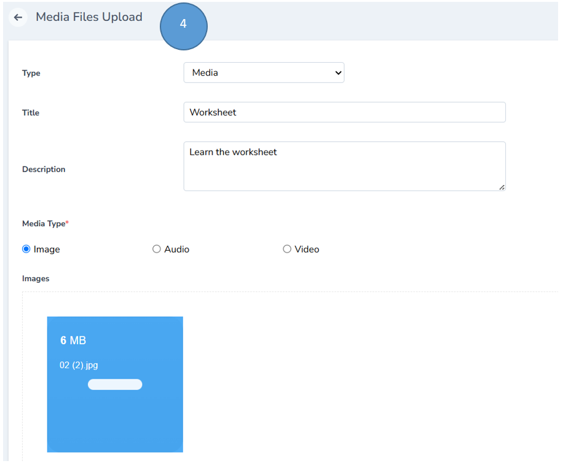
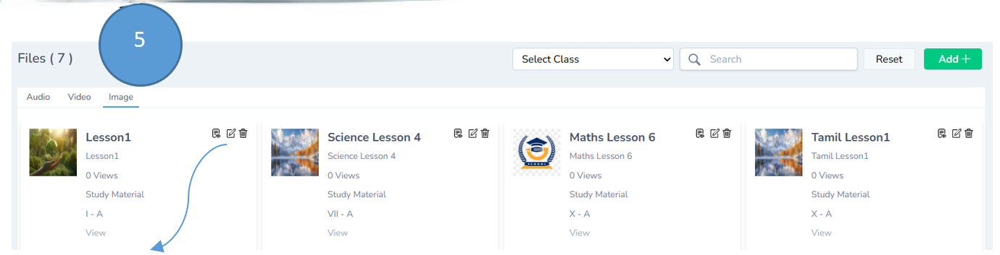
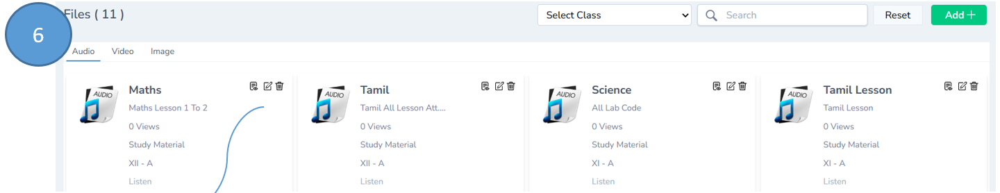
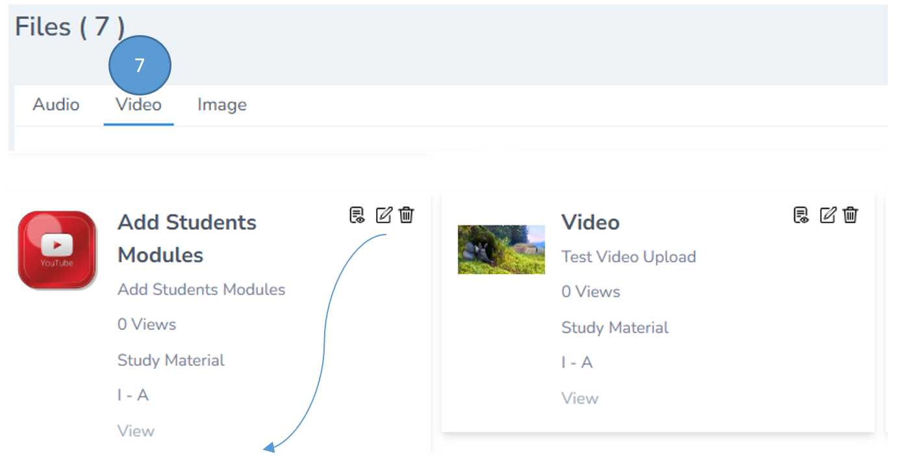
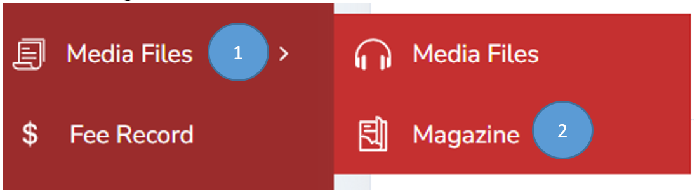
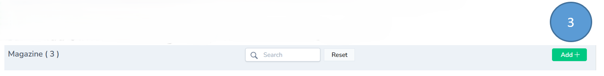
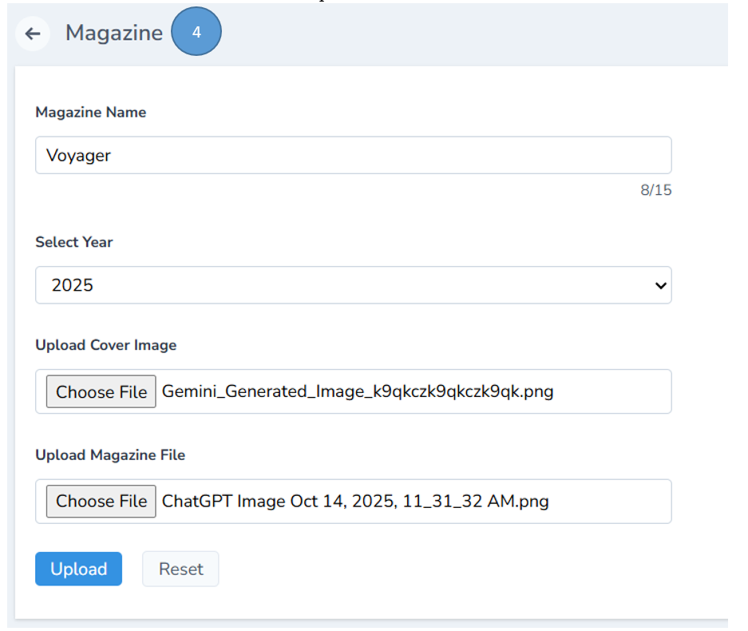
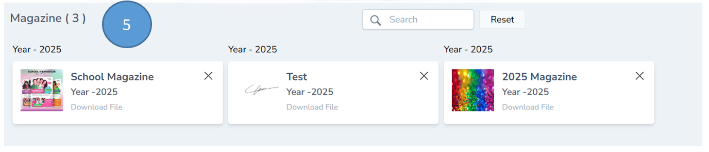

# Media Files Management

1. Click Media files from the admin dashboard

2. Click Media files from the sub menu

3. Click Add button on the right top corner to add a file

4. Fill all the details in the form and click submit

Note : Media files TYPE can be Media, study material or value education

Media Type can Image , Audio or Video

5. Click image tab to see the image file listed

Note : View, edit and delete options are available if you need any changes

6. Click Audio tab to listen to audio files

Note : View, edit and delete options are available if you need any changes

7. Click Video tab to view the video files

Note : View, edit and delete options are available if you need any changes

## Magazine Management

1. Click Media files from the admin panel of the dashboard

2. Click Magazine from the sub menu

3. Click add button on the right top corner to add a magazine

4. Fill all the details in the form and click upload.

Note : Magazine file should be in PDF format

5. The new magazine will be uploaded and will be listed in magazine module

