# Parents Management Module 

The Parents Management module allows administrators to view, add, edit, and manage parent profiles within the system. Parent records are linked to student profiles, enabling effective communication, access control, and monitoring of student-related information.

## 1. Accessing Parents Management

1.	Login with **Admin credentials.**
2.	From the left navigation pane, click **Users.**
3.	Select **Parents.**

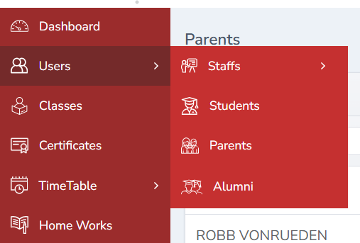

## 2. Viewing Parent Details

- A list of all registered parents will be displayed.
- Parent details such as name, contact information, and status can be viewed from this screen.

## 3. Editing Parent Details

1.	Click the **Edit button** corresponding to the parent.
2.	Update the required details.
3.	Click **Save.**
4.	The updated information will be saved successfully.

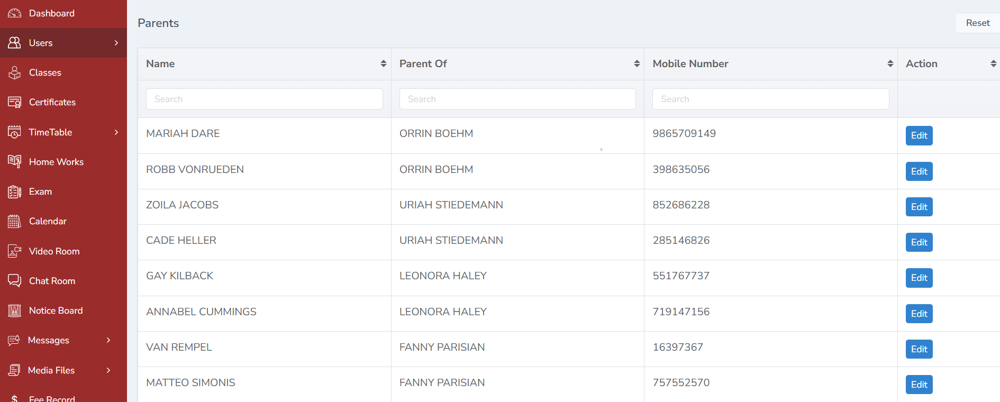

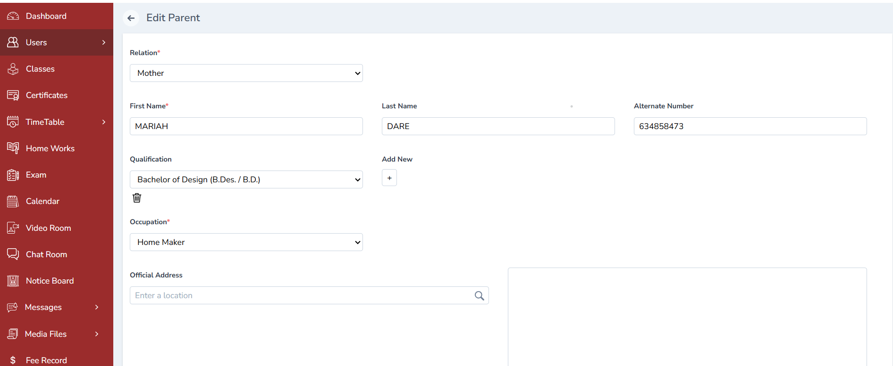

## 4. How to Add a Parent

Parents are added through the **Student Management module** and automatically linked to the student profile.

Steps to Add a Parent

1.	From the admin dashboard, click **Users.**
2.	Select **Students** from the sub menu.
3.	Choose the required student and click **View Full Profile.**
4.	Click the **three-dot (⋮)** menu on the top-right corner.
5.	Select **Add Parent.**
6.	Enter all required parent details.
7.	Click **Submit.**

The parent details will be:
- Added to the student’s profile
- Listed automatically in the **Parents Management** module

**Note:** The same procedure can be followed to add **Mother** or **Guardian** details.

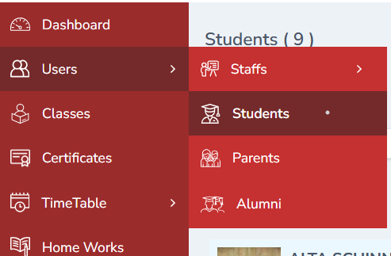

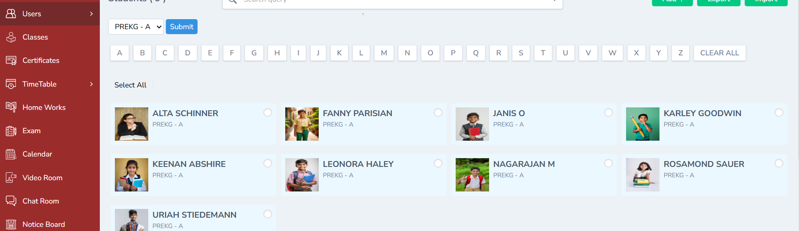

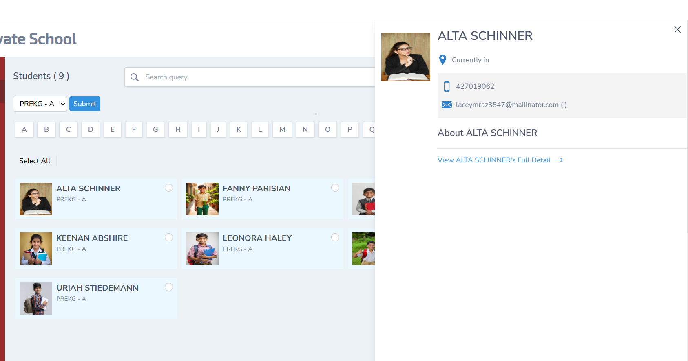

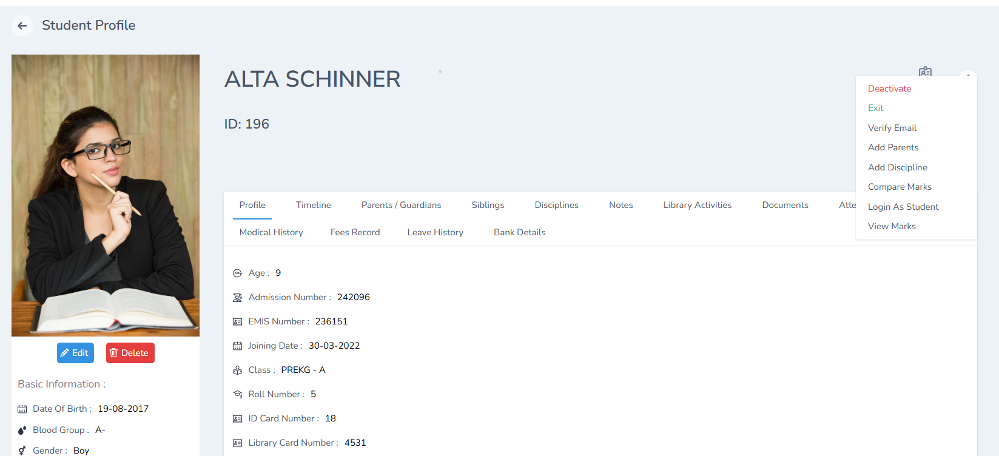

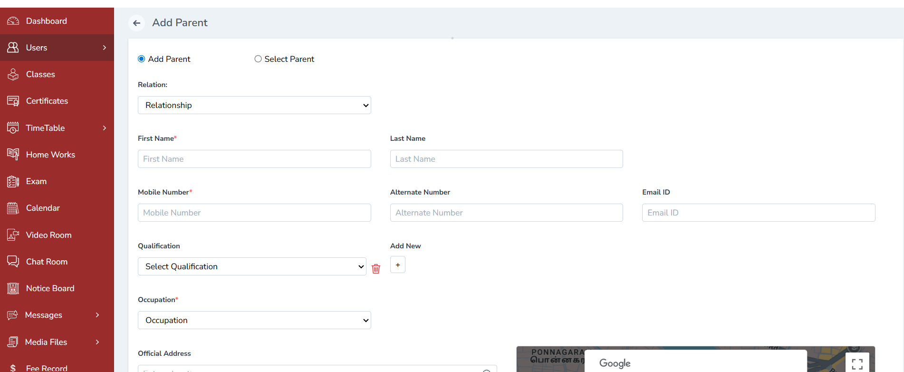

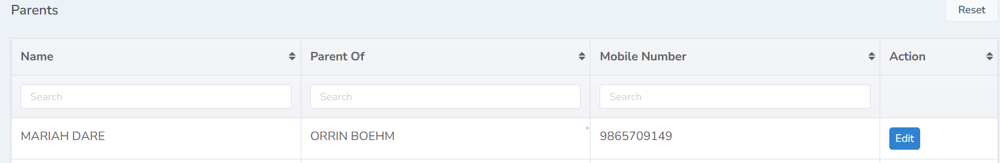

## 5. Managing Parent Accounts

The following actions are available in the Parents Management screen:
Edit Parent
- Click the **Edit (✎)** icon to modify parent details.

Delete Parent
- Click the **Delete (🗑)** icon to remove the parent record.

Deactivate Parent
- Click the **Deactivate** option to disable parent access temporarily.

Reset Password
- Click **Reset Password** to generate a new password for the parent.

Verify Email
- Click **Verify Email** to confirm the parent’s email address.

View Credentials
- Click the **Credentials** tab to view:
    - Email ID
    - Mobile Number.

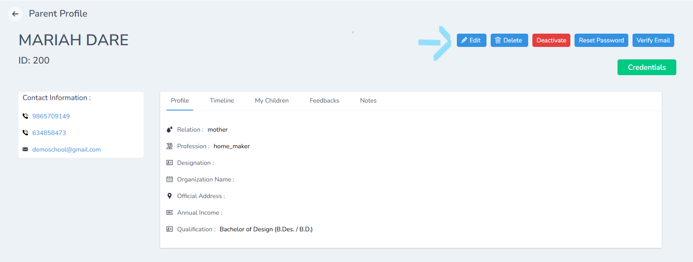 

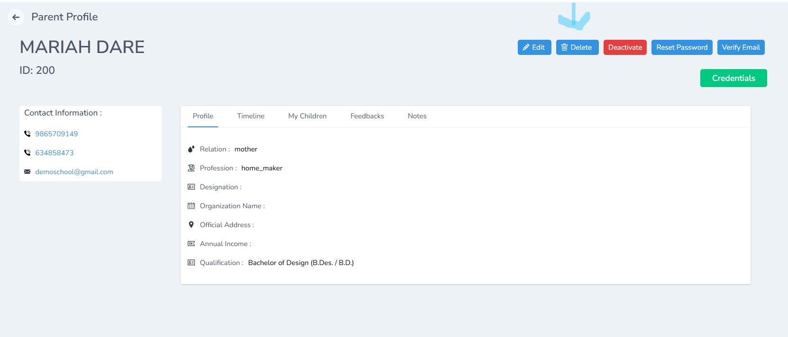

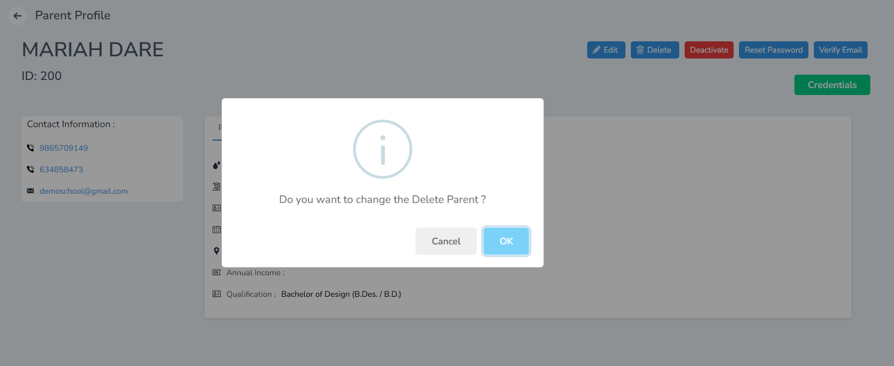

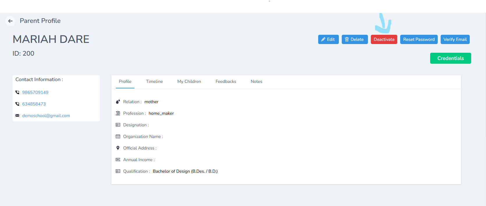

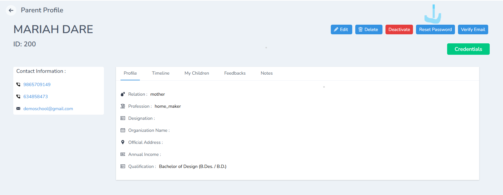

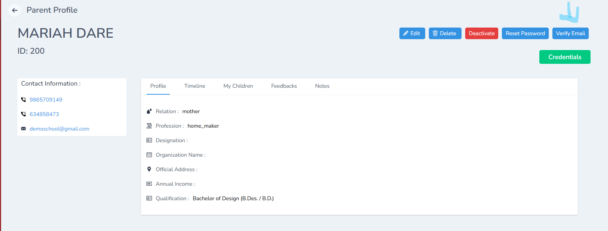

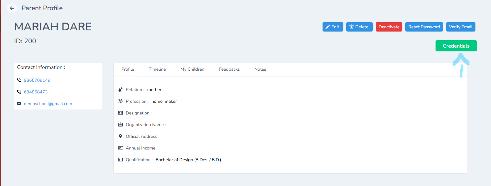

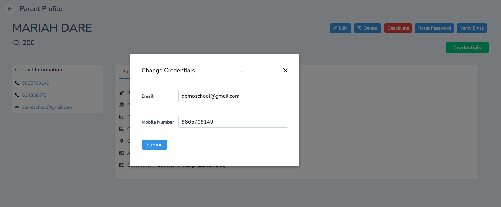

