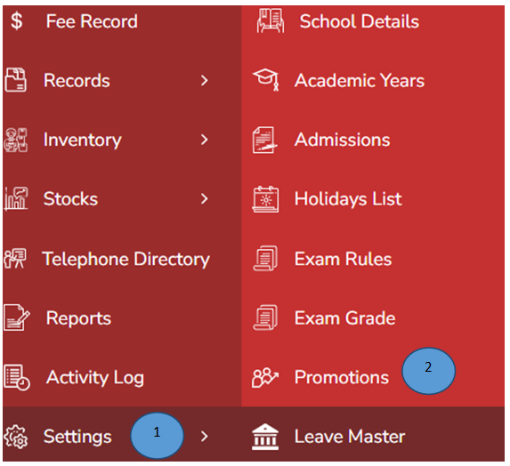
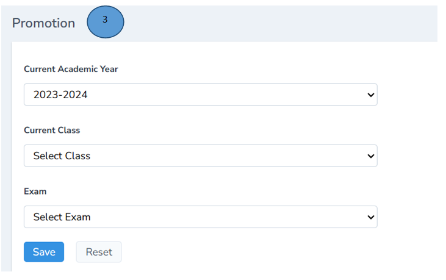

# Promotion management 
 

1.	Click  settings from the left pane 

2.	Click promotions from the side menu 

3.	Fill in the all the details and click submit. Reset can also be done 

4.	Promotion messages will be sent to the parents on the parent app
