# GegoK12 Reception Management Module

A Complete Guide for Admins & Receptionists

---

## Introduction

The **Reception Module** in GegoK12 is designed to modernize and digitize the school’s front-desk operations. As the first point of contact for parents, visitors, students, and vendors, receptionists handle a large volume of daily communications. This module provides them with the tools they need to manage every visitor entry, phone call, postal item, and task efficiently.

The Reception Module gives receptionists their own **login, dashboard**, and **workflow tools** to manage:

- Visitor Log
- Call Log
- Postal Record
- To-Do List
- Calendar View
- Holiday List
- Notice Board
- Activity Log

This ensures transparency, accountability, and a smooth front-desk experience for the entire school community.

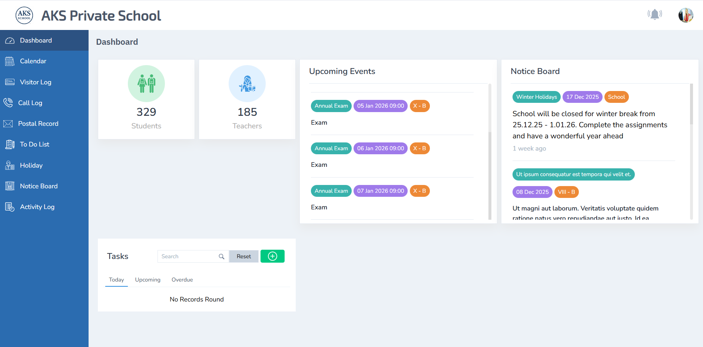

## Creating a Receptionist (Admin Guide)

### Navigate to Non-Teaching Staff

**Menu Path:**

Users → Staffs → Non-Teaching Staff

Click **Add New Staff** to begin creating the profile

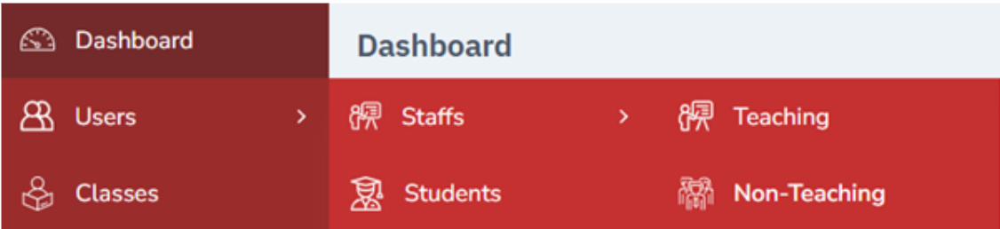

---

### Fill Basic Profile Details

A staff creation form will open. Enter all required information such as:

- Name
- Mobile Number
- Email (Used as Login ID)
- Designation → **Receptionist**

Click **Submit** to move to the next tab.

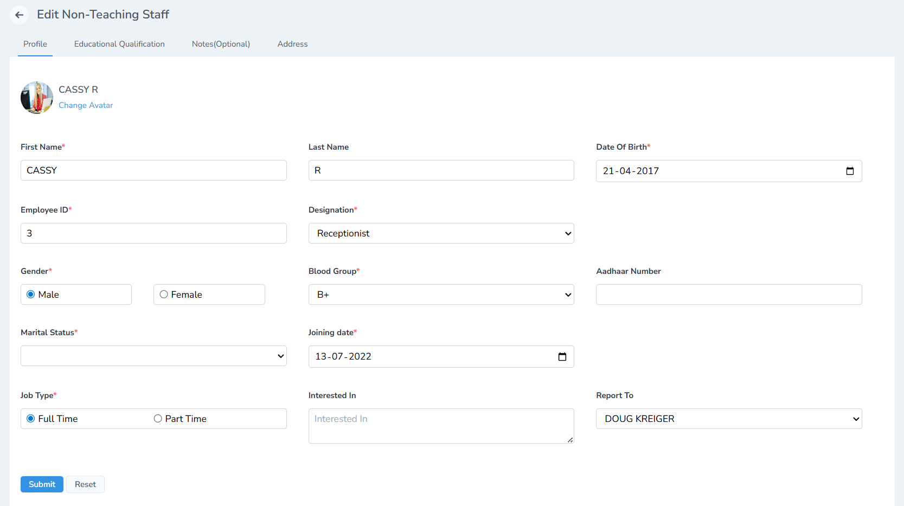
Note: Email ID is mandatory. It becomes the Receptionist’s login username.

---

### Add Educational Qualification

Fill in the relevant qualification details and click **Submit**.

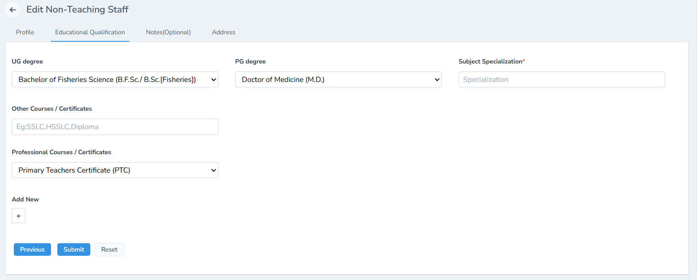

---

### Add Notes

Add any internal notes related to the receptionist profile.

Click **Submit**.

---

### Enter Address

Add communication and permanent address information.

Click **Submit** to complete the creation process.

---

### Login Auto-Creation for Receptionist

Once all steps are completed, GegoK12 automatically creates the login credentials:

- **Username:** Email entered by the admin
- **Password:** password (Receptionist can change it later)

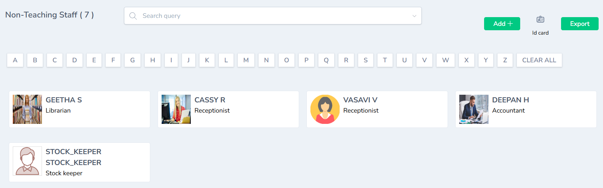

The receptionist can later update their password using **Change Password** inside their dashboard.

---

## Additional Admin Controls

From the receptionist’s profile page, the admin can:

- **Edit Profile**
- **Delete Profile**
- View **Timeline**
- Add **Notes**
- Upload **Documents**
- Record **Bank Details**

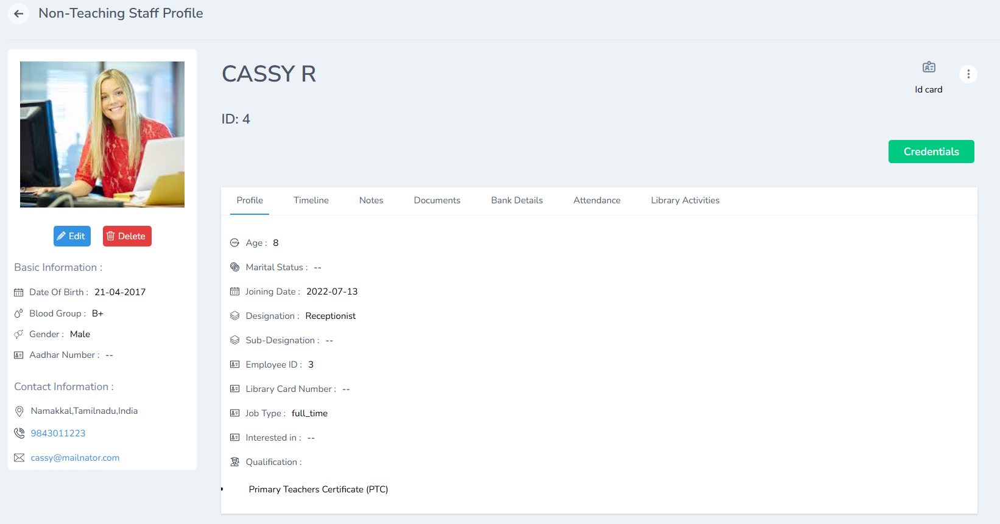

View Timeline by clicking on it

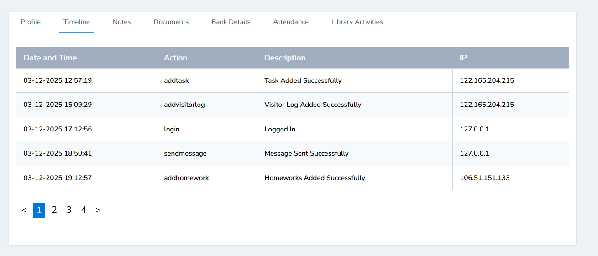

Add notes and click submit

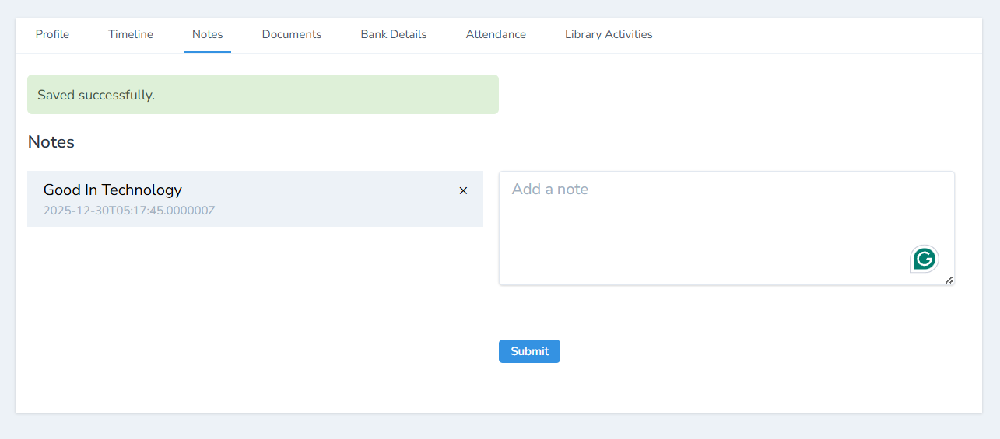

Upload documents such certificates, ID proofs & other documents and click submit

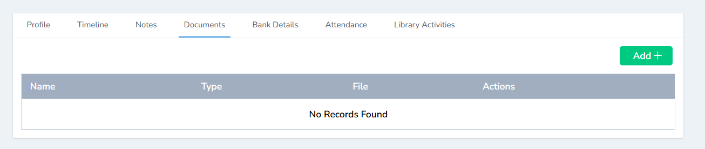

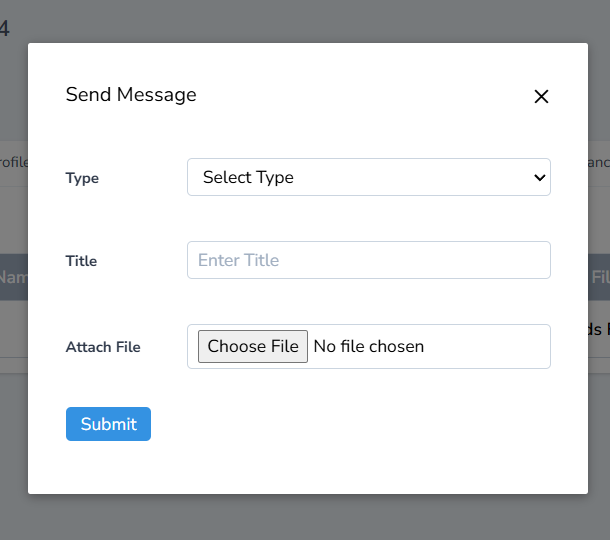

Enter bank details for the the salary processing

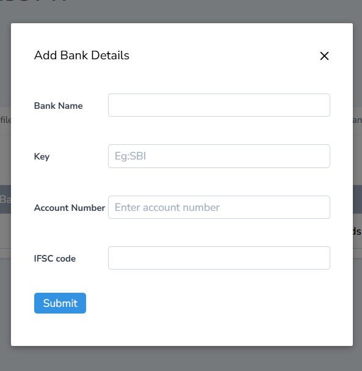

---

## Receptionist 

### Logging In

Receptionists log in through the school portal using:

- **Email ID** → Username
- **password** → Default password

They may change their password after login.

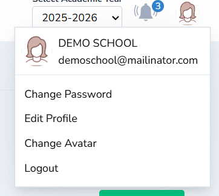

---

### Dashboard 

Once logged in, the Receptionist Dashboard provides a consolidated view of:

- Recent visitor activity
- Recent calls & postal items
- Upcoming events
- School notices
- Holiday list

The left pane contains quick access to all relevant modules:

- Calendar
- Visitor Log
- Call Log
- Postal Record
- To-Do List
- Holidays
- Notice Board
- Activity Log

---

## Calendar & Events

### Overview

The Calendar gives the receptionist a **holistic, real-time picture** of all events happening in the school. Since events impact visitor flow and parent enquiries, staying informed is crucial.

The calendar displays events created by:

- **Admin** → School-wide events
- **Teachers** → Class-level events

This ensures the receptionist always knows:

- What is happening today
- Which classes are engaged
- When important events are scheduled
- Whether a day is likely to be busy at the front desk

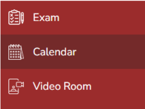

---

### Using the Calendar

The receptionist generally **does not create events**. But there is an option to create Events. For Events, check the [Link to Calendar Module] Calendar Module. They use the calendar to view and refer to school activities.

Steps:

1. Go to the **Calendar** from the left menu
2. Browse events using **Day**, **Week**, or **Month** view
3. Click on any event to see full details—title, time, creator, event type

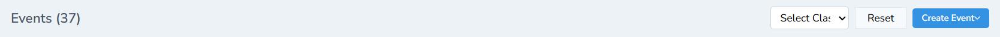

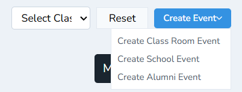

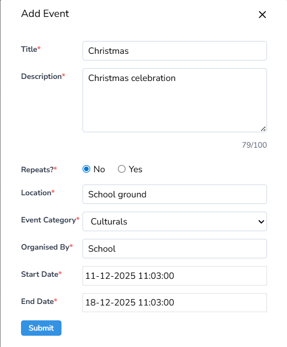

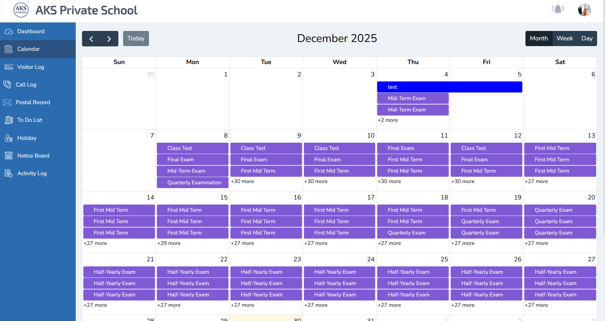

---

### Types of Events Visible

#### School Events

- Annual Day
- Sports Day
- Examination Schedules
- PTA Meetings

#### Classroom Events

- Class activities
- Tests / Exams
- Celebrations
- Homework updates

All events appear in a structured, color-coded manner.

---

### Why Calendar Access is Important

Having full visibility helps the receptionist:

- Answer parent queries with confidence
- Plan visitor appointments around events
- Coordinate with teachers and staff
- Manage front-desk operations smoothly
- Prepare for high-traffic days

---

## Visitor Log

### Overview

The **Visitor Log** replaces traditional handwritten entry registers with a secure, searchable digital system. Every person entering the campus is recorded—parents, guests, vendors, interview candidates, or officials.

Digitizing visitor management ensures:

- Better security oversight
- Accurate record of all entries
- Professional front-desk handling
- Easy retrieval of past visitor details
- Full transparency for audit purposes

This is one of the core responsibilities of a receptionist.

---

### Adding a Visitor

1. Click **Visitor Log**
2. Click **Add** (top-right)
3. Fill visitor information
4. Click **Submit**

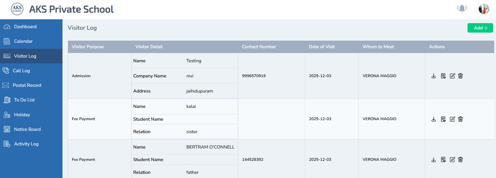

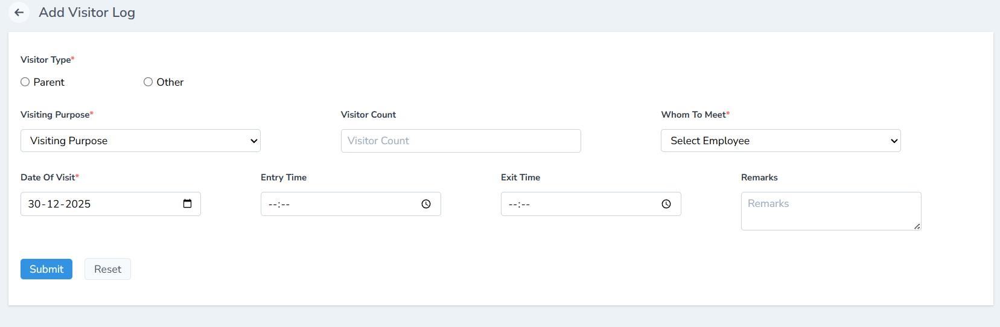

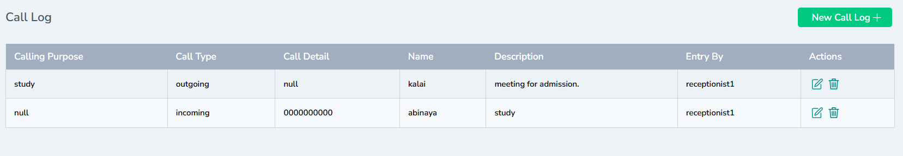

---

### Manage Visitor Records

Receptionists can:

- **Download** & Print the visitor details as the visitor pass
- **Print** entries
- **Edit** details
- **Delete** entries

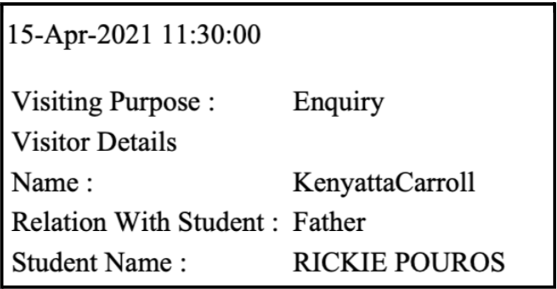

---

## Call Log

### Overview

The **Call Log** digitizes the record of all incoming and outgoing phone calls handled at the front desk. Schools receive calls about:

- Admissions enquiries
- Transport updates
- Student absenteeism
- School events
- Staff availability
- Emergency messages

A structured Call Log ensures:

- Every call is documented
- No message is missed
- Follow-ups are tracked
- Administrators have a clear communication trail

---

### Adding a Call Log

1. Click **Call Log**
2. Click **Add Log**
3. Fill caller information & notes
4. Click **Save**

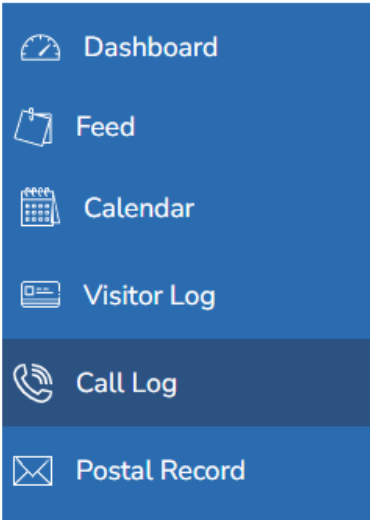

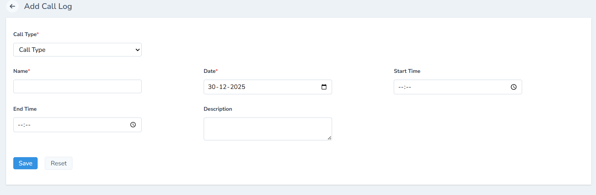

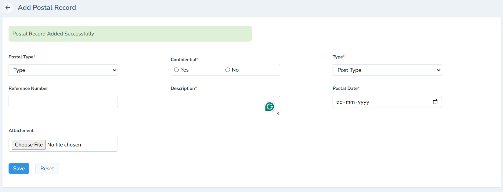

---

## Postal Record

### Overview

The **Postal Record** module digitizes the handling of incoming and outgoing courier/postal items. At a school, postal items may include:

- Certificates
- Vendor letters
- Official documents
- Admission forms
- Speed posts
- Courier parcels

Digitizing postal management ensures:

- Nothing gets misplaced
- Items are properly tracked
- Staff can refer back to older entries
- Accountability is maintained

---

### Adding a Postal Record

1. Click **Postal Record**
2. Click **Add New Postal Record**
3. Fill sender/receiver details
4. Click **Save**

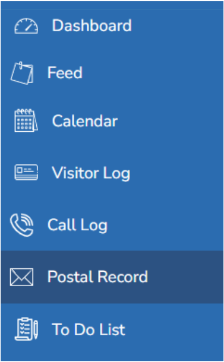

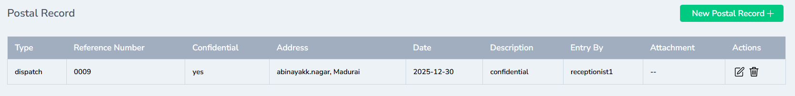

---

## To-Do List

### Overview

Receptionists handle numerous daily tasks. The **To-Do List** helps maintain personal productivity and ensures no important task is forgotten.

Receptionists can create task reminders for:

- Follow-up calls
- Document preparation
- Visitor reminders
- Staff coordination
- Daily duties

---

### Adding a To-Do Item

1. Open **To-Do List**
2. Click **Add**
3. Enter task details
4. Click **Save**

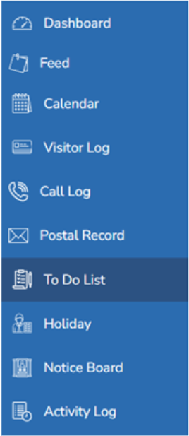

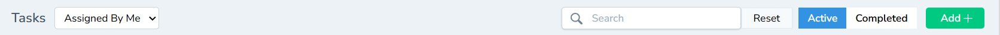

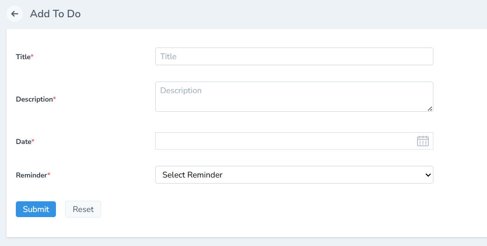

---

## Holidays

### Overview

Receptionists can view the complete holiday list added by the admin. This helps answer parent queries and understand operational closures.

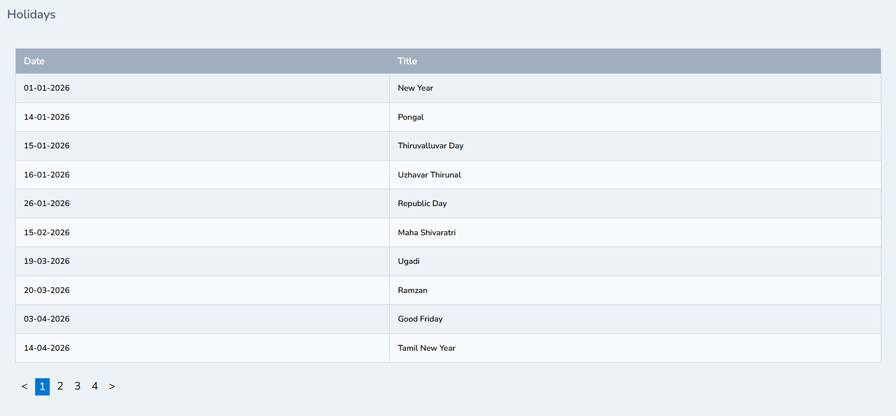

Note: Only admins can create or edit holidays.

 [Open the Holiday List  Guide](/documentation/core-modules/holiday-list)

---

## Notice Board

### Overview

The Notice Board displays all important announcements from the school. This helps receptionists stay updated and respond correctly to enquiries.

Receptionists will see notices such as:

- Exam dates
- Fee notifications
- Event announcements
- Holiday updates
- Staff circulars

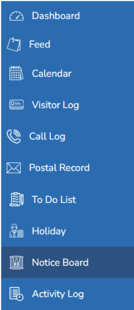

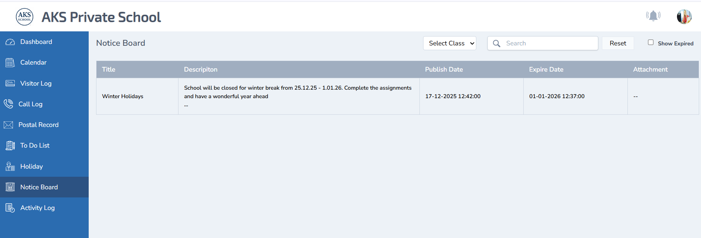

Click the given link to check how the admin records the notices in the notice board

[Open the Notice Board Management Guide](/documentation/core-modules/notice-board-management)

---

## Activity Log

### Overview

The Activity Log displays all actions performed by the receptionist, ensuring transparency and accountability.

This includes:

- Visitor entries
- Call records
- Postal entries
- To-Do updates
- Edits and deletions

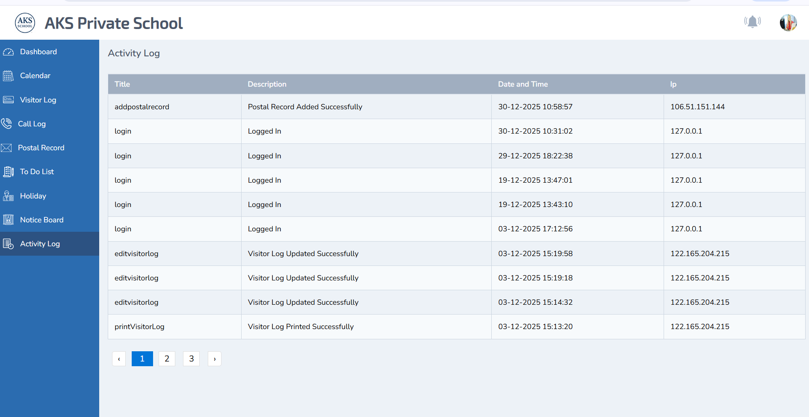

---

