# GegoK12 – Settings Module Manual
# Step – Step guide 

## Introduction to the Settings Module
The **settings Module** is the backbone of the GegoK12 School Management System. It allows administrators to configure school-wide foundational data, academic structures, admission flow, exam rules, holiday lists, and operational policies.
This module ensures that the entire school system runs smoothly with accurate, organized, and centralized information.

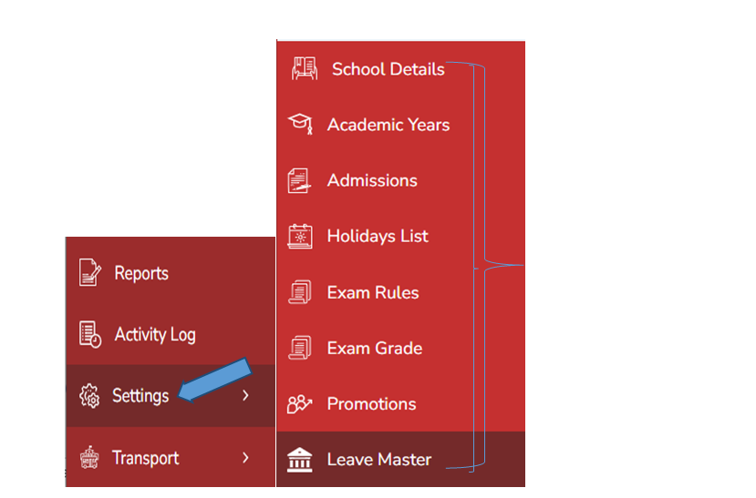  

## Accessing the Settings Module

From the left-side navigation panel:
 
 **Click → Settings** 

This opens the list of core configuration options:
- School Details
- Academic Years
- Admissions
- Holiday List
- Exam Rules
- Exam Grades
- Promotions
- Leave Master

## School Details

**Purpose of School Details Module**

The School Details section stores essential information about the institution. These details sync across all roles (Admin, Teachers, Parents, Receptionist, Accountant, Librarian).

**Steps**

1.	Click **Settings → School Details.**
2.	Enter all mandatory information:

- School Name
- About Us
- Admission Open/Close Status
- Admission Close Message
- Affiliation Number
- Affiliated Board
- Date of Establishment
- Landline
- Motto
- Logo
- Website
- Address
- City, State, Country, Pincode

3.Click **Submit** to save.

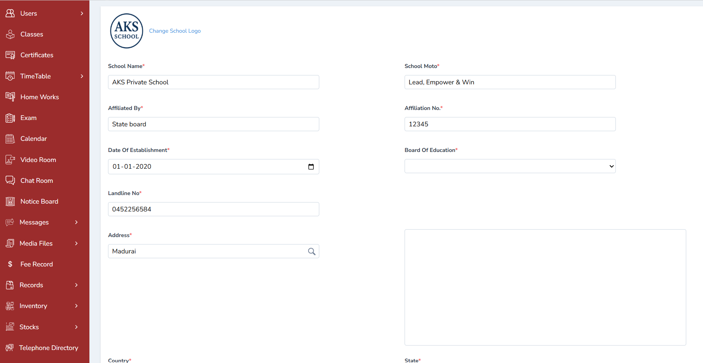

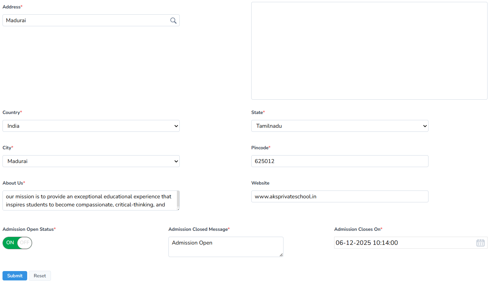

**Editing**

- Click the Edit button in the top-right corner to update the school details at any time.

**Admission Status Note**

**Open Tab** : Indicates whether online admission is active or inactive.

**Viewing the Online Admission Form**

- Click **View** → The admission form opens.

- It includes **5 steps:**

1.	Standard Details
2.	Student Details
3.	Academic Details
4.	Parent Details
5.	Personal Details

The school details information will be displayed in the Teachers & Parent App once they login with their credentials. 

## Online Admission Form Sections

**Use of Online Admission Form**

- Allows parents or administrators to capture complete student information digitally.

- Reduces manual entry, improves accuracy, and streamlines admission workflow.

**Standard Details**

- Select the admission class and click Next.

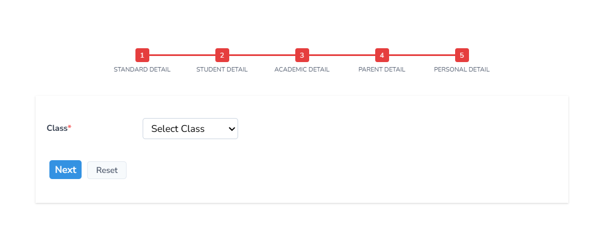

**Student Details**

Record:
- First Name, Last Name
- Photograph
- Date of Birth
- Gender
- Height, Weight
- Birthplace, Nationality
- Identification Marks
- Sibling details (Yes/No)

Click **Next**.

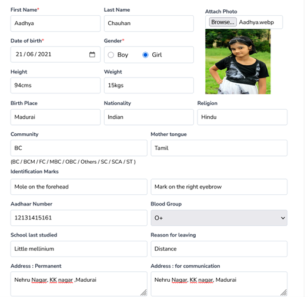

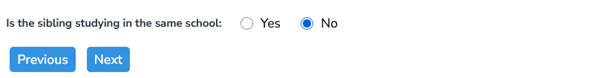

**Academic Details**

Record:

- Last exam marks
- Board of study
- Choice of language

**Note:**

**Group selection and board registration apply only for Grade X, XI & XII.**

Click **Next.**

**Parent Details**

-Record all parent/guardian information.

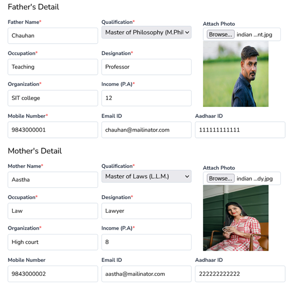

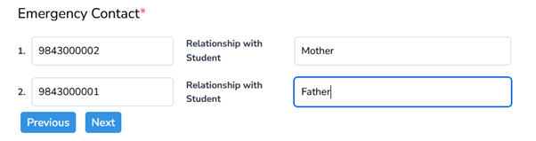

**Personal Details**

Complete remaining personal information.

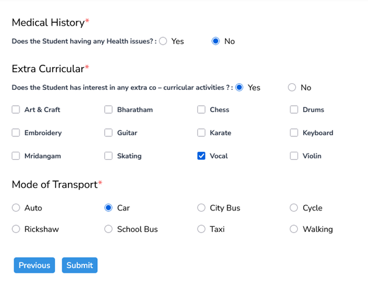

After submission:

A **new application form** is successfully added.

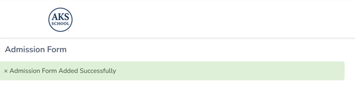

## Additional Notes for School Details

- School information can be edited any time.

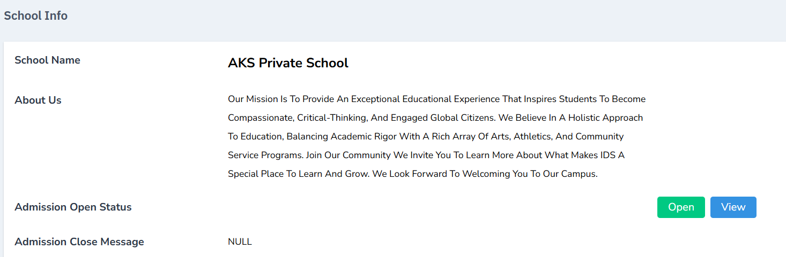

- Admission status can be set to **Active/Inactive.**

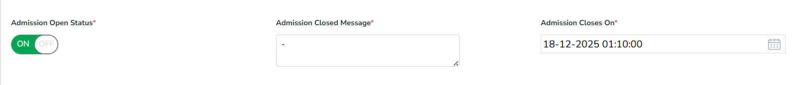

- You can reset all details using the **Reset** button.

- School details appear in the **Teacher App** and **Parent App** once they log in.

## Academic Years

**Purpose**

This section manages academic year timelines and classifications (current, new, old).

**Steps**

1.	Go to **Settings → Academic Years.**
2.	Click **Add** (top-right corner).
3.	Enter:
 - Description
 - Start Date
 - End Date
 - Type (Current / New / Old Academic Year)

4.	Click **Submit.**

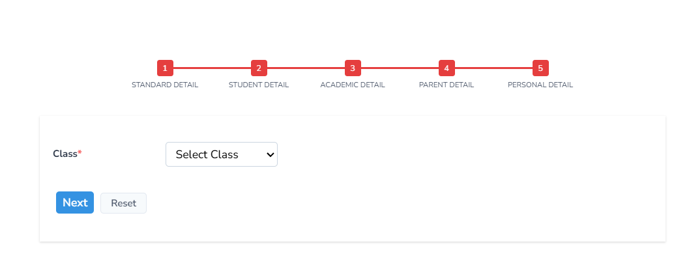

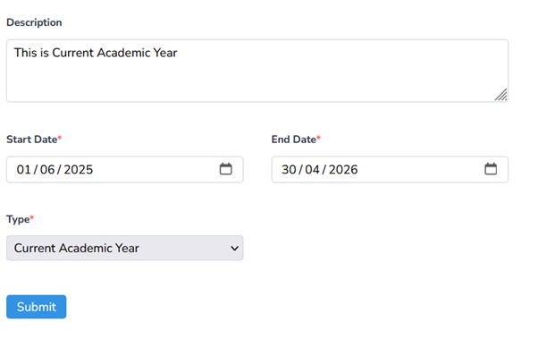

**Available Actions**

- Edit
- View
- Delete

**Note: The details can be edited from the action menu** 

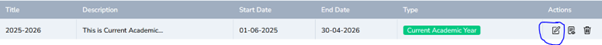

**Note: The details can be edited from the action menu**

**Note: The details can be edited from the action menu**

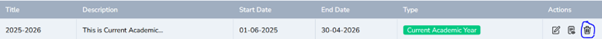

**Note**

- Details can be reset when needed.

## Admissions

**Purpose**

Lists all online admission forms submitted via Admin.

**Steps**

1.	Go to **Settings → Admissions.**
2.	View:

 - Application Number
 - Name
 - Class Applied
 - Application Status
 - Action options

 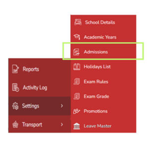

 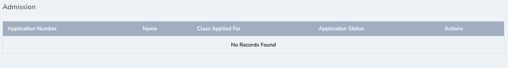

The online student admission form filled by the administrator will be listed here. The details such as Application Number, Name, class applied for,application status, action will be displayed.

The application status can be changed by the edit tab. The Application status has pending, rejected and approved status 

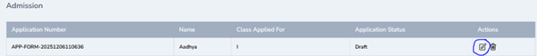

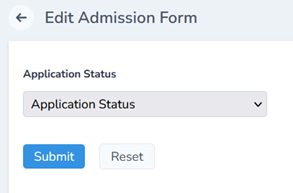

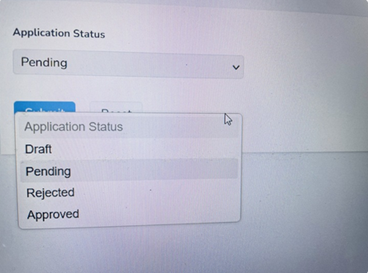

**Application Status - Pending (BUG )**

Change the status to pending and click submit

**Application Status - Rejected**

Change the status to Rejected and click submit

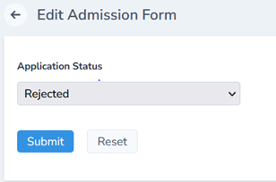

**Application Status – Approved**

Change the status to Approved, record all the details such as section,fee type, Admission fee –paid /unpaid and click submit. The student will successfully get enrolled. ( How will we notify the parent about the enrolment ) 

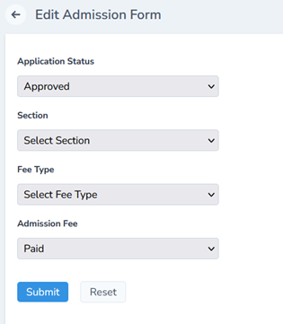

## Holiday List

**Purpose**

Allows admin to set all school holidays for the academic year.

**Steps**

1.	Go to **Settings → Holiday List.**
2.	Click **Add (top-right).**
3.	Enter holiday details.
4.	Click **Submit.**

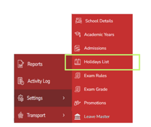

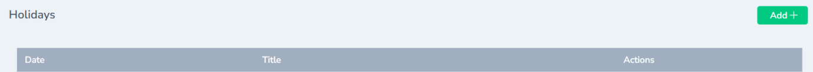

- Click Holiday List and then Add from the top-right corner.
- Enter the holiday details for the current year and click Submit.

**Holiday List Reflection in Teacher’s Profile**

Login as a Teacher with the credentials given by the admin. To check how to login Click 

[Open the Holiday List Guide](/documentation/core-modules/holiday-list)

Go to Dashboard ----- Holidays (The list of holidays will be displayed)

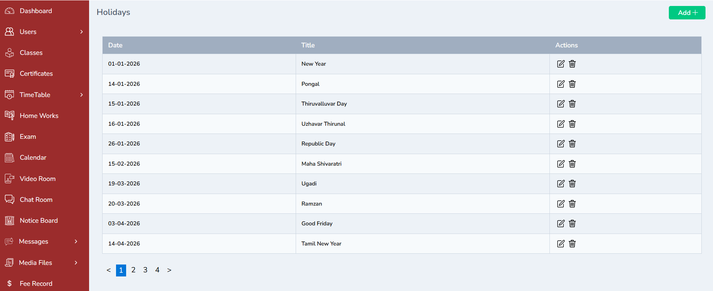

**Holiday List Reflection in Student’s Profile**

Login with the App credentials in the mobile App or login in the web
Click Holidays on the left pane of the dashboard ------ (The list of holidays will be displayed)

**Holiday List Reflection in Receptionist ’s Profile**
Login with the credentials in the Receptionist’s Login and click Holidays 
Holidays ------ (The list of holidays will be displayed)

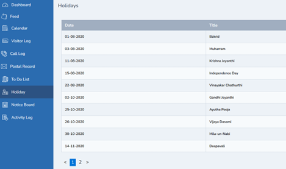

**Holiday List Reflection in Accountant ’s Profile**
Login with the credentials in the Accountant’s Login and click Holidays  
Holidays ------ (The list of holidays will be displayed)

**Holiday List Reflection in Librarian ’s Profile**
Login with the credentials in the librarian’s Login and click Holidays  
Holidays ------ (The list of holidays will be displayed)

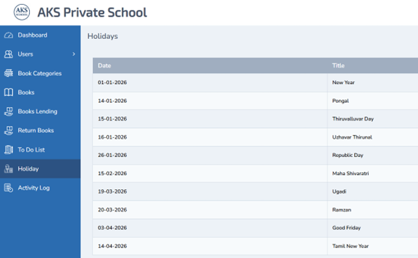

## Exam Rules

**Purpose**

Defines the scoring boundaries used for grading calculation. 

**Steps**

1.	Go to **Settings → Exam Rules.**
2.	Enter:

- Grade Name
- Minimum Score Percentage
- Maximum Score Percentage

3.	Click **Submit.**

**Note:**
These rules help auto-generate grade calculations.

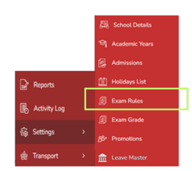

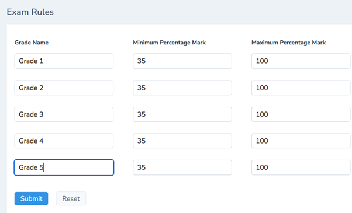

- Record exam rules by entering the Grade Name, Minimum Score Percentage, and Maximum Score Percentage.
- Click Submit to save.
- These rules will automatically assist in grade calculation.

## Exam Grades

**Purpose**

Displays the list of graded brackets defined for assessment.

**Steps**

1.	Click **Settings → Exam Grades.**
2.	View the preconfigured exam grades.

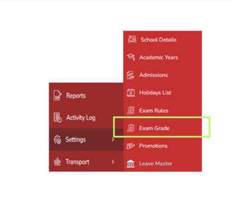

- The list of exam grades configured will be displayed here for reference.

## Promotions

**Purpose**

Manages promotion workflow from one class to the next.

**Important Note**

- Before promotions, ensure **Exam Module** is properly set up.
- Reference guide:

[Open the Exam Management Guide](/documentation/add-on-modules/exam-management)

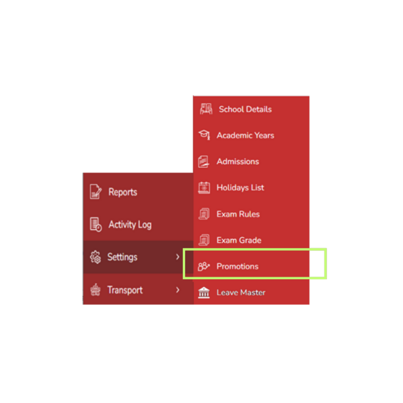
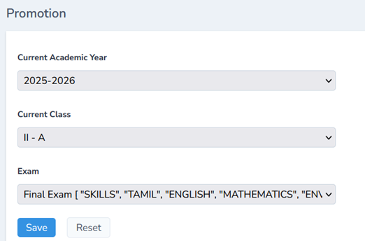

The promotion list for Grade II A can be downloaded in the excel sheet. 

## Leave Master

**Purpose**

Defines leave categories applied across staff roles.

Common types:
- Earned Leave
- Casual Leave
- Sick Leave
- Maternity Leave
- Quarantine Leave
- Study Leave

**Steps**

1.	Go to **Settings → Leave Master.**
2.	Click **Add New (top-right).**

3.	Enter:
- Leave Type
- Maximum Days

4.	Click **Submit.**

**Full Leave Module Reference**

[Open the Leave Master Guide](/documentation/core-modules/leave-master)

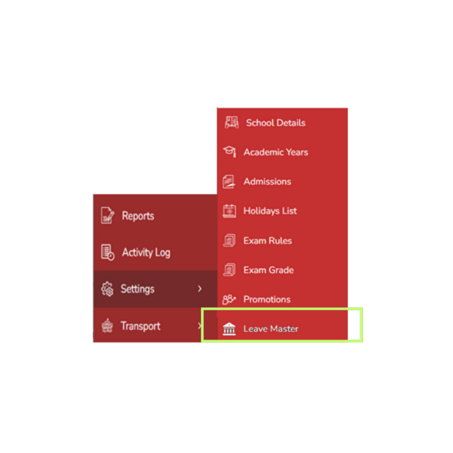
Define different leave types for clarity, such as Earned Leave, Casual Leave, Sick Leave, Maternity Leave, Quarantine Leave, and Study Leave.

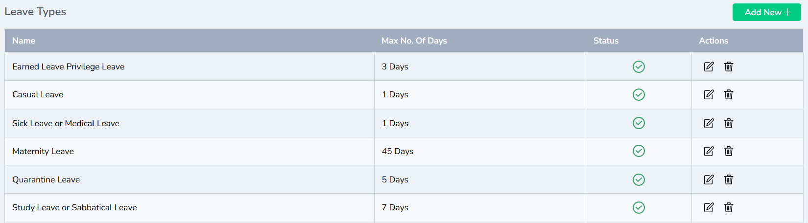
- Click Add New from the top-right corner, enter the leave type and maximum number of days, and click Submit.
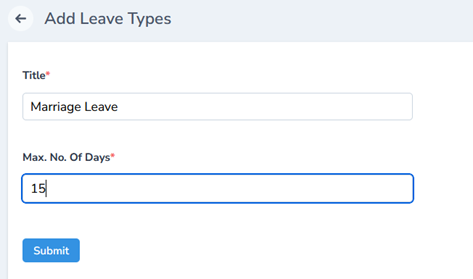

## Conclusion
The Settings Module ensures that your institution’s operational foundation is properly structured.
By configuring these settingss// correctly, all other modules (Admissions, Fees, Payroll, Staff, Academics) will function smoothly with accurate and centralized data.