# Settings

The Settings Module is the backbone of GegoK12 School Management Software, where administrators can configure school-wide information, academic structures, and essential operational rules. It brings every key detail under one roof for seamless management and accuracy.

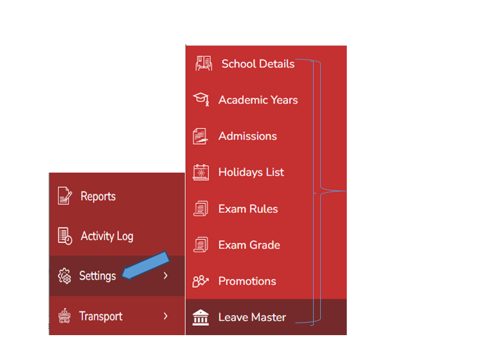

Click Settings from the left pane.
A list of options will be displayed:

- School Details
- Academic Years
- Admissions
- Holiday List
- Exam Rules
- Exam Grades
- Promotions
- Leave Master

## School Details

Click school details from the settings tab

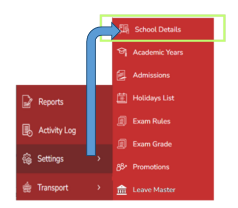

Click School Details to record all information such as: School Name, About Us, Admission Open/Close Status, Admission Close Message, Affiliation Number, Affiliated Board, Date of Establishment, Landline, Motto, Logo, Website, Address, City, State, Country, and Pincode.

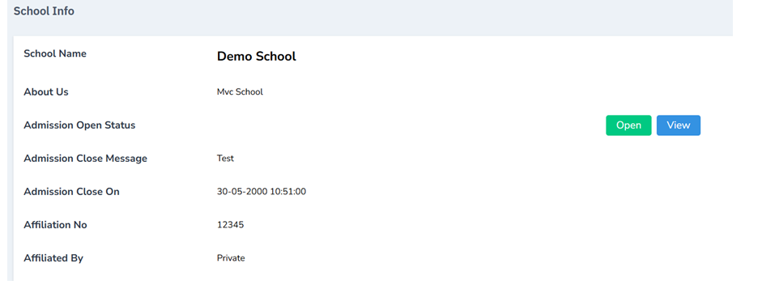

- Click Submit to save
- You can edit details at any time

Note: Open Tab says the admission status is open

If you click View tab then Admission form will be opened by clicking Next button. Record all the details and click submit. The new application details will be displayed in the Admission Module.

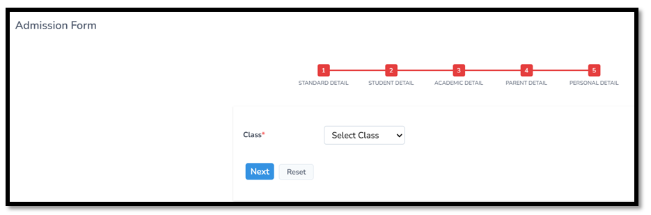

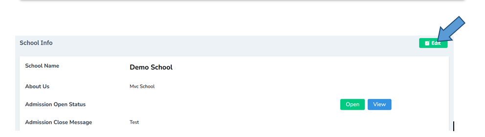

Note: The school info can also be edited if required

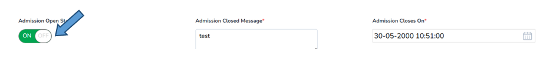

Note: Admission status can be changed here. It can be active or inactive depending upon the availability

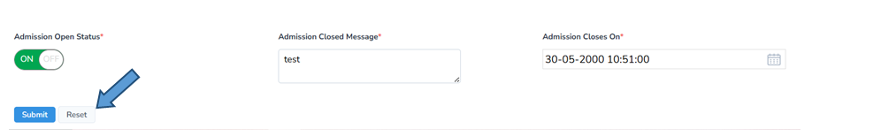

Note: All the details can be reset by clicking the reset button

## Academic Years

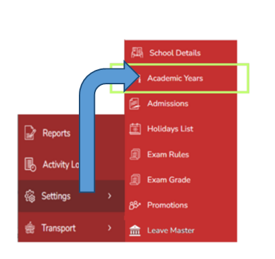

- Click Academic Years from the settings tab
- Click Add from the top-right corner.

- Enter the description, start date, end date, and select the type (Current, New, or Old Academic Year).

- Click Submit.
- Details can also be reset when needed.

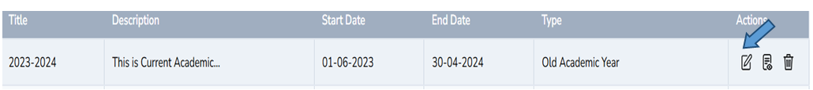
Note: The details can be edited from the action menu

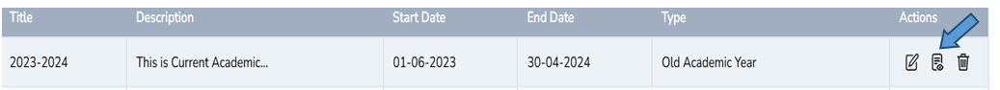

Note: The details can be viewed from the action menu

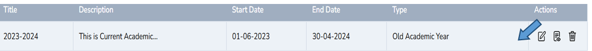

Note: The details can be deleted from the action menu

## Admissions

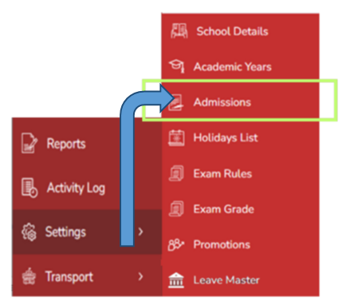

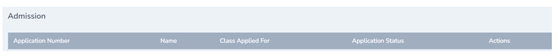

- The online student admission form filled by the administrator will be listed here. The details such as Application Number, Name, class applied for, application status, action will be displayed here.

## Holiday List

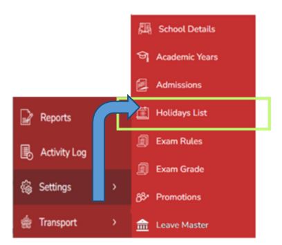

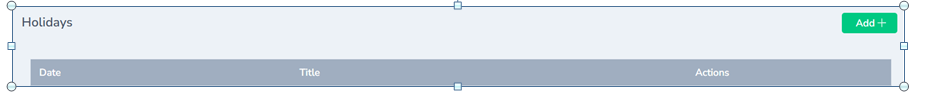

- Click Holiday List and then Add from the top-right corner.
- Enter the holiday details for the current year and click Submit.

## Exam Rules

Click Exam rules from the settings tab

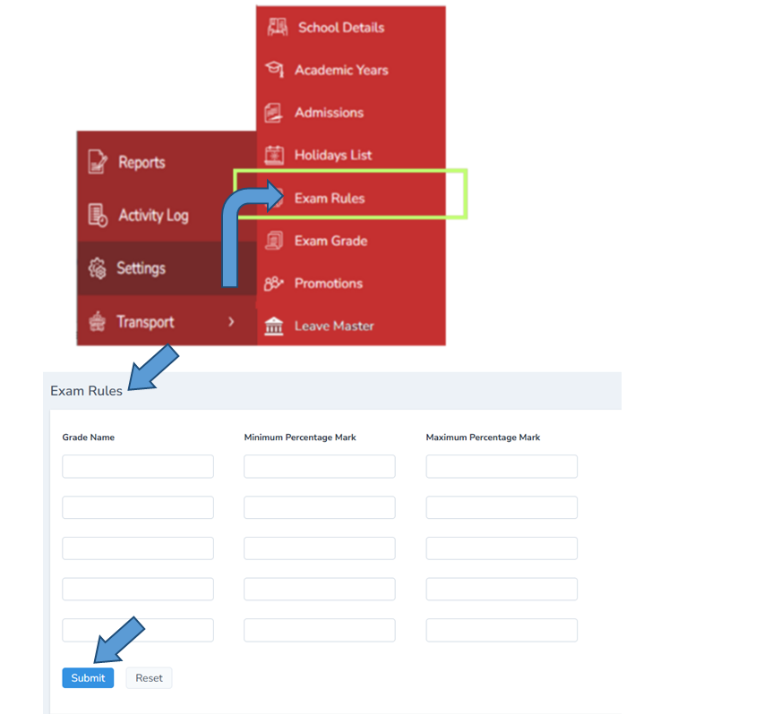

- Record exam rules by entering the Grade Name, Minimum Score Percentage, and Maximum Score Percentage.
- Click Submit to save.
- These rules will automatically assist in grade calculation.

## Exam Grades

Click Exam grades from the settings tab

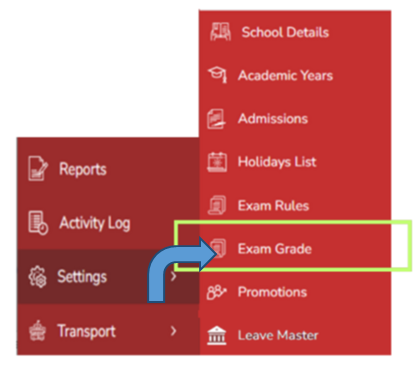
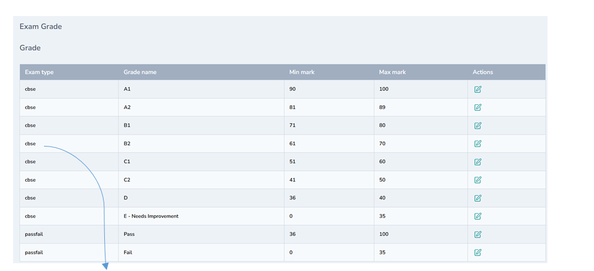

- The list of exam grades configured will be displayed here for reference.

## Promotions

Click promotions from the settings tab

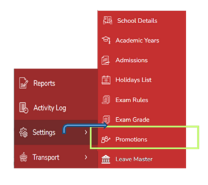

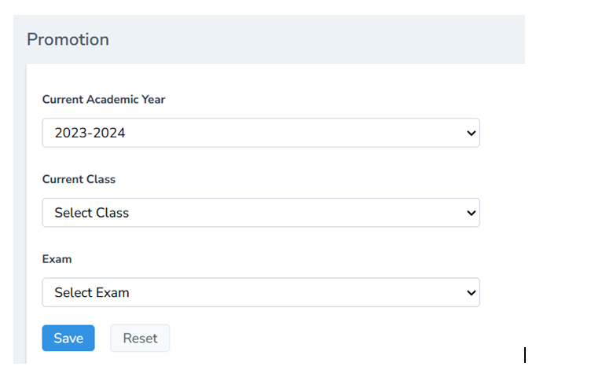

Digital promotion cards can be created and shared with ease.

- Click Promotions and enter details like Academic Year, Class, and Exam Excelled, then click Save.

## Leave Master

Click Leave master from the settings tab

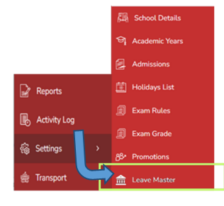

Define different leave types for clarity, such as Earned Leave, Casual Leave, Sick Leave, Maternity Leave, Quarantine Leave, and Study Leave.

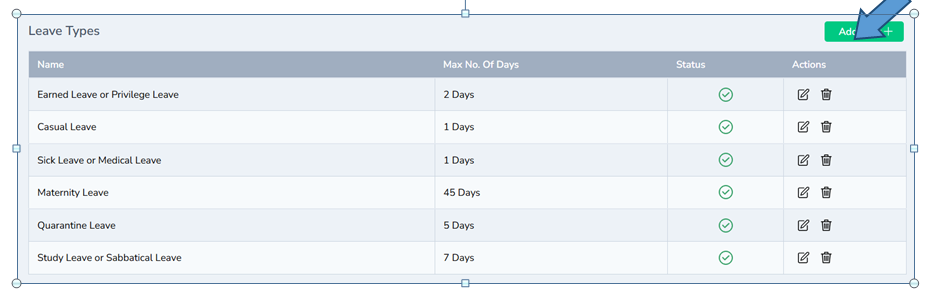

- Click Add New from the top-right corner, enter the leave type and maximum number of days, and click Submit.

The Settings Module ensures that your school’s foundation is well-organized, accurate, and fully customizable for smooth day-to-day operations.
