# GegoK12 Staff Management Module

## How to Add a Teacher
## Complete Step-by-Step Guide for Admin & Staff

## **Overview**

The GegoK12 User Management Module allows administrators and authorized staff members to efficiently manage teacher profiles. This guide provides a complete walkthrough on how to add a new teacher into the system, including personal details, qualifications, notes, and address information. Follow the steps carefully to ensure accurate entry and smooth onboarding.

**1. Accessing the User Management Module**

Step 1: Navigate to the Teaching Staff Section

- Go to **Users → Staff → Teaching.**

- This section displays all existing teachers registered in the system.

**2. Creating a New Teacher Profile**

Step 2: Click on **Add**

- On the top-right corner, click **Add**

 
- A new teacher registration form will appear.

**3. Entering Teacher Profile Details**

**Step 3: Fill in Basic & Personal Information**

Record all necessary details, including:

- Full Name
- Email ID( it is important to login into the teacher profile)
- Phone Number
- Aadhar Number
- Employment ID
- Date of Birth
- Other relevant staff information

Ensure all mandatory fields are completed before moving to the next section

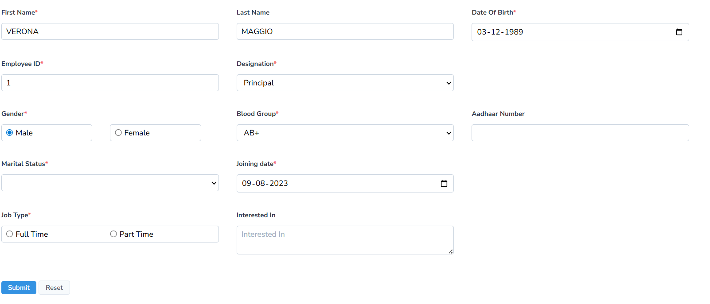

**4. Adding Educational Qualifications**

**Step 4: Enter Qualification Details**

- Provide complete educational background of the teacher.

-Include degree names, specializations, certifications, and institution details.

- Click **Submit** to save and proceed.

A new tab will open after submission.

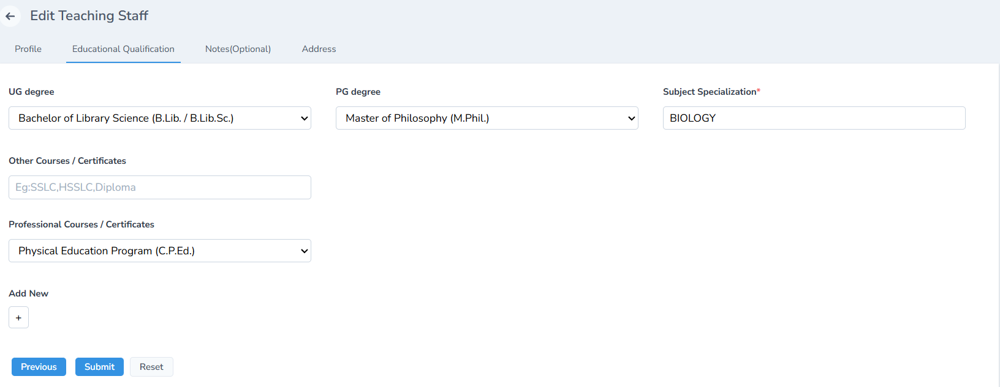

**5. Recording Notes & Additional Information**

**Step 5: Enter Notes**

- Add important remarks relating to the staff member.

- These may include internal notes, special instructions, or HR-related information.

- Click **Submit** to save the notes.

A new tab will open after saving the notes.

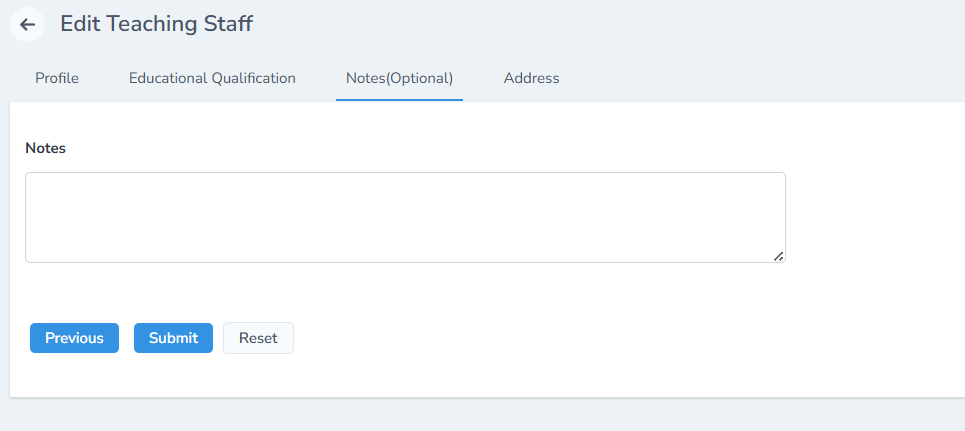

**6. Recording Address Information**

**Step 6: Enter Address Details**

Fill in the teacher's complete residential details including:

- Address Line
- Country
- State
- City
- Pincode

Click **Submit** after completing all fields.

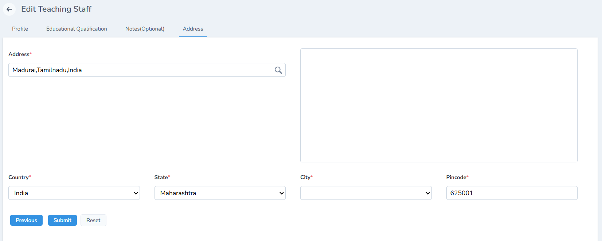

**7. Successful Profile Creation**

**Step 7: Final Confirmation**

Once all details are submitted:

- The teacher’s profile is successfully created and saved in the portal.

- You can now view, edit, or manage the teacher’s profile from the Teaching Staff list.

**Your teacher profile setup is now complete!**

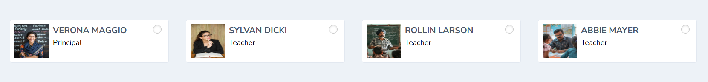

**8. How to Filter & Search Options for Teaching Staff**
 

When viewing the **Teaching Staff** list, administrators can efficiently locate specific teachers using the built-in filtering tools:

**Search Bar**

- Allows the admin to search teacher profiles using keywords such as name, ID, email, or phone number.

- Helps quickly locate specific staff members in large institutions

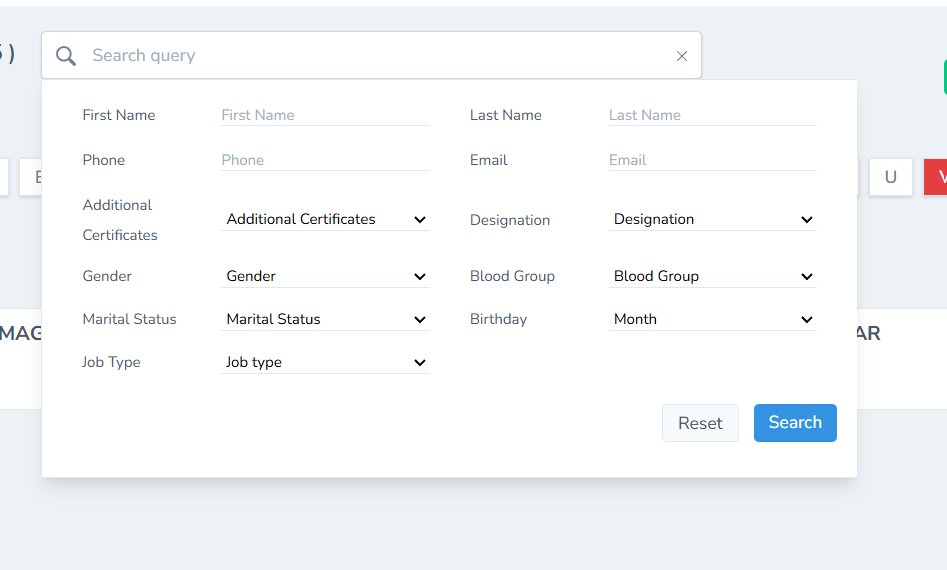

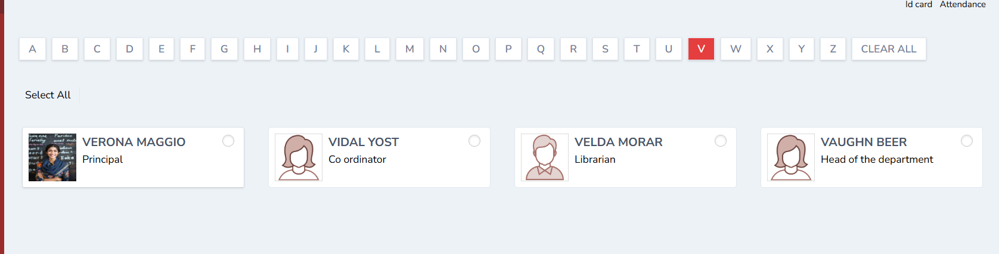

**Alphabetical Filter**

- Displays buttons from **A–Z**  for easy alphabetical filtering.

- Clicking a letter shows all teachers whose names begin with that letter.

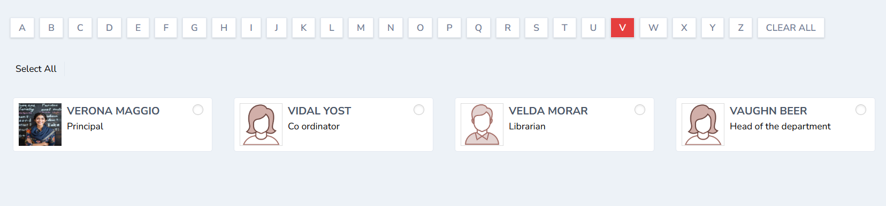

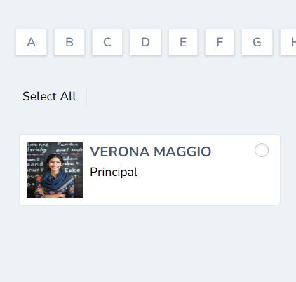

- Ideal for quick navigation through long staff lists.

These filtering tools help streamline staff management and improve admin efficiency.

**9.How to Import & Export the teacher’s details**

When you reach the **Teaching Staff** list page, you will find additional bulk management tools next to the **Add** button:

**2a.Import Teachers**

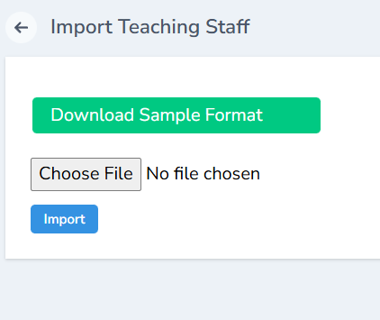

This feature allows you to upload multiple teacher profiles at once.

- Click **Import.**

- Download the system-provided sample file.

- Fill in all teacher details such as Name, Email, Mobile Number, Department, Aadhar No, Employment ID, etc.

- Upload the file back into the portal.

- The system validates the data and displays any errors that need correction.

- Once validated, all teacher profiles are added instantly.

**2b. Export Teachers**

This option helps you download the existing teacher list in bulk.

- Click **Export.**

- The system downloads the teacher database in Excel/CSV format.

- Useful for data backup, audits, HR documents, or verifying staff records.

These import/export tools make large-scale data management efficient and minimize manual entry work.

**2c.The ID Card can generated in seconds by clicking ID card. The ID can also be printed.**

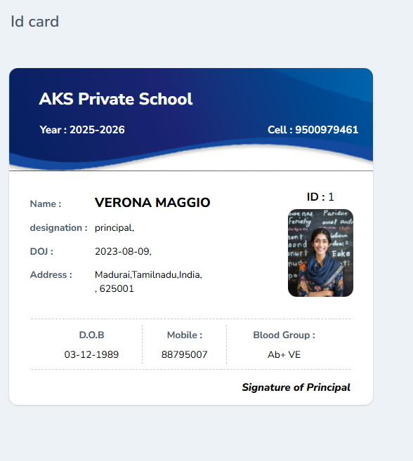

**10. How to add Attendance by the Admin**

The admin can mark the attendance using the attendance tab. Fill all the details such as date, session, reason and remarks and click save and submit. The same will be reflected in the teacher’s profile….

For more info ( Check how to add the attendance link) 

**11. Additional Profile Tabs**

**The admin can add the Additional Profile Tabs (After the Teacher’s Profile Is Created)**

Once the teacher’s profile is saved, several tabs become available for further management of the teacher’s information in the admin dashboard.

**Profile**

Displays all basic personal, professional, and contact details of the teacher.

**Timeline**

Shows chronological activities and updates related to the teacher, such as profile edits, class assignments, document uploads, etc.

**Assigned Classes**

Lists all the classes, subjects, and schedules assigned to the teacher. Helps administrators quickly verify teaching responsibilities.

Classes can be assigned by the admin. Click the link for the detailed tutorial

[https://docs.gegok12.com/documentation/core-modules/class-section-management](https://docs.gegok12.com/documentation/core-modules/class-section-management)

**Leave History**

Displays all approved, pending, and rejected leave applications submitted by the teacher. Useful for attendance and payroll management.

**Notes**

Section for internal remarks or HR notes. These notes are only visible to admin-level users.

**Documents**

Allows uploading and storing essential teacher documents such as certificates, ID proofs, appointment letters, contracts, etc.

Click Add on the top-right corner to upload teacher-related documents. You can:

- **Add** certificates

- Upload ID proofs

- Attach appointment/experience letters

- Upload any other supporting documents

After selecting and uploading the required files:

- Click **Submit** to save the documents

- The uploaded files will be successfully stored and displayed in the teacher’s profile for future reference. Allows uploading and storing essential teacher documents such as certificates, ID proofs, appointment letters, contracts, etc.

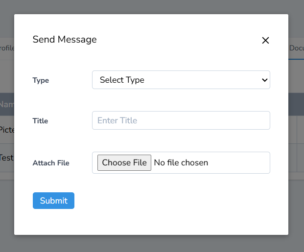

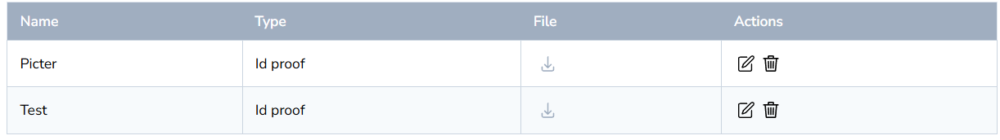

**Bank Details**

Used to store salary processing information such as bank account number, IFSC, branch, and other payment-related details.

Click **Add** on the top-right corner to enter the teacher’s bank information. You can:

- Add bank account number

- Enter IFSC code

- Specify bank name and branch details

- Provide any additional salary-related banking information

After filling in the details:

- Click **Submit** to save

- The bank details will be securely stored and displayed in the teacher’s profile for future payroll processing.
Used to store salary processing information such as bank account number, IFSC, branch, and other payment-related details.

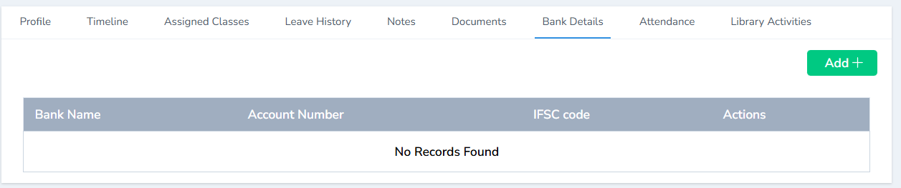

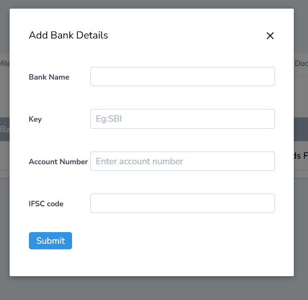

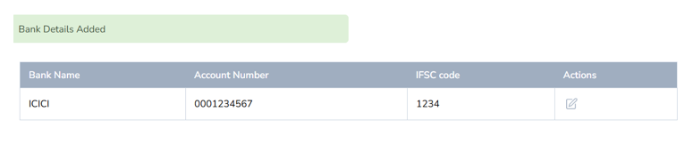

**Attendance**

Displays the teacher’s monthly attendance records, including present days, leave, and late entries.

**Library Activities**

Shows the teacher’s library usage such as borrowed books, return dates, overdue alerts, and book history.
The admin can check the library activities such as issue date , return date and status of the book taken from the library 

These tabs help provide a complete, well-organized record of each teacher within the institution’s system.

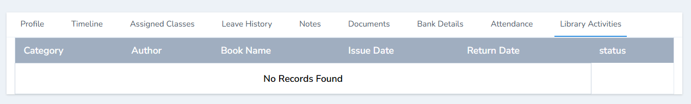

## **Additional Actions Available in Teacher Profile**

When viewing a teacher’s complete profile, administrators have access to several important action buttons for managing account status, verification, and credentials.

**1.Deactivate**

- Click Deactivate  to disable the teacher’s account without permanently deleting it.

- Change the status to OK if you want to deactivate  

- Helpful when a staff member resigns, goes on long-term leave, or is temporarily inactive.

- The teacher will no longer be able to log in after deactivation.

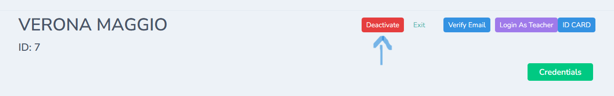

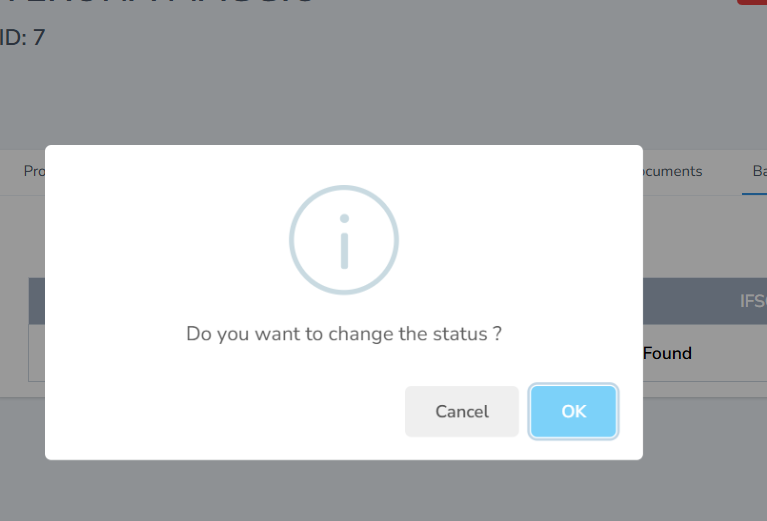

**2.Exit**

- Click Exit to permanently exit the teacher’s account.

- Change the status to **OK** if you want to exit the teacher 

- Allows the admin to exit the current profile view and return to the main teacher list.

- Useful for quick navigation.
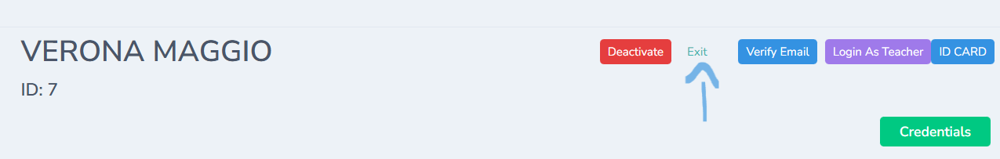

**3.Verify Email**

Click  verify email to the teacher’s registered email address.

- Sends a verification email to the teacher’s registered email address.

- Ensures the email is active and valid for communication and login recovery.

- Status updates once the teacher verifies the email.

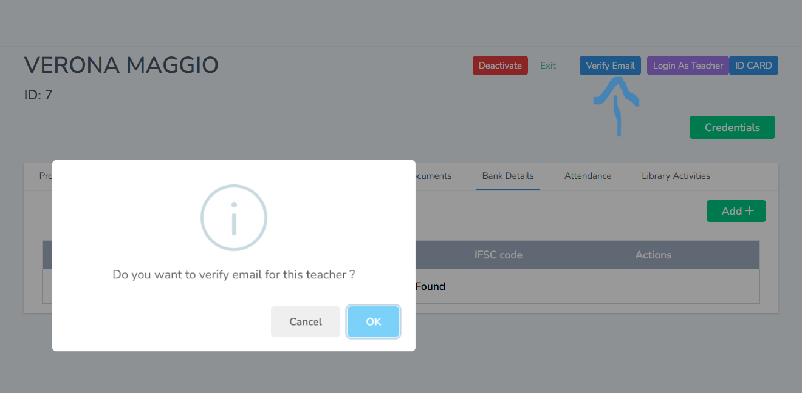

**4.Login as Teacher**

- Allows the admin to temporarily log in as the teacher by clicking Login as Teacher 

- The teacher’s dashboard will be opened 

- Useful for checking issues, verifying dashboard access, or troubleshooting user complaints.

- All actions performed are logged for security.

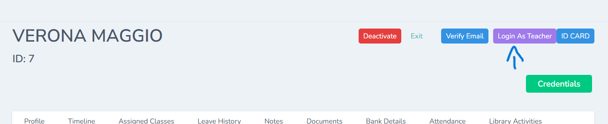

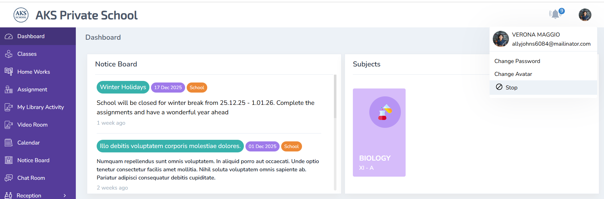

**5.ID Card**

- Generates or displays the teacher’s digital ID card.

- Can be downloaded or printed for school records.

- Includes essential staff identification details.

**6.Credentials**

- Provides access to the teacher’s login credentials.

- Allows the admin to view or regenerate the username and password.

- Useful for onboarding or assisting teachers who forget their login details

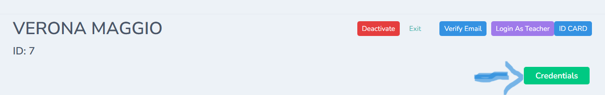

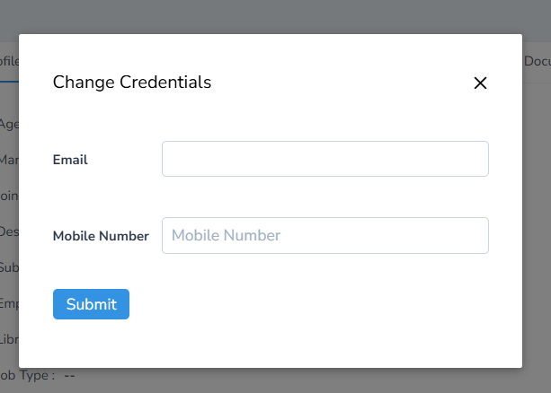

### 1.How to Add a Non Teaching Staff

**There are various categories of non-teaching staff in the school, and the same procedure applies to all non-teaching staff members.**

Menu Path

**Users → Staff → Non-Teaching**

Steps

1.	Log in with your **Admin** credentials.

2.	From the left menu, go to **Users.**

3.	Click **on Staff.**

4.	Select **Non-Teaching.**

5.	A new tab will open showing the list of non-teaching staff.

6.	Click the **Add (+)** button to create a new non-teaching staff profile.

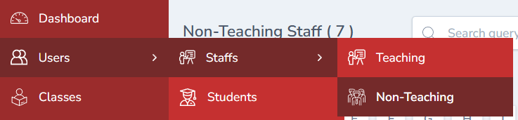

**1.1.How to Add an Accountant**

Menu path 

**Users ----Staff ----Non teaching ----- Add**

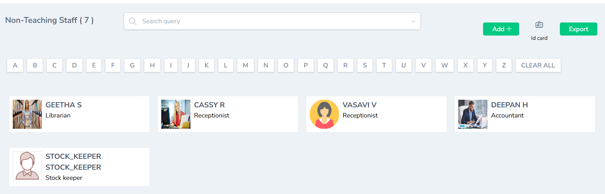

**1.2. Fill in Basic Profile Details**

Once you click **Add**, a new staff creation form opens.

Enter the Required Details

- **Name**
- **Mobile Number**
- **Email ID** (This will be used as the Login Username)
- **Designation → Select Accountant**

After entering all the details, **click** Submit.

**1.3 Add Educational Qualification**

Once the basic details are saved:

1.	A new tab **Educational Qualification** will open.

2.	Enter all qualification details such as:

- UG Degree
- PG Degree
- Subject Specialization etc

3.	Click **Submit** to proceed.

**1.4 Add Notes (Optional)**

The next tab shows the **Notes** section.

- Enter any internal notes related to the staff (optional).

- Click **Submit** to move to the next step.

**1.5 Add Address Details**

A new tab labelled Address will appear.

1.	Enter the complete **address** of the accountant.

2.	Review the details.

3.	Click **Submit.**

Once this final section is completed, the accountant’s profile is fully created.

### 2. Login Credentials Creation

After all steps are completed, **GegoK12 automatically generates the login credentials** for the Accountant.
Default Login Credentials

- **Username:**  The Email ID entered during staff creation
- **Password:**  password (A default password)

**Note:**

The Accountant can change this password later from the profile settings.

**The ID card can be generated and printed from the admin’s profile**

### 3. Completion

The **Accountant login is now successfully** created, and the staff can access the Accountant Module with the generated credentials.

**Additional modules**

From the Accountant’s profile page, the admin can

- Edit Profile
- Delete Profile
- View Profile
- View timeline
- Add Notes
- Upload Documents
- Record Bank Details

The Accountant can login with the credentials given by the Admin

**Login Id:** The mail id given by the Admin

**Password:** Password(By default)  

The password can be changed later by the accountant in the accountant’s profile

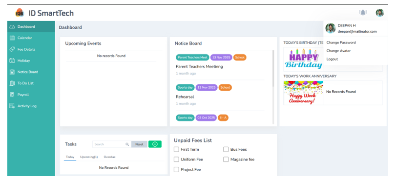

The accountant can view the unpaid fee by clicking on to it 

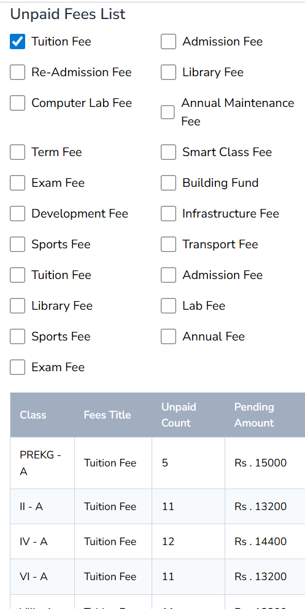

The accountant can schedule the structural and other fee

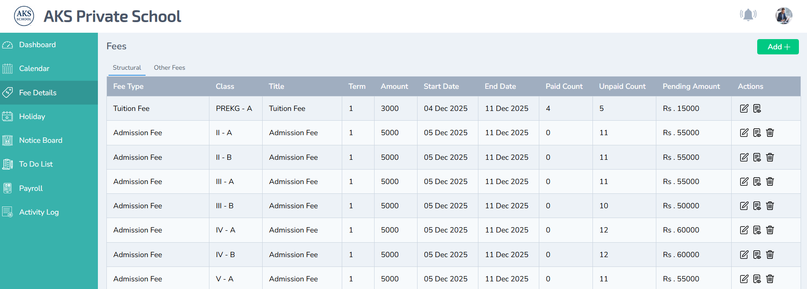

To know more details about accountant module click Account management 

[https://docs.gegok12.com/documentation/core-modules/account-management](https://docs.gegok12.com/documentation/core-modules/account-management)

### 4. Creating a Receptionist (Admin Guide)

**4.1 Navigate to Non-Teaching Staff**

Menu Path:

**Users → Staffs → Non-Teaching Staff**

Click Add New Staff to begin creating the profile.

Step 1: Go to users ---- Staffs ---- Non Teaching 

**4.2 Fill Basic Profile Details**

A staff creation form will open. Enter all required information such as:

- Name
- Mobile Number
- Email (Used as Login ID)
- Designation → **Receptionist**

Click **Submit** to move to the next tab.

**Note:** Email ID is mandatory. It becomes the Receptionist’s login username.

**4.3 Add Educational Qualification**

Fill in the relevant qualification details and click **Submit.**

 
**4.4 Add Notes**

Add any internal notes related to the receptionist profile.

Click **Submit.**
 
**4.5 Enter Address**

Add communication and permanent address information.

Click **Submit** to complete the creation process.

**4.6 Login Auto-Creation for Receptionist**

Once all steps are completed, GegoK12 automatically creates the login credentials:

- **Username:** Email entered by the admin
- **Password:** password (Receptionist can change it later)
- The receptionist can later update their password using **Change Password** inside their dashboard.

 
**4.7 Additional Admin Controls**

From the receptionist’s profile page, the admin can:

- **Edit Profile**

- **Delete Profile**

- **View Timeline**

- **Add Notes**

- **Upload Documents**

- **Record Bank Details**

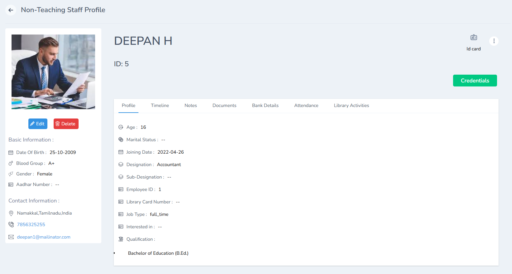

**Check Timeline**

**Step 8:** The timeline shows the list of activities in the receptionist profile

 
**Enter Notes**

**Step 9:** Any important details about the profile can be recorded here. Once done click submit

  
**Upload Documents**

**Step 10:** Click Documents and add the documents for future use by clicking the add button and click submit. 

 
**Enter Bank Details**

**Step11:** Bank details can be added here for the future use by clicking the Add button 

 
 Once the admin creates the receptionist login the receptionist can login in the portal login with Mail Id as the given mail id during the form craetion and password as password. The password can be changed if required by using change password.   

 The password can be changed from the receptionist login by clicking change password  

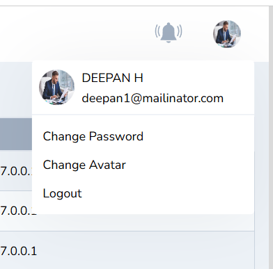

 Link – You can click the given link to know “How to Login as a receptionist”  

[https://docs.gegok12.com/documentation/core-modules/reception-management](https://docs.gegok12.com/documentation/core-modules/reception-management)

- **Username:** Email entered by the admin

- **Password:** password (Receptionist can change it later)

**The ID card can be generated and printed from the admin’s profile**

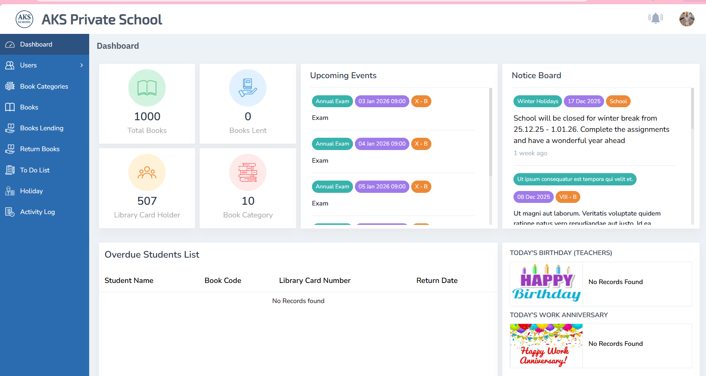

### 5.How to Add the librarian?

**5.1.Navigate to Non-Teaching Staff**

Menu Path:

**Users → Staffs → Non-Teaching Staff**

Click Add New Staff to begin creating the profile.

**Step 1:** Go to **users ---- Staffs ---- Non Teaching** 

 
**5.2 Fill Basic Profile Details**

A staff creation form will open. Enter all required information such as:

- Name

- Mobile Number

- Email (Used as Login ID)

- Designation → **Librarian**

Click **Submit** to move to the next tab.

**Note:** Email ID is mandatory. It becomes the Librarian’s login username.

 
**5.3.Add Educational Qualification**

Fill in the relevant qualification details and click **Submit.**

**5.4.Add Notes**

Add any internal notes related to the receptionist profile.

Click **Submit.**

**5.5. Enter Address**

Add communication and permanent address information.

Click **Submit** to complete the creation process.

 
**The ID card can be generated and printed from the admin’s profile**

## **Login Auto-Creation for Librarian**

Once all steps are completed, GegoK12 automatically creates the **login credentials:**

- **Username:** Email entered by the admin

- **Password:** password ( can change it later)

- The librarian can later update their password using **Change Password** inside their dashboard.

Link – You can click the given link to know “ The working of  library management”

[https://docs.gegok12.com/documentation/core-modules/library-management](https://docs.gegok12.com/documentation/core-modules/library-management) 

