# Staff Management

Staff management becomes effortless with our school management software. From profiles to records, everything is organized and just a click away

Click Users on the left pane and click staffs and then slect teaching and non teaching based on your requirement
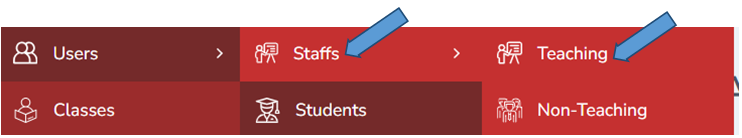

---
## Add Staff

1.  Click Teaching and add the staff by recording all the details
2.  With the help of the export button you can export the documents from excel.
3.  With the help of the import button you can import the documents to excel.

---

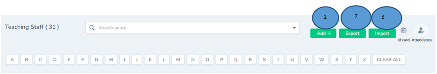

4.	Teacher can view the ID card 
5.	Staff Attendance can be marked here if the teacher is absent 

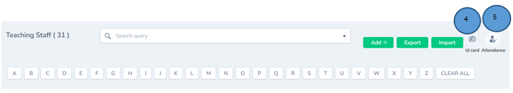

---

The number of teachers added in the portal will be shown
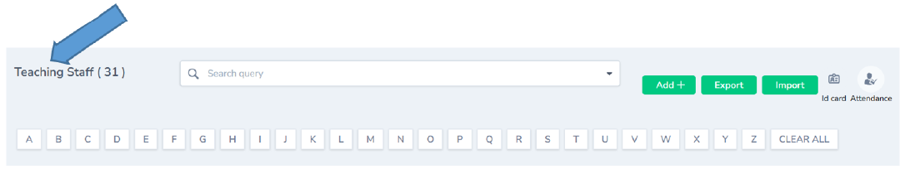

---

## Search and Filter Staff

You can use search button to filter the students based on your query
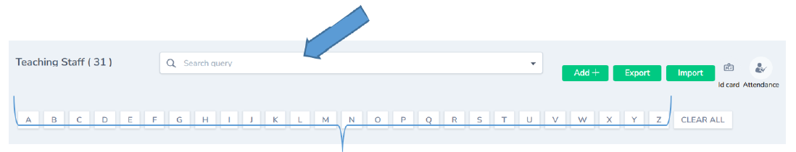

---

The added teachers will be listed down here
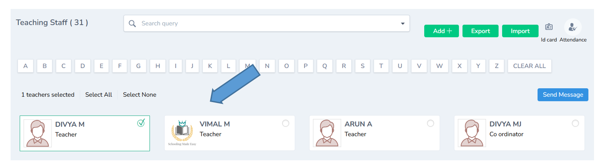

---

## Send Message

Click any of the teacher and messages can be sent
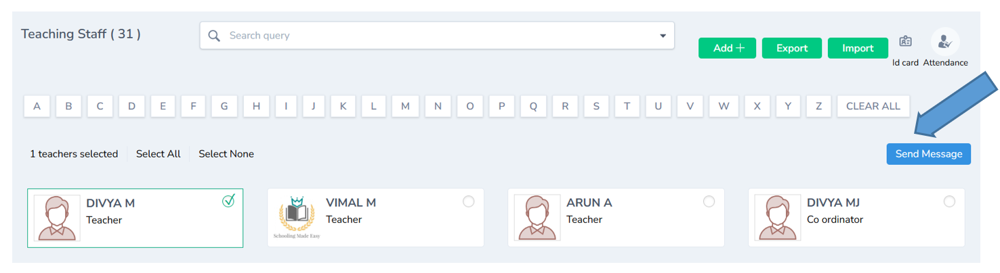

---
## Staff Details

Teacher’s full details can be viewed here.
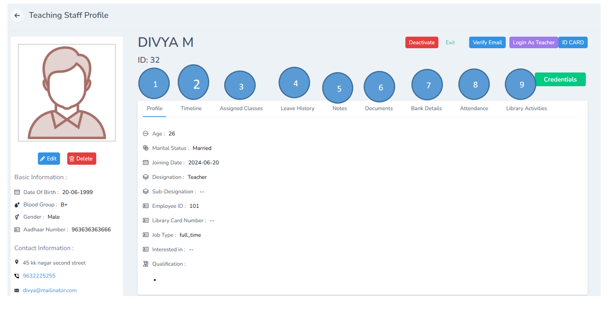

### Staff Profile

1.  Access the complete student profile in one place.

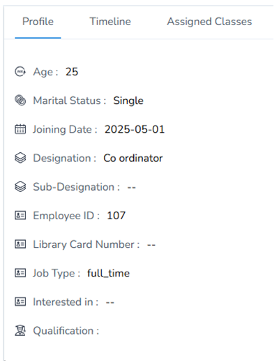

### Timeline

2.  Track every change made to the student’s record.

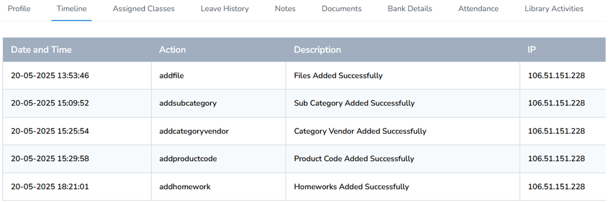

### Assigned Class

3.  Assigned classes can be viewed

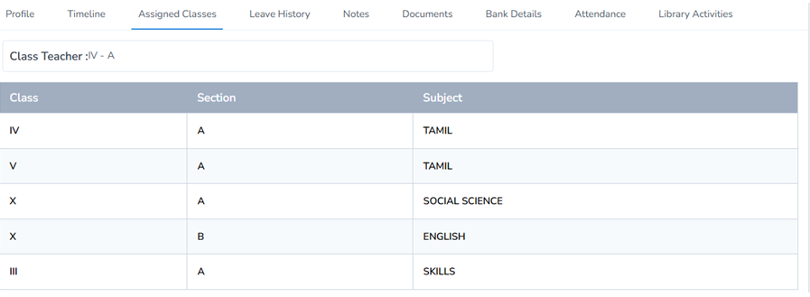

### Leave History
4.  Check the student’s leave history.

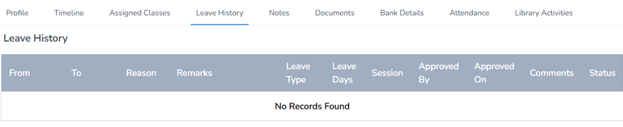

5.  Highlight and view important notes about the student.

6.  Important documents can shown here
7.  Review bank details securely.
8.  Monitor attendance records with ease.
9.  Track the teacher’s library usage and borrowed books.

### Staff Actions and Controls
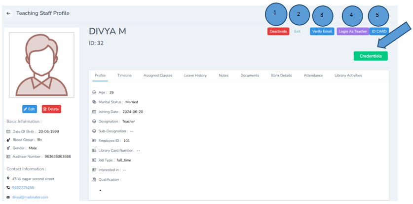

1. Teacher info can be Deactivated
2. Exit to be clicked to exit from the window
3. Email can be verified
4. Can login as a teacher
5. Teacher ID can be viewed

Teacher credentials like ID and PWD can be viewed and it can be changed here as well

---

## How to Manage the Teacher Profile

1.	Login with the teacher credentials
2.	A new dashboard will open,the overview of the dashboard is shown below

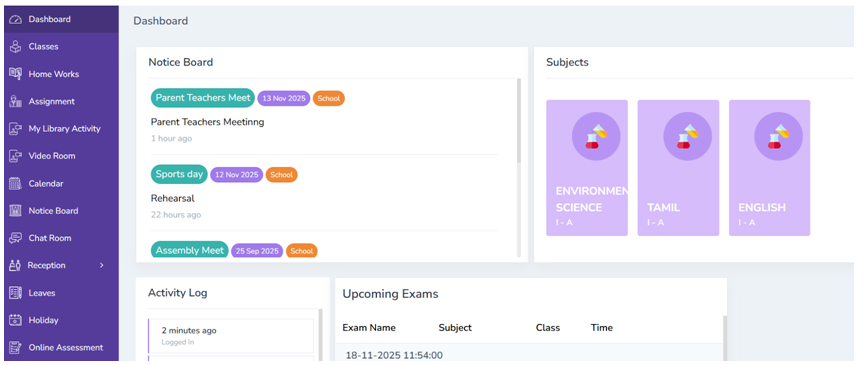

3.	Click classes tab and view the list of classes handled by the teacher

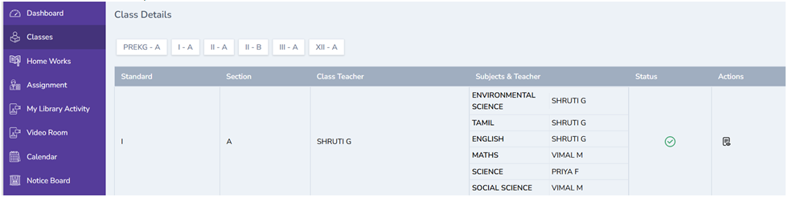

### Homework

4.	Click Homeworks to view the list of home work given by the teacher. The teacher can add home work by clicking the add button on the right top.

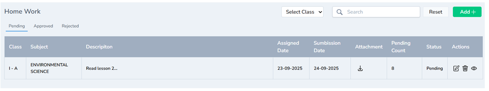

### Assignment

5.	Click assignment from the left pane and add assignment by filling the details as done below and click submit. The assignment will added successfully and sent to the students profile.

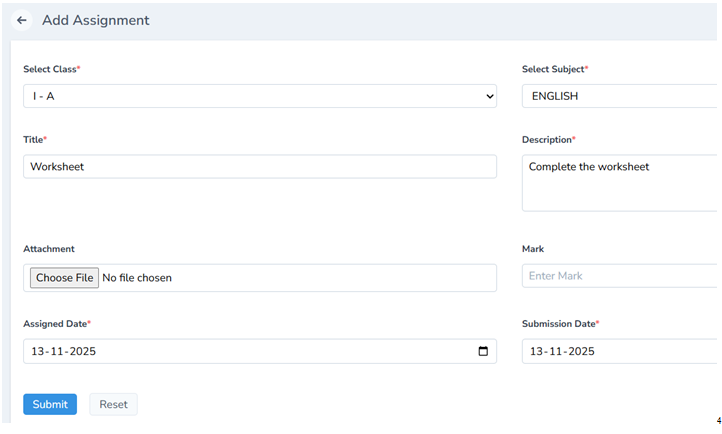
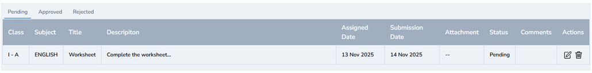

### Library Activity

6.	Click library activity to view the library details 

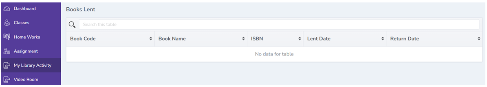

### Video Room

7.	The teacher can create a video room by clicking on the video room module and then add button on the right top and fill all the details, a new video room will be created 

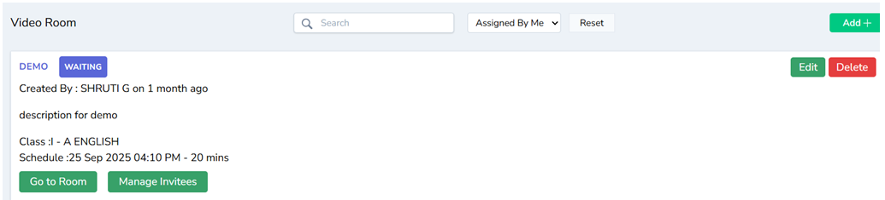

Note: The invitees can be managed by the teacher.

### Calendar

8.	By clicking on the calendar, the teacher can view the list of events marked in the calendar 

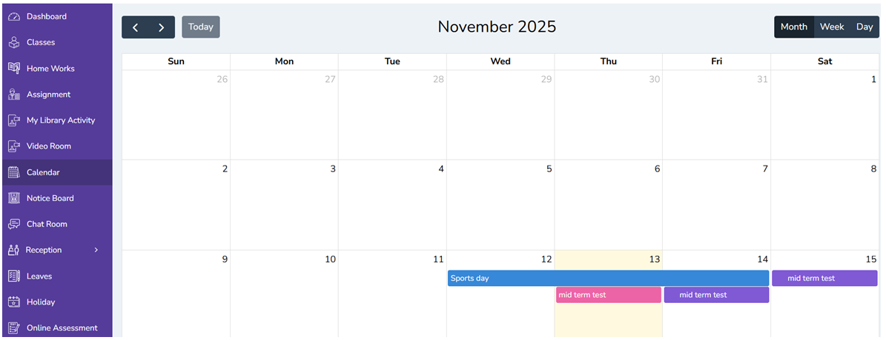

### Notice Board

9.	By clicking on the notice board , the teacher can view the digital notices

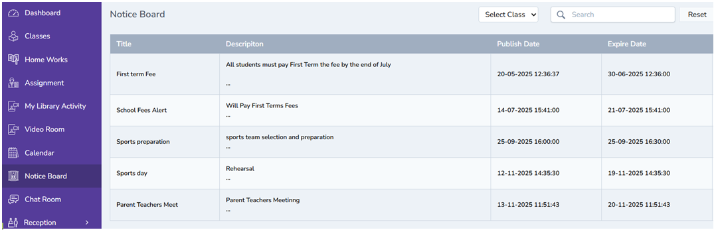

### Chat Room

10.	By clicking on the chat room module the teacher can view the chat room’s which are active for communication

### Reception

11.	By clicking on the reception module, the teacher can create visitor log, call log and postal record
Visitor Log 
11a. Click visitor log from the left pane of the dashboard
11b. Click Add button the right top corner 

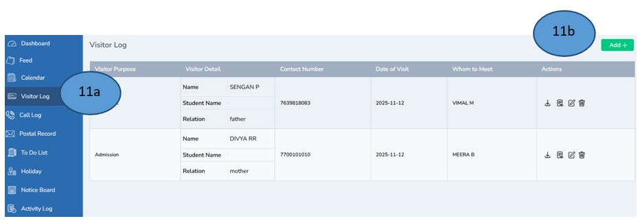

11c. Fill all the details in the form and click submit

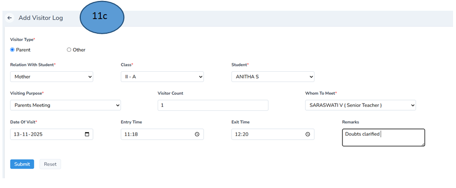

11d. The visitor details will be added in the visitor 

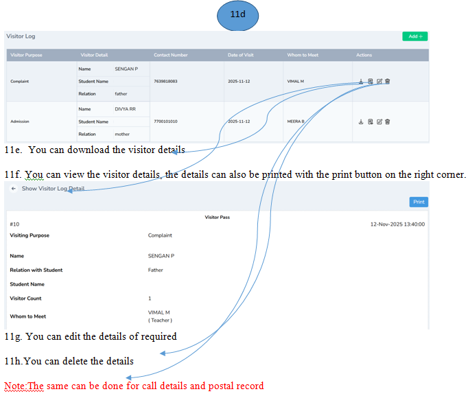

## Leave Management

12.	Click leave from the left side of the pane and click add leave from the right top corner to apply for leave. The leave applications will also be displayed in the leave section. 

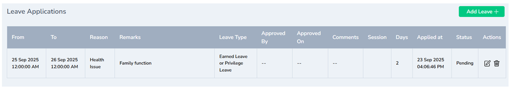

Note: The leave status will be changed if the principal approves the leave

13.	Click holiday to display the holidays of the year

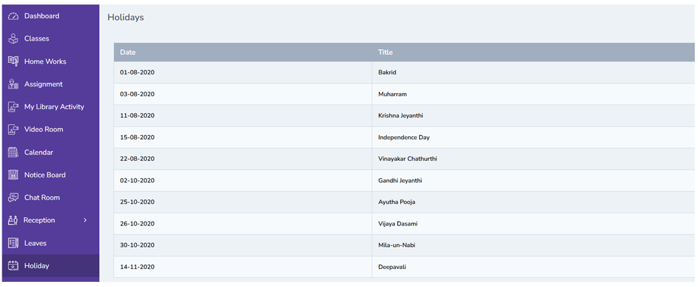

14.	The teacher can add online assessment by clicking on the online assessment and click add button on the right top corner , record all the details and click submit . The assessment will be created and sent to the parents for completion.

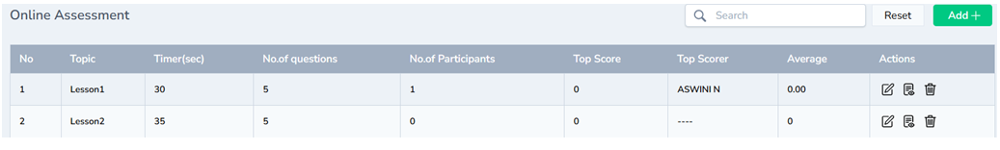

## Lesson Plan

15.	Click Lesson plan module from the left pane. 

15a. Click Add button on the right top corner.

15b.Fill all the details and click save

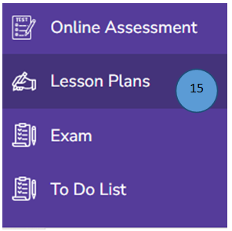
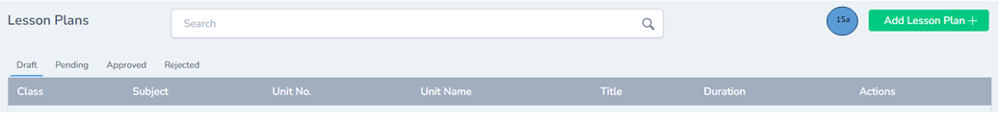
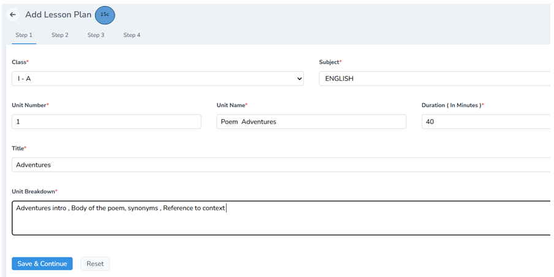

15d.The lesson plan will be displayed in the lesson plan tab.

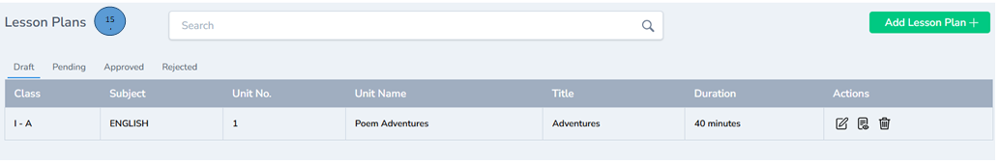

16.	Click exams , the upcoming exam schedule will displayed

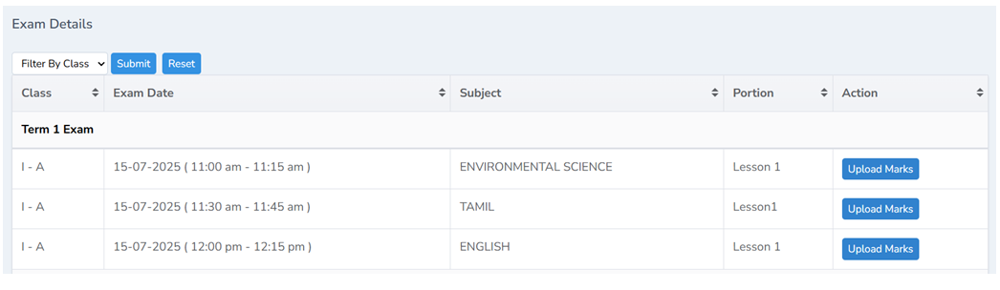

17.	Click to do list and add a task for self, students or teachers , finally click and save . The list of tasks will be displayed and reminders will also be given to complete the task before time. 

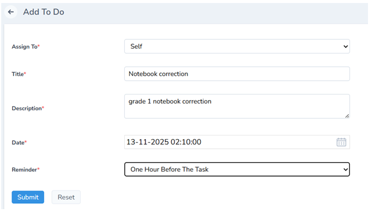