# Student Management

GegoK12 is a smart, cloud-based school management software designed to simplify, secure, and centralize your school’s database. From student and staff profiles to exams, fees, and even uniforms everything is stored, organized, and just a click away. With GegoK12, data turns into insights, and management becomes effortless.

To get into student management click Users from the left pane and click students

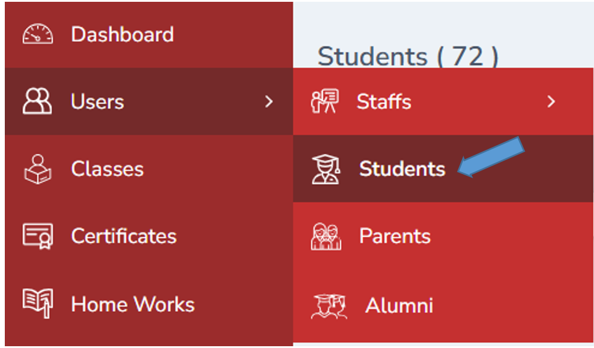

---

## Add Student
Add button is helpful to add the new students in the portal

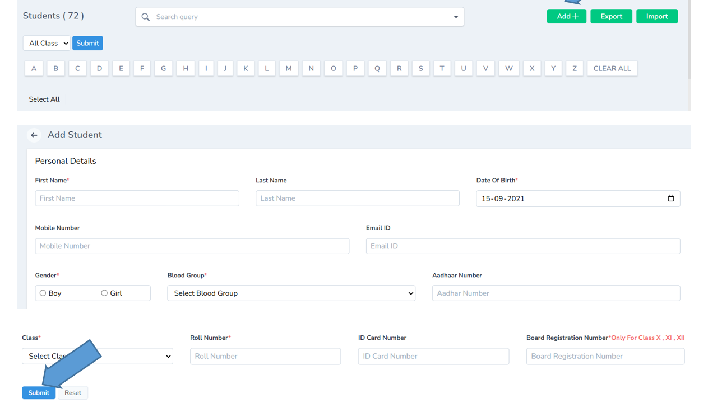
Click submit after recording all the details. You can also reset the details if required.

---

## Students List

The added student will be listed down.

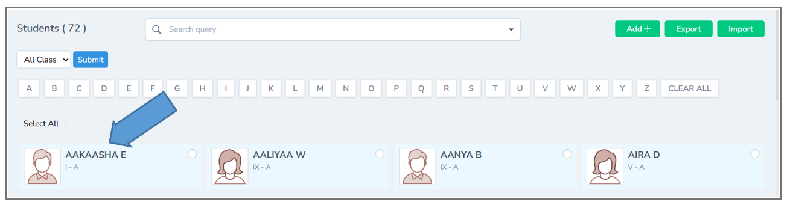

---
## Student Detail

By double clicking on the student you can view the entire details of the student.

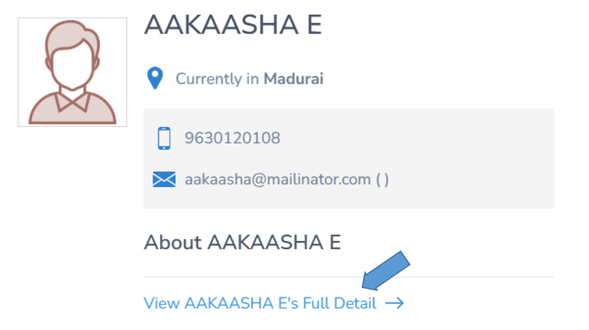

---
### Edit or Delete Student Records
You can easily edit or delete the information whenever required.

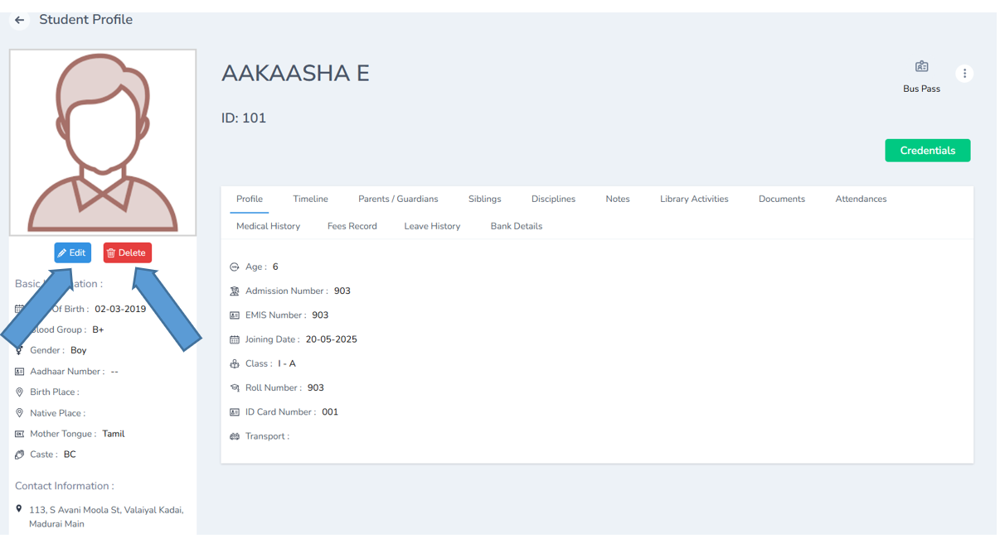

---
### Student Profile Actions
Click 3 dots on the right corner the list of options will be displayed such as Deactivate , Exit, Verify email, Add parents, Add disciplie, compare marks,login as student and view marks.

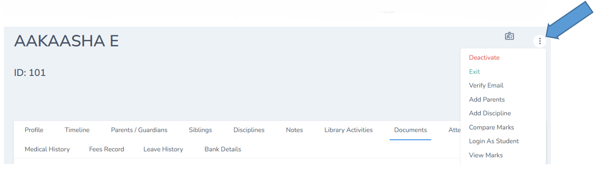

---
### Student Detail Tabs

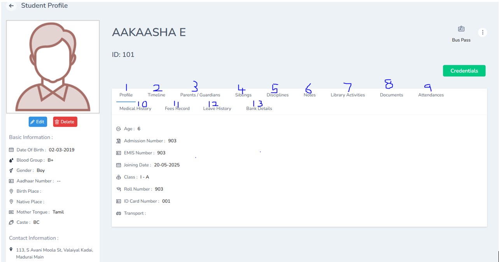

1. Access the complete student profile in one place.
2. Track every change made to the student’s record.
3. View parent and guardian information instantly.
4. Check details of siblings enrolled in the school.
5. Review the student’s disciplinary history.
6. Highlight and view important notes about the student.
7. Track the student’s library usage and borrowed books.
8. Important documents can shown here
9. Monitor attendance records with ease.
10. Access the student’s medical history when needed.
11. View comprehensive fee payment details.
12. Check the student’s leave history.
13. Review bank details securely.

---
## Import and Export Students

With the help of the export button you can export the documents from excel.

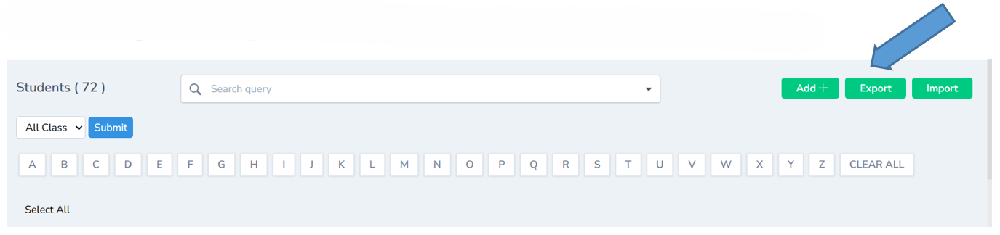

---

With the help of the export button you can import the documents to excel.

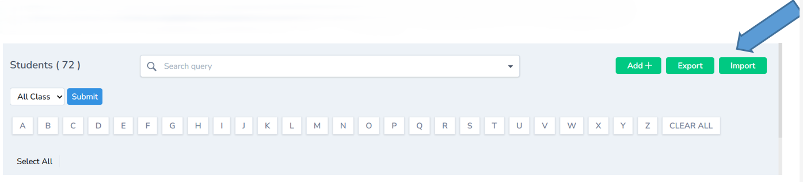

---
## Send Message

By click on the student you can send message or add fee details if required

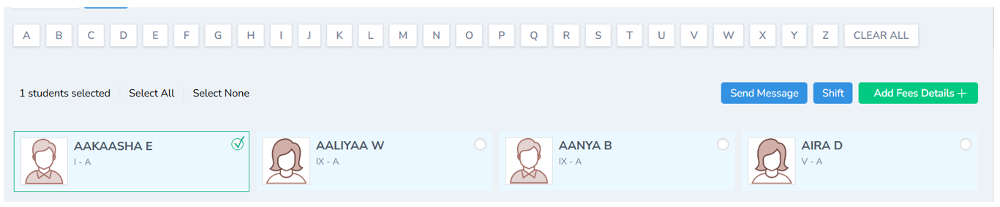

---

The number of students added in the portal will be shown

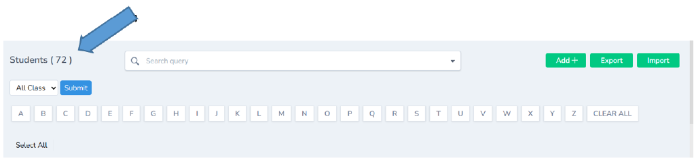

---

## Search and Filter Students

You can use search button to filter the students based on your query

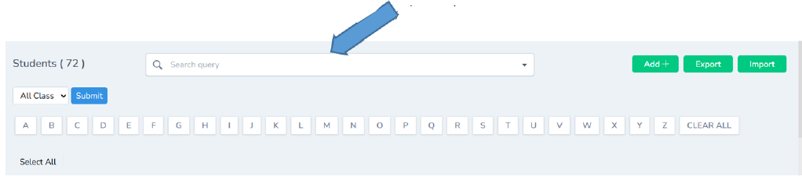

---

The classes will be listed down in this column

---

Student’s can be filtered using the Alphabet.

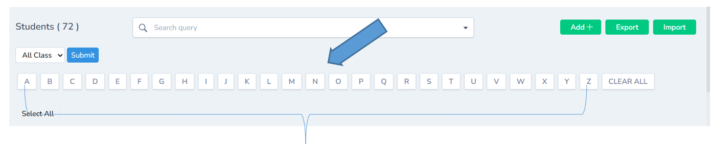

---
