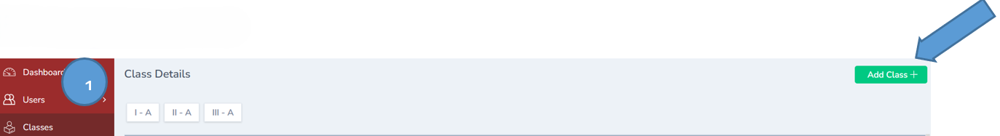
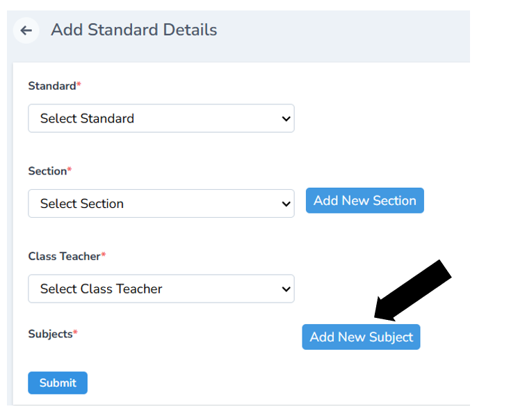
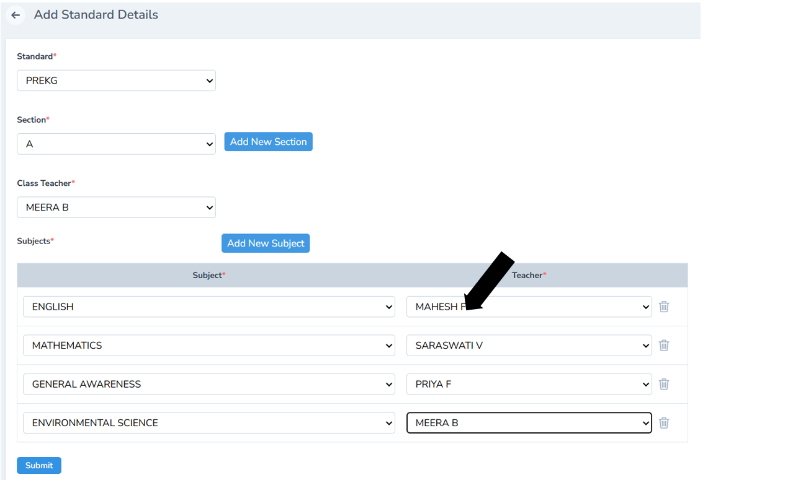
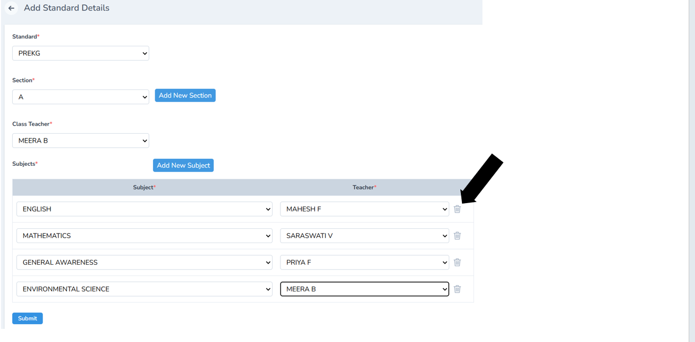

# Subject Management in School Management Software

Subject Management is a feature that helps schools create, organize, and assign subjects across different classes and grades. Instead of manually keeping track of subjects and teachers, the software centralizes everything in one place.

---

## How Subject Management Works

1.  **Create Subjects**  – Add subjects like Mathematics, Science, English, History, etc. into the system.

2.  **Assign to Classes/Grades** – Link each subject to the respective classes (e.g., Grade 5 → Mathematics, Science, Social Studies).

3.  **Assign Teachers** – Allocate subject teachers so it’s clear who is responsible for which subject in each class.

4.  **Set Timetables** – Subjects automatically reflect in timetable creation, ensuring proper scheduling.

5.  **Track Performance** – Subject-wise exam marks and student performance reports can be generated.

To Add a subject, first you need to add a class

Click Users ----- Add class

Fill in all the details such as standard, section,class teacher to be assigned and allocation of the subjects and click submit

---

---

Note: If you want to remove the subject or the teacher you can just click the delete icon on the extreme right

Once completed, a new class is created with the selected subjects and assigned teachers.
