# Task Management

## Introduction

The **Task Management** module allows the Admin to create and manage tasks for self, students, and teachers. Tasks can be assigned with due dates, reminders, and completion tracking to ensure work is completed on time. Admins can also monitor today's tasks and overdue tasks from the dashboard.

## Task Management for Admin (Self)

### How to Add a Task for Admin

1. Log in using **Admin credentials.**
   - **Login ID:** Email ID
   - **Password:** Password

2. After successful login, the **Admin Dashboard** overview will be displayed.

3. Scroll down to the **bottom of the dashboard.**

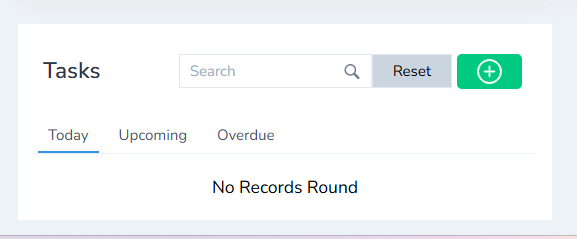

4. Click the "+" (Add Task) button.

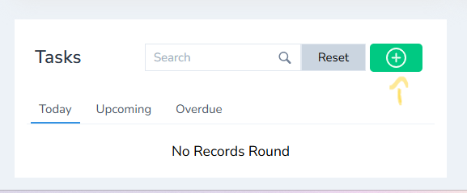

5. A task creation form will be displayed.

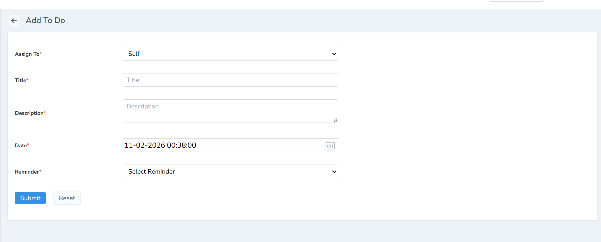

6. Fill in all the required task details and click **Submit.**

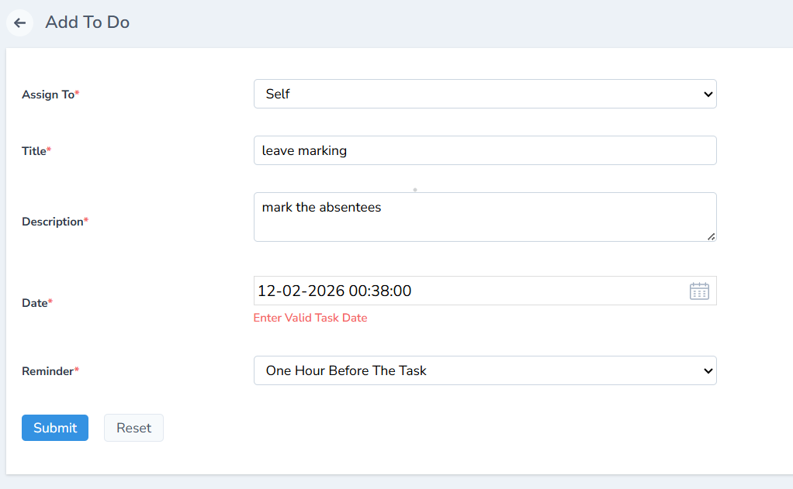

7. Once submitted, the task will be added and listed under the **Upcoming Tasks** tab.

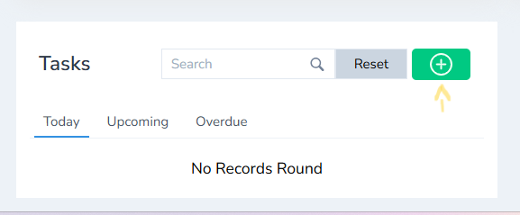

### Marking a Task as Completed

- When the task is completed, tick the **checkbox** next to the task to mark it as **Completed.**

**Note:** Tasks scheduled for **today** and **overdue tasks** will also be displayed automatically.

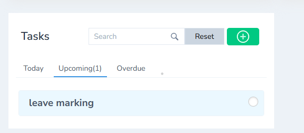

## Task Management for Students

### How to Add a Task for Students (Admin)

1. Log in using **Admin credentials.**
   - **Login ID:** Email ID
   - **Password:** Password

2. After login, the **Admin Dashboard** will be displayed.

3. Scroll down to the **bottom of the dashboard.**

4. Click the "+" (Add Task) button.

5. The task creation form will appear.

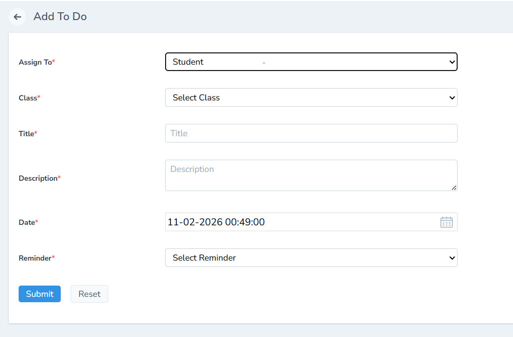

6. Fill in all required details:
   - Select the **Assign To** option correctly.
   - Choose the **Class and Student(s).**
   - Tasks can be assigned to:
     - A single student
     - A group of students
     - All students in a class
   - Select the **due date.**
   - Set a **reminder** (e.g., 1 hour before, 1 day before, or 2 days before the task).

 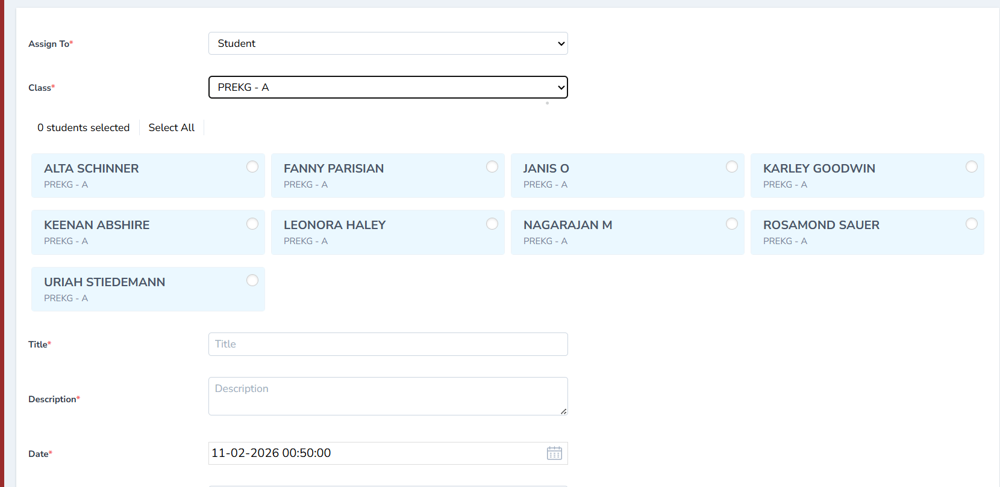  

7. Click **Submit** to create the task.

8. The task will be added to the **student's profile.**

### Student Task Completion

1. Log in to the **Student account** using the student's Login ID and Password.

2. The assigned tasks will be displayed at the **bottom of the Student Dashboard.**

3. Click the **checkbox** next to the task.

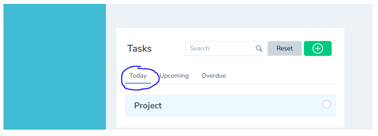

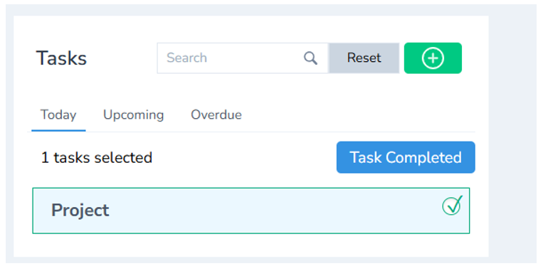

4. Click **Task Completed** to successfully complete the task.

## Task Management for Teacher

### How to Add a Task for a Teacher

1. Log in using Admin credentials.
   - **Login ID:** Email ID
   - **Password:** Password

2. After successful login, the **Admin Dashboard** overview will be displayed.

3. Scroll down to the **bottom of the dashboard.**

4. Click the "+" (Add Task) button.

5. A task creation form will be formed.

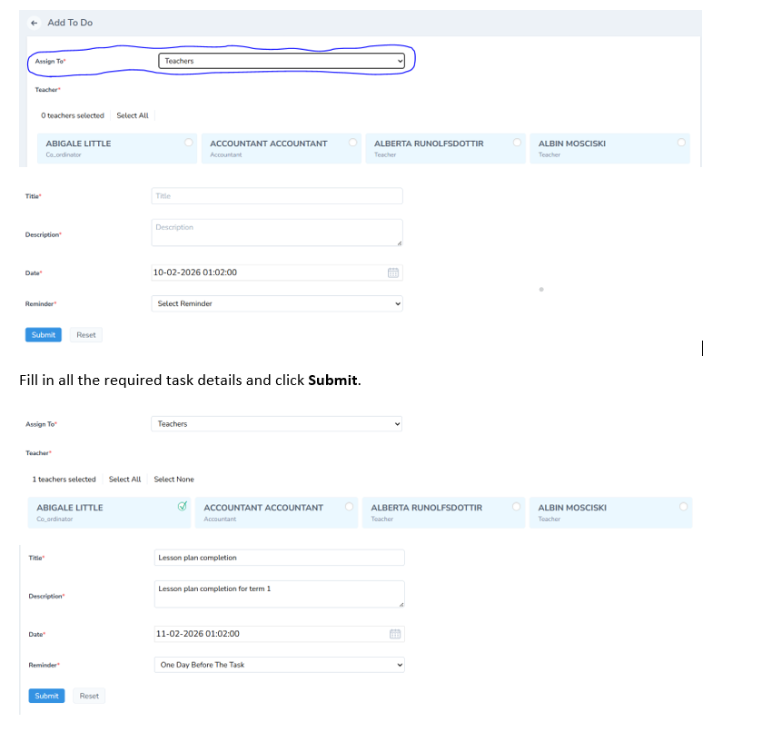

6. Fill in all the required task details and click **Submit.**

7. Once submitted, the task will be added and listed under the **Upcoming Tasks** tab.

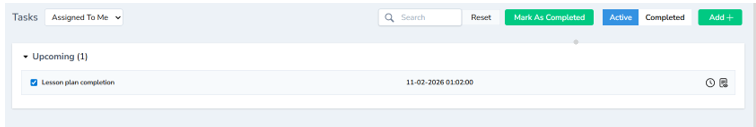

### Marking a Task as Completed

- When the task is completed, tick the **checkbox** next to the task to mark it as **Completed.**

## How to Create a Task by the Student

1. Log in using **Student credentials.**
   - **Login ID:** Email ID provided by the Admin
   - **Password:** Default Password

2. After successful login, the **Student Dashboard** will be displayed.

3. From the **left panel** of the dashboard, click **To-Do List.**

4. Click the "+" **(Add Task)** button.

5. A **task creation form** will be displayed.

6. Enter the task details such as **task name, description, date, and reminder** (if applicable).

7. Click **Submit** to create the task.

8. The task will be added to the student's **To-Do List** and will appear in the **upcoming tasks** section.

9. Once the task is completed, select the **checkbox** and mark the task as **Completed.**

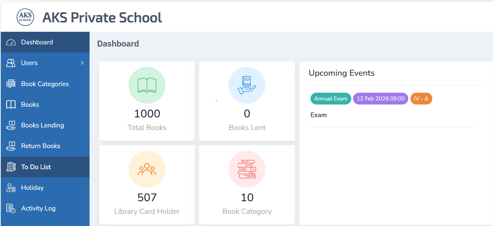

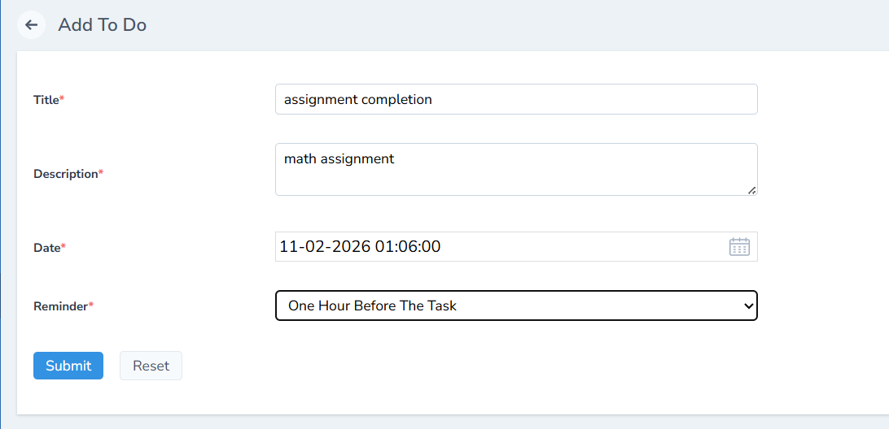

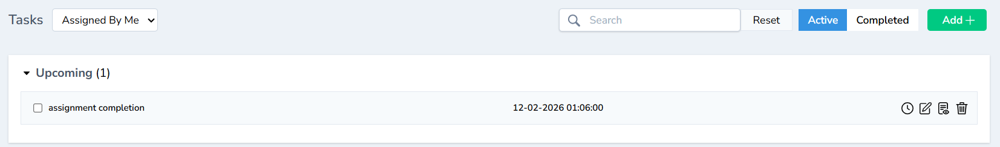

## Other Task Features

The **Task Management** module provides additional options to efficiently manage tasks.

- **Reminder Icon:** Used to set or receive reminders for tasks, helping ensure tasks are completed on time.

- **Edit Icon:** Allows modification of task details if any changes are required.

- **View Icon:** Enables viewing of complete task information without making changes.

- **Delete Icon:** Used to delete a task that has been created.

- **Mark as Completed:** Select the **checkbox** to mark a task as completed. Once marked as completed, the task will no longer appear in the active task list.

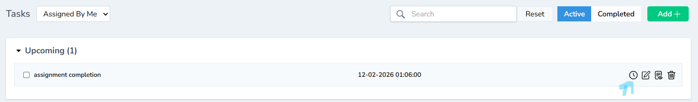

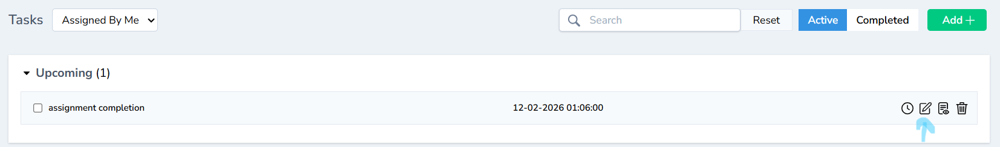

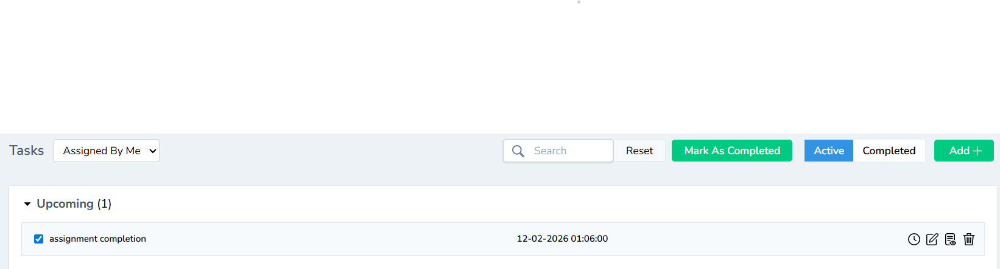

## Task Tabs and Views

- **Active Tasks:** Displays all ongoing and pending tasks.

- **Completed Tasks:** Displays tasks that have been marked as completed.

- **Task Views:**
  - Tasks Assigned by Me: Shows tasks created or assigned by the logged-in user.
  - Tasks Assigned to Me: Shows tasks assigned to the logged-in user by others.

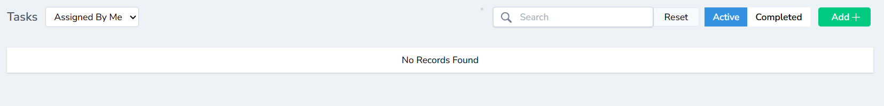

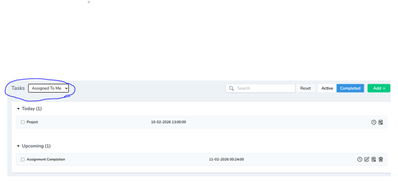

## Special Note

The same procedure can be applied for teachers and non-teaching staff.
