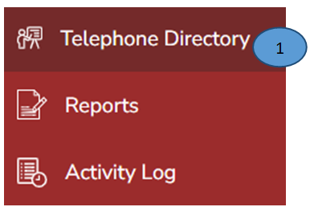
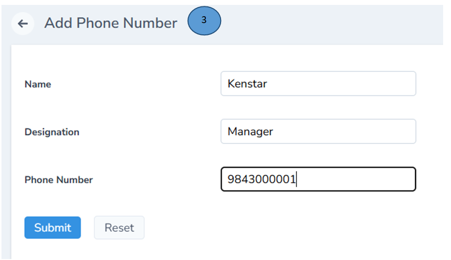
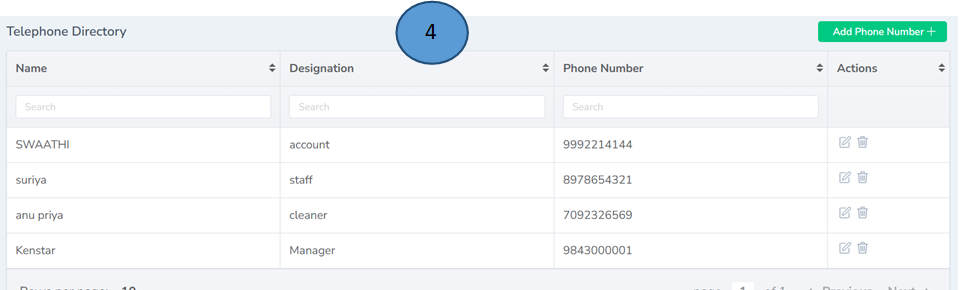

# Telephone Directory Management    
 

1.	Click Telephone Directory on the left pane 

2.	Click Add phone number tab from the right top corner 

3.	A new from will open, record all the details in the form and click submit. 

Note: You can also Reset the same if there are any deletions 

 

4.  New phone number with all the details will be listed down in the digital telephone directory. The same can be used anytime and from anywhere. 

Note: Editing and deleting is also possible from the Actions tab 

 

