# Installation Guide (Teacher App)

## Prerequisites

- Android Studio
- Git

**Project:** GegoK12 Teacher App

**Repository Link:**  
**HTTPS:** [https://github.com/Gego-K12/gegok12-teacher-app.git](https://github.com/Gego-K12/gegok12-teacher-app.git)

## 1. Install Android Studio

To develop or build the project, you must install Android Studio.

**Step 1: Download Android Studio**

- Visit the official Android Studio download page: https://developer.android.com/studio
- For a step-by-step installation tutorial, you may refer to: https://www.c-sharpcorner.com/article/how-to-download-and-install-android-studio-in-windows-10/

**Step 2: Install**

- After download, double-click the file: Android Studio-ide.exe
- The Android Studio Setup Wizard will open.
- Click Next, follow the prompts, and then click Finish to complete installation.
- When Android Studio opens for the first time, install any SDK components if prompted.

**Step 3: Clone the Project Repository**

Create a folder on your computer where you want to store your open-source projects (example: C:\GegoK12\TeacherApp).

**Clone using HTTPS:** Open Command Prompt or Git Bash and run:

```bash
git clone https://github.com/Gego-K12/gegok12-teacher-app.git
```

- Open Android Studio, popup will appear

Click on Open an existing Android Studio project” and select the project (or)

Click File -> Open, Open file or Project window will appear, where you can select your project as follows:

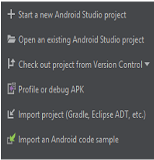

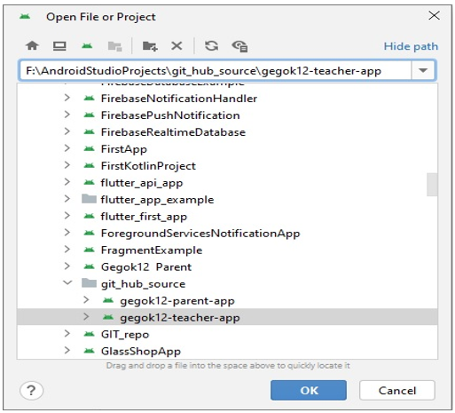

### IMPORTANT:

**Wait for Gradle Sync and Dependencies to Download**

Before proceeding with the project configuration, **ensure that Gradle sync is complete and all required dependencies are downloaded.**

1. Once you have opened the project in Android Studio, it will automatically attempt to sync with Gradle.

2. You will see a **Gradle Sync** process running at the bottom of Android Studio. Wait until this process completes.

   **Note:** This process may take a few minutes depending on your internet connection and the size of the project.

3. Once the sync is complete and Gradle dependencies are downloaded, you will see a "Sync finished" message in the status bar.

Until the Gradle sync is complete, **do not proceed with any configuration changes,** as it may cause errors in building the project or syncing dependencies.

## 2. Project configuration

**Update the Package Name (Refactor)**

```
  NOTE:
    You must change the package name FIRST before adding google-services.json.
    If you add google-services.json first, the Firebase will cause build errors.
```    

**Steps:**

1. In Android Studio:
   **Right-click → gegosoft/yourappname → refactor → rename → rename package**

2. Change from: **_com.gegosoft.yourappname_**

3. To your new desired package name.

4. Click **Do Refactor**.

5. Android Studio will rename all directories, manifests, Gradle namespaces, and references.

**After refactor:**

- Check **build.gradle (app-level)** → namespace "com.xxx.xxx"
- Check **AndroidManifest.xml** → package="com.xxx.xxx"

✔ **_Package name and Application ID must be identical_**.

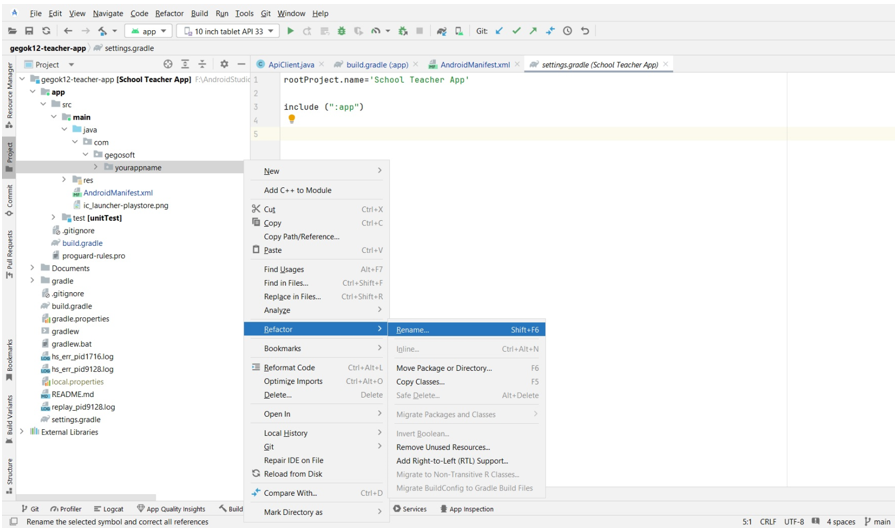

**If Package Name Not Updated Automatically,**

After refactoring, check the following sections.

- **build.gradle (Module: app)**

Look for:

- namespace "com.gegosoft.yourappname"
- applicationId "com.gegosoft.yourappname"

Replace with your new package name:

- namespace "com.&lt;your_company&gt;.&lt;your_app&gt;"
- applicationId "com. .&lt;your_company&gt;.&lt;your_app&gt;"

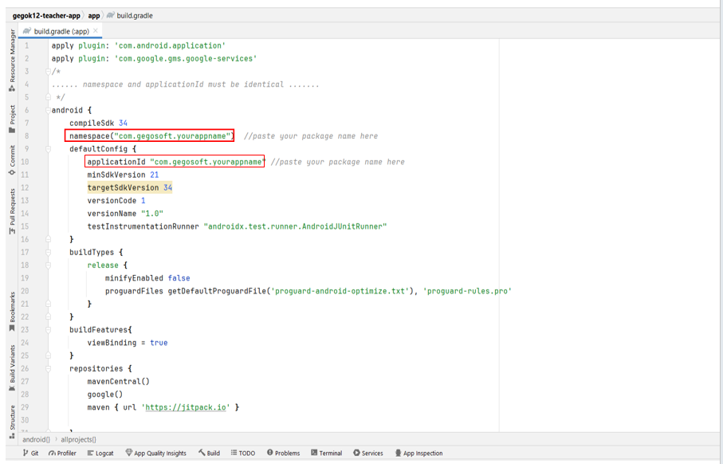

- **AndroidManifest.xml**

Open - app/src/main/AndroidManifest.xm

Look for:

- package="com.gegosoft.yourappname"

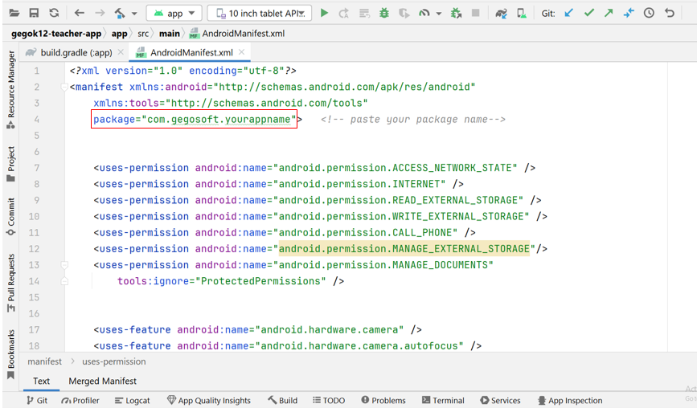

- **Check the Folder structure** [ app/src/main/java/com/gegosoft/yourappname/ ]

- If the folder names did not change automatically:

→ Right-click the folder → Rename each level manually (com → gegosoft → yourappname)

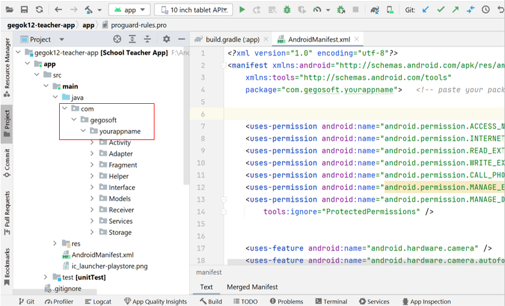

<span style="color:red">Note: Add the google-services.json File (AFTER Package Rename)</span>

## 3. Firebase configuration

- Refer this link - https://alphatech.technology/Blog-Entry-srk/Google-Services-Json-bek/ and get **google-services.json** from
  https://console.firebase.google.com/ and place it under app folder
  project → app → google-services.json

- Reference JSON Structure [Please generate google-services.json with your package name]:

<span style="color:red">Note: Please do not change or rename the google-services.json file. If a previous file exists, remove it and add the newly generated file from Firebase.</span>

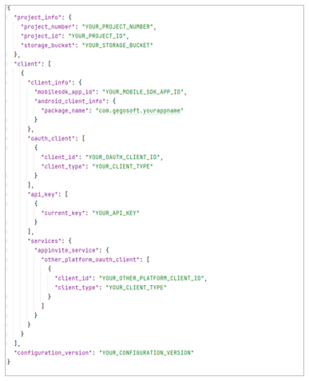

## 4. Update Domain URL

- Paste your domain URL in the ApiClient file [app\src\main\java\com\gegosoft\yourappname\Helper\ApiClient ]

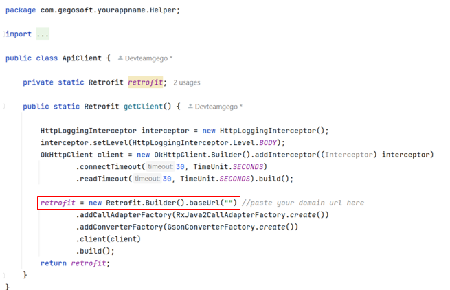

### Confirm Everything Is Updated

- The package name in code
- The folder directories
- The namespace and applicationId
- The manifest package attribute
- Your Firebase google-services.json package field
- Check domain url in ApiClient.java

## 5. Updating the App Name and App Icon

- **Updating the App Name**

  The app name appears on the device's home screen and in the app launcher. You can update the app name by modifying the **strings.xml** file and ensuring it is correctly referenced in the **AndroidManifest.xml**.

  - **Steps:**

**1. Locate and Edit the strings.xml File:**

- Navigate to res/values/strings.xml.
- Find the app name entry, which is usually defined as:
- &lt;string name="app_name"&gt;Teacher Demo School&lt;/string&gt;


**2. Update the App Name:**

- Change the value of app_name to your desired app name:
- &lt;string name="app_name"&gt;YourAppName&lt;/string&gt;

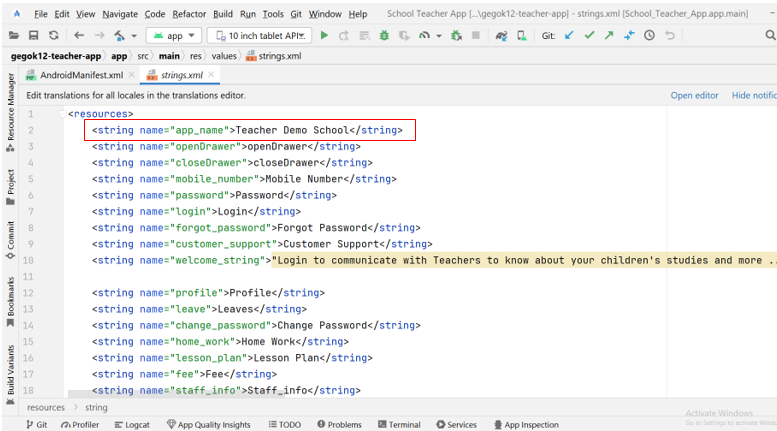

**3.Check the AndroidManifest.xml File:**

- Ensure that the android:label attribute in the &lt;application&gt; tag points to the app_name string resource:

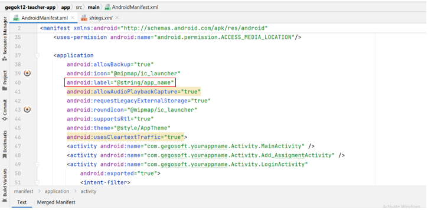

- **Updating the App Icon**

The app icon is the image shown on the device's home screen and in the app launcher

**Steps:**

**1. Open Image Asset Studio:**

- Right-click on the res folder in the project view.
- Navigate to New > Image Asset.


**2. Choose Icon Type:**

- In the "Asset Studio" window, under "Icon Type," choose **Launcher Icons (Adaptive and Legacy)**.
- This will give you the option to select a vector image, clipart, or your own custom image for the app icon.

**3. Set the Icon:**

- Click on the icon area to browse [**Source Assest** section → **Path**] and select your new icon image.
- Adjust the image (resize, reposition, etc.) as necessary to ensure it looks good.
- Image Asset Studio will automatically create the required icon sizes for different screen densities (hdpi, mdpi, xhdpi, xxhdpi, xxxhdpi).

**4. Review and Apply:**

- Review the icon preview to ensure it looks correct across all densities.
- Once satisfied, click Next and then Finish to apply the icon.

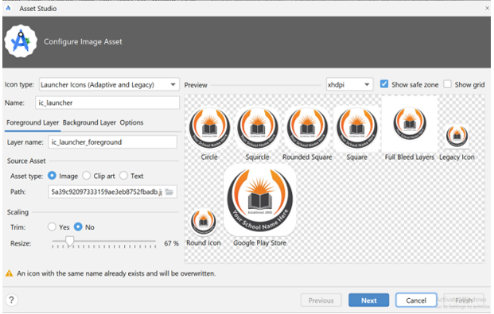

**5. Verify in AndroidManifest.xml:**

- Ensure the &lt;application&gt; tag in the AndroidManifest.xml file references the correct icon (it should automatically update to @mipmap/ic_launcher):

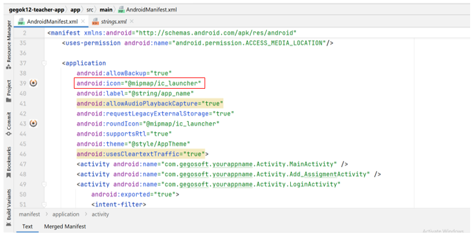

## 6. Sync the Project & Build

- Click **Sync Now**
- Build and run the project

  a) For creating virtual devices, from menu - select Tools -> Device Manager or you can select the icon given in the below image:

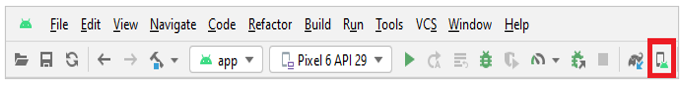

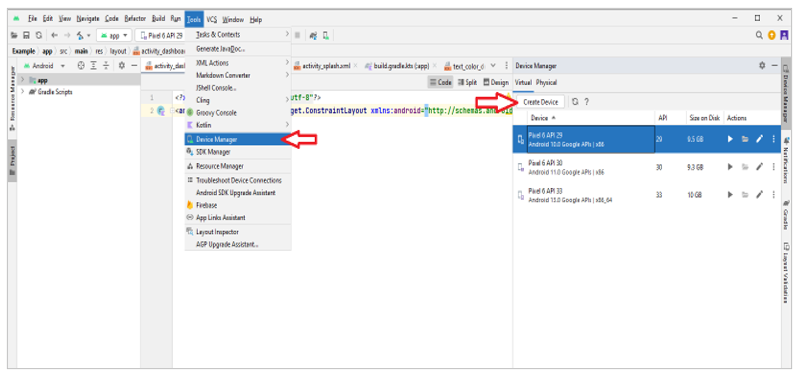

b) To run the project in emulator, from menu - select Run -> Run ‘app’ or you can select the icon given in the below image:

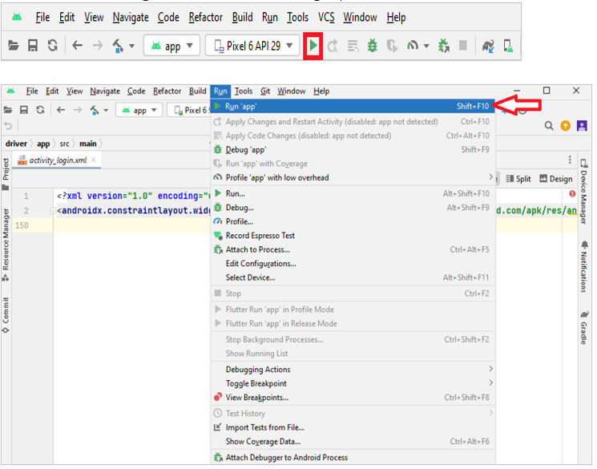

c) To build apk file (.apk), from menu - select **Build -> Build Bundle(s)/ APK(s) -> Build APK(s)**.

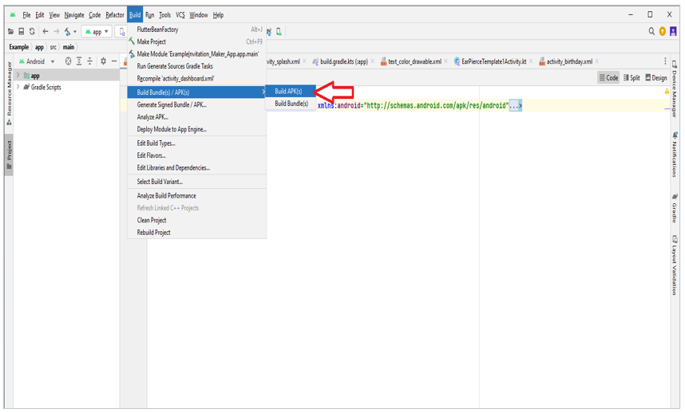

d) At bottom right Build APK(s) popup will appear, click locate from the popup. It redirects to the folder, please click on debug folder , app-debug is the apk file, you can rename it by right-click on it

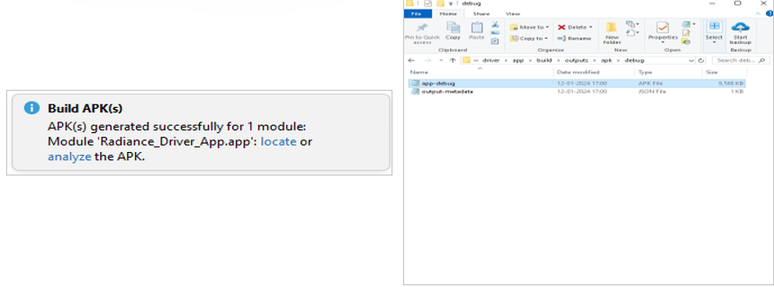

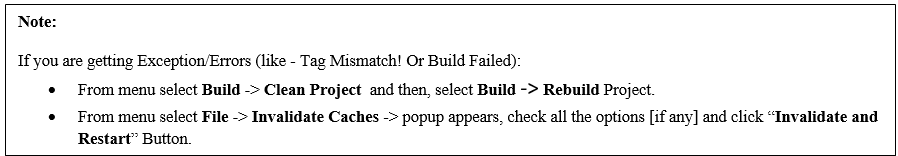
